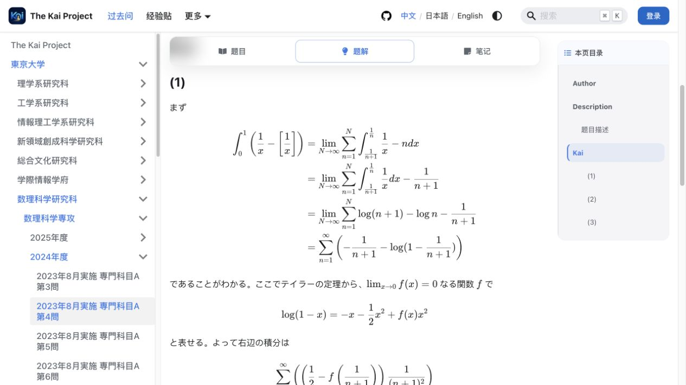
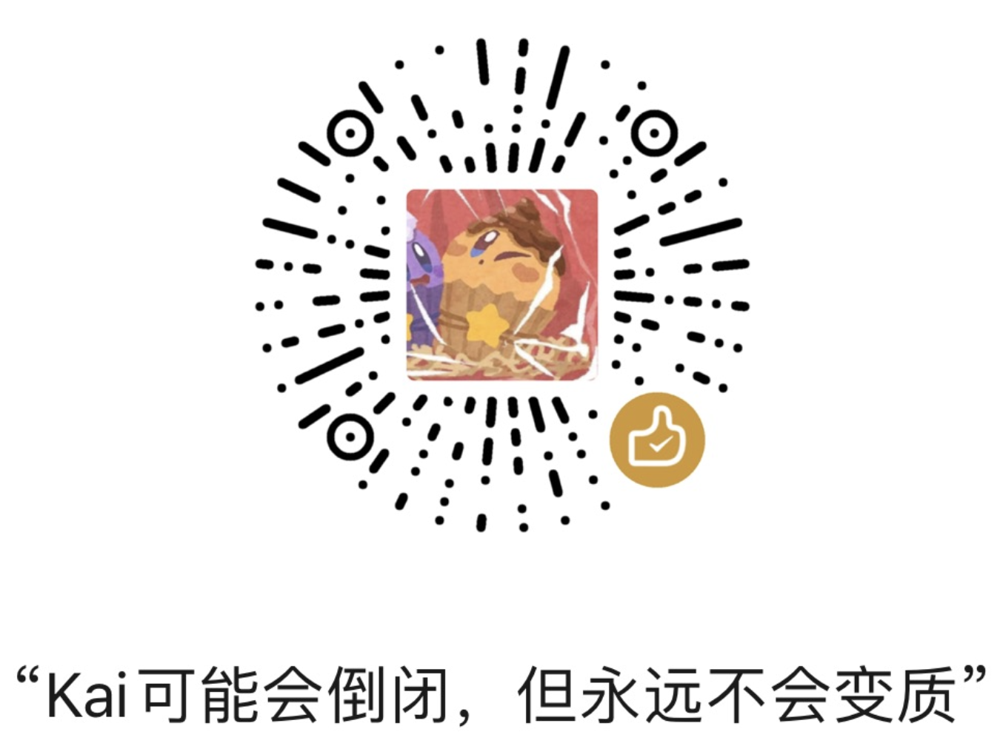
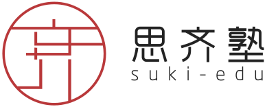

<div align="center">

[](https://www.gnu.org/licenses/agpl-3.0)
[](https://runjp.com)
[](https://github.com/Myyura/the_kai_project)

</div>

<div align="center">
  <h1 align="center">
    The Kai Project
    <br />
  </h1>
  <p align="center"><a href="./README.md">English</a> | <a href="./README.zh.md">中文</a> | <a href="./README.ja.md">日本語</a><br></p>

  <a href="https://deepwiki.com/Myyura/the_kai_project"></a>
</div>

# 📖 はじめに
The Kai Project は、日本の大学院入試の過去問・公開解答・受験体験を共有するオープンソースプラットフォームです。ログインユーザーは、データベースに直接保存される進捗、ノート、非公開問題セットも利用できます。

```text
"Answer to the Ultimate Question of Life, the Universe, and Everything"
```

プロジェクトウェブサイト: [日本の大学院入試問題解答](https://runjp.com/)

<p align="center">
  <a href="https://runjp.com/docs/tokyo-university/mathematical_sciences/ms/2024/ms_202308_A_4#kai">
    
  </a>
</p>

<p align="center"><em>大学別ナビゲーション、多言語コンテンツ、KaTeX による数式解説を備えた解答ページ。</em></p>

## オープンソースと継続的な運営

The Kai Project はオープンソースプロジェクトと公開学習アーカイブを基盤としています。コミュニティによって維持される過去問インデックス、公開解答、学習資料および関連ドキュメントは、プロジェクトの中核的な公開コンテンツとして、学習者が継続的にアクセスできる形で提供されます。

長期的な保守、技術サービス、コミュニティ運営を支えるため、プロジェクトは学習ツール、アカウント機能、データ API、学習支援、パートナーシップなどに関する持続可能な運営方法を検討する場合があります。これらの補助的なサービスや連携は、中核的な公開コンテンツのオープンアクセス性を変更するものではありません。

# ✨ 主な機能
- 複数大学・研究科にまたがる過去問と解答の公開データベース
- 受験体験記や勉強メモのブログ
- 問題ごとの進捗記録、復習リマインダー、学習ヒートマップ、進捗ダッシュボード
- Markdown / LaTeX 対応ノートと、ハイライト・素早い移動・編集ができる本文注釈
- Supabase に保存される学習進捗、非公開問題セット、公開ニックネーム、練習ランキング、コミュニティ難易度評価
- ログイン後のサイト内フォームによる新規解答の投稿と、既存解答ページからの訂正投稿
- ローカル検索と解答ページの画像共有（Web 文書の閲覧にはネットワーク接続が必要です）

# 👏 プロジェクトへの参加
The Kai Project では、[サイト内投稿](https://runjp.com/me?tab=contribute)、GitHub の Pull Request、[メール](mailto:376672994@qq.com)、コミュニティでの議論を通じて、解答、訂正、コード、ドキュメントへの貢献を受け付けています。サイト内投稿には Git の知識は必要ありません。

ローカル開発環境の構築、アカウントとデータベースの設定、開発者向け API とデプロイ、投稿方法、文書形式、タグ、ファイル配置については、[開発・貢献ガイド](./CONTRIBUTING.ja.md) を参照してください。すべての貢献は、マージ前に[コントリビューターライセンス同意書 (CLA)](CLA.md)への同意が必要です。

公開過去問アーカイブと公開解答ライブラリに受け入れられた貢献は、プロジェクトの中核的な公開コンテンツとして、引き続きオープンにアクセスできる形で提供します。

# 💬 コミュニティ議論
The Kai Project の Discord または QQ グループに参加して、試験解答や受験体験を共有し、フィードバックをお寄せください。解答に誤りがある場合は GitHub Issues からも知らせてください。

[Discord に参加](https://discord.gg/VcUHXzB9Mk)

[QQグループ：925154731](https://qm.qq.com/q/MVPd9wniQU)

コミュニティ経由のフィードバックは、メンテナーによってリポジトリに取り込まれたり、今後の改善方針に活用されたりします。

# ©️ ライセンスと著作権
The Kai Project に提出されるコード、ドキュメント、データ、学習資料など、すべての貢献には [コントリビューターライセンス同意書 (CLA)](CLA.md) が適用されます。コード貢献は、GNU Affero General Public License v3.0 の下でも配布されます。

CLA の公開コアコンテンツに関する約束に基づき、受け入れられた公開解答、学習資料、関連ドキュメントは、プロジェクトのオープンソース公開アーカイブの一部として引き続きアクセス可能な状態を保ちます。同時に、補助ツール、API、サービス支援、提携シナリオに関する長期的な運営の余地も保持します。

また、入試問題の著作権は各学校・機関に帰属します。

このプロジェクトは、この知識ベースの維持と拡張に関わるすべての貢献者に感謝します。

コンテンツが権利を侵害していると思われる場合は、直ちに管理者までご連絡ください。

# ☕ プロジェクトを支援する

The Kai Project が役に立ったと感じたら、コーヒー一杯分のご支援をご検討ください。いただいた支援は、次の活動に役立てます。

- プロジェクト基盤の保守と改善
- より便利な学習機能・アカウント機能の提供
- より多くの入試問題の解答・解説、受験ガイドの作成とレビュー
- 中核となる公開資料の無償公開とコミュニティの長期運営

## 支援方法

支援は任意です。追加コンテンツへのアクセス権が付与されたり、掲載・編集上の判断が左右されたりすることはありません。

<p align="center">
  
</p>

## 商業提携

教育機関、コミュニティ、関連プロジェクトとの長期的な連携を歓迎します。すべての商業提携は次の原則に従います。

- 中核となる公開コンテンツは、引き続き無償で公開します。
- 提携は透明かつ非排他的であり、コンテンツの掲載や編集上の判断に影響を与えません。
- 利用者のアカウント情報、学習記録、ノート、投稿履歴、その他の個人データを提携先に提供しません。
- 第三者の商用サービスに関する紹介は、サービスの品質、適合性、教育効果を保証するものではありません。

提携に関するお問い合わせは [376672994@qq.com](mailto:376672994@qq.com) までご連絡ください。

### 長期戦略パートナー

<div align="center">
  <a href="https://www.siqishu.com/">
    <picture>
      <source media="(prefers-color-scheme: dark)" srcset="./static/img/support/siqishu-logo-light.svg">
      <source media="(prefers-color-scheme: light)" srcset="./static/img/support/siqishu-logo-dark.svg">
      
    </picture>
  </a>
  <p>
    <a href="https://www.siqishu.com/"><strong>思齐塾</strong></a><br>
    日本の理工系進学をサポート · 長期戦略パートナー
  </p>
</div>

思齐塾は、日本の理工系進学と就職支援に取り組む教育機関です。Kai の長期戦略パートナーとして、継続的な支援と協働を通じて、コンテンツ、機能、コミュニティの発展を支えています。

**Kai コミュニティ向け提携特典：** Kai を通じて思齐塾を知った方は、相談時にログイン済みの Kai アカウント画面を任意で提示すると、Kai コミュニティ向けの提携特典について案内を受けられます。対象講座、特典内容、有効期間は、相談時の思齐塾の案内をご確認ください。Kai がパートナーにアカウント情報その他の個人データを提供することはありません。

## コントリビューター

一つひとつの解答、訂正、コード、ドキュメントの改善が、The Kai Project の成長を支えています。

<p align="center">
  <a href="https://github.com/Myyura/the_kai_project/graphs/contributors">
    
  </a>
</p>
