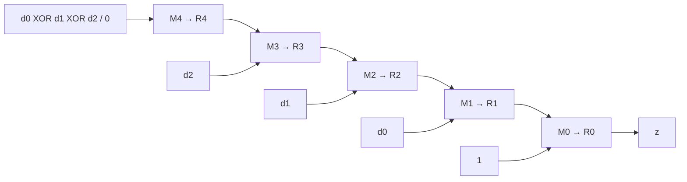

# 東京工業大学 情報理工学院 情報工学系 2016年8月実施 午前 5.

## **Author**
祭音Myyura (co-authored with GPT 5.6 SOL)&#x20;

## **Description**

(1) 次のブール代数の等式を証明せよ。

$$
\overline{\overline{x\cdot\overline{xy}}\cdot\overline{y\cdot\overline{xy}}}
=x\bar y\vee y\bar x.
$$

(2) NOT、OR、AND、XOR を、それぞれ $4$ 個以下の $2$ 入力 NAND ゲートだけで実現せよ。

(3) $3$ ビットを直列送信する回路を考える。$R_0,\ldots,R_4$ は立上りエッジ動作の D フリップフロップで、初期値はすべて $0$。$z=Q(R_0)$ とする。$e=1$ のとき、各立上りで

$$
(R_4,R_3,R_2,R_1,R_0)
\gets(d_0\oplus d_1\oplus d_2,d_2,d_1,d_0,1)
$$

を並列ロードする。$e=0$ のときは

$$
(R_4,R_3,R_2,R_1,R_0)\gets(0,R_4,R_3,R_2,R_1)
$$

とシフトする。各式の右辺は更新前の値を使う。

各 MUX は $e=1$ で上記の並列入力、$e=0$ で前段の値を選ぶ。
入力波形は次のとおりである。$C_i$ は第 $i$ クロックの立上りから次の立上りまでを表す。

- $e$ は $C_1$ 開始直後に $1$、$C_2$ 開始直後に $0$、$C_5$ 開始直後に $1$、$C_6$ 開始直後に $0$ となる。
- $d_0$ は $C_1$ 開始直後から $C_5$ 開始直後まで $1$、それ以外は $0$。
- $d_1=0$。$d_2$ は $C_5$ 開始直後から $1$、それ以前は $0$。

(a) $C_1$ から $C_{12}$ までの clock と $z$ の波形を描け。
(b) 誤り検出の原理を $150$ 文字程度で説明せよ。

(4) $3$ ウェイ・セットアソシアティブキャッシュを考える。ブロックサイズは $2$ ワード、容量は $12$ ブロック、置換は LRU とする。各ウェイの行 index は $0,1,2,3$ である。全行の初期値は $v=0$、tag/data は $0$、LRU 順位は way-1、way-2、way-3 がそれぞれ $1,2,3$。順位 $1$ が最古、$3$ が最新である。アドレス $x$ のワード内容を $(x)$ と記す。$data1,data2$ はブロックの低位・高位アドレスのワードを格納する。

初期状態からワードアドレス $26,51$ をこの順に参照すると、index $1$ は次の状態になる。他の行は初期状態のままである。

| way | v | tag | lru | data1 | data2 |
| --- | ---: | ---: | ---: | --- | --- |
| 1 | 1 | 3 | 2 | (26) | (27) |
| 2 | 1 | 6 | 3 | (50) | (51) |
| 3 | 0 | 0 | 1 | 0 | 0 |

(a) 次に $60$ を参照した後の way-1 の全行を示せ。
(b) 続いて $61,19,50$ を参照する。各アクセスのヒット／ミスと、その後の way-2 の全行を示せ。
(c) さらに $18,42,43,12$ を参照する。各アクセスのヒット／ミスと、その後の全ウェイ・全行を示せ。

### 题目描述

1. 证明所给 NAND 组合等于异或。
2. 分别用至多四个二输入 NAND 门实现 NOT、OR、AND、XOR。
3. 五个上升沿触发 D 触发器初值均为零；使能为一时加载“起始位、三位数据、异或校验位”，为零时右移并补零。按上述输入时刻画出 $C_1$ 到 $C_{12}$ 的时钟和输出；用约 $150$ 个日文字符说明检错原理。
4. 对三路组相联、每块两字、共十二块的 LRU 缓存，按 $26,51,60,61,19,50,18,42,43,12$ 的顺序访问。给出各阶段指定缓存行的 valid、tag、LRU、两字内容及命中情况；LRU 数字越小越旧。

## **Kai**

### (1)

De Morgan の法則と吸収律により、

$$
\begin{aligned}
\overline{\overline{x\overline{xy}}\ \overline{y\overline{xy}}}
&=x\overline{xy}\vee y\overline{xy}\\
&=x(\bar x\vee\bar y)\vee y(\bar x\vee\bar y)
=x\bar y\vee y\bar x.
\end{aligned}
$$

### (2)

$N(a,b)=\overline{ab}$ とおく。次の結線でよい。

| 関数 | 中間信号と出力 | NAND 数 |
| --- | --- | ---: |
| NOT | $z=N(x,x)$ | 1 |
| OR | $u=N(x,x),\ v=N(y,y),\ z=N(u,v)$ | 3 |
| AND | $u=N(x,y),\ z=N(u,u)$ | 2 |
| XOR | $u=N(x,y),\ v=N(x,u),\ w=N(y,u),\ z=N(v,w)$ | 4 |

### (3)

#### (a)

$C_2$ と $C_6$ の立上りでロードする。各立上り直後の値は次のとおり。

| サイクル | C1 | C2 | C3 | C4 | C5 | C6 | C7 | C8 | C9 | C10 | C11 | C12 |
| --- | ---: | ---: | ---: | ---: | ---: | ---: | ---: | ---: | ---: | ---: | ---: | ---: |
| $z$ | 0 | 1 | 1 | 0 | 0 | 1 | 0 | 0 | 1 | 1 | 0 | 0 |

#### (b)

送信側は３ビットのデータの排他的論理和をパリティビットとして付加する。受信側でデータとパリティの計４ビットの排他的論理和を求め、１なら誤りと判定する。正常時は１の個数が偶数になるため、１ビット誤りを含む奇数個の反転を検出できる。ただし偶数個の反転や誤り位置は判別できない。

### (4)

ワードアドレス $a$ に対して、

$$
\text{offset}=a\bmod2,\quad
\text{index}=\left\lfloor a/2\right\rfloor\bmod4,\quad
\text{tag}=\left\lfloor a/8\right\rfloor.
$$

#### (a)

$60$ は index $2$、tag $7$。way-1 の状態は次のとおり。

| index | v | tag | lru | data1 | data2 |
| --- | ---: | ---: | ---: | --- | --- |
| 0 | 0 | 0 | 1 | 0 | 0 |
| 1 | 1 | 3 | 2 | (26) | (27) |
| 2 | 1 | 7 | 3 | (60) | (61) |
| 3 | 0 | 0 | 1 | 0 | 0 |

#### (b)

$61$：ヒット、$19$：ミス、$50$：ヒット。way-2 の状態は次のとおり。

| index | v | tag | lru | data1 | data2 |
| --- | ---: | ---: | ---: | --- | --- |
| 0 | 0 | 0 | 2 | 0 | 0 |
| 1 | 1 | 6 | 3 | (50) | (51) |
| 2 | 0 | 0 | 1 | 0 | 0 |
| 3 | 0 | 0 | 2 | 0 | 0 |

#### (c)

$18$：ヒット、$42$：ミス、$43$：ヒット、$12$：ミス。最終状態は次のとおり。

| way | index | v | tag | lru | data1 | data2 |
| --- | --- | ---: | ---: | ---: | --- | --- |
| 1 | 0 | 0 | 0 | 1 | 0 | 0 |
| 1 | 1 | 1 | 5 | 3 | (42) | (43) |
| 1 | 2 | 1 | 7 | 2 | (60) | (61) |
| 1 | 3 | 0 | 0 | 1 | 0 | 0 |
| 2 | 0 | 0 | 0 | 2 | 0 | 0 |
| 2 | 1 | 1 | 6 | 1 | (50) | (51) |
| 2 | 2 | 1 | 1 | 3 | (12) | (13) |
| 2 | 3 | 0 | 0 | 2 | 0 | 0 |
| 3 | 0 | 0 | 0 | 3 | 0 | 0 |
| 3 | 1 | 1 | 2 | 2 | (18) | (19) |
| 3 | 2 | 0 | 0 | 1 | 0 | 0 |
| 3 | 3 | 0 | 0 | 3 | 0 | 0 |
