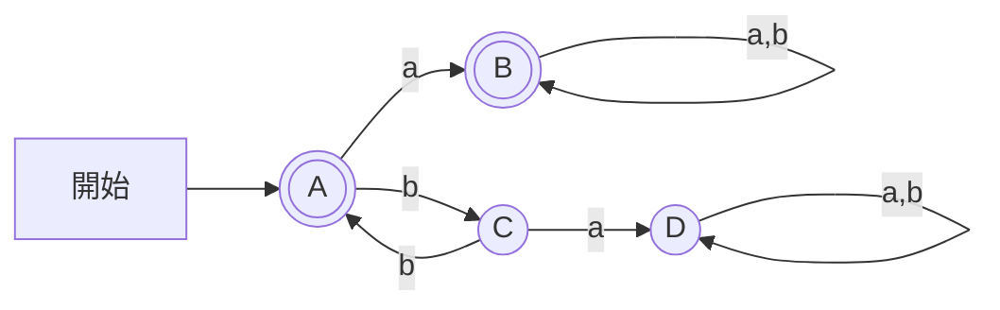

# 東京工業大学 情報理工学院 情報工学系 2018年8月実施 午前 2.

## **Author**
祭音Myyura (co-authored with GPT 5.6 SOL)&#x20;

## **Description**

1. $(\neg P\lor Q)\to(P\land R)$ の真理値表を完成せよ。行は $(P,Q,R)=(T,T,T),(T,T,F),(T,F,T),(T,F,F),(F,T,T),(F,T,F),(F,F,T),(F,F,F)$ の順とする。
2. NAND を $P\mathbin{|}Q=\neg(P\land Q)$ と書く。NAND のみで $P\to Q$ を表せ。
3. Chomsky の分類表の空欄を埋めよ。語群は、文脈依存文法、正規文法、接辞文法、$S\to aSa$、$S\to aA$、$AS\to b$、チューリングマシン、プッシュダウン・オートマトン、有限オートマトンである（各語1回まで）。

| 型 | 文法 | 規則の例 | 計算モデル |
|---|---|---|---|
| 0 | 句構造文法 | (c) | (f) |
| 1 | (a) | $bS\to bb$ | 線形有界オートマトン |
| 2 | 文脈自由文法 | (d) | (g) |
| 3 | (b) | (e) | (h) |

4. 初期・受理状態 $q_1$、もう1状態 $q_2$ の NFA を与える。遷移は $\delta(q_1,a)=\{q_1,q_2\}$、$\delta(q_1,b)=\{q_2\}$、$\delta(q_2,a)=\varnothing$、$\delta(q_2,b)=\{q_1\}$。
(a) ア `ab`、イ `abbb`、ウ `bbba`、エ `aaab`、オ `aaabba`、カ `bbabb`、キ `aabaa` のうち受理されるものを全て選べ。
(b) 受理言語の正規表現を求めよ（選択は `|`、閉包は `*`）。(c) 等価な DFA を構成せよ。

### 题目描述

计算命题公式真值表，用 NAND 表示蕴含，补全 Chomsky 层次表；判断给定非确定自动机接受哪些串，并求正则表达式及确定化自动机。

## **Kai**

### 1)

$$
 (\neg P\lor Q)\to(P\land R)
= (P\land\neg Q)\lor(P\land R)=P\land(\neg Q\lor R). 
$$

従って (a)〜(h) は順に $\boxed{T,F,T,T,F,F,F,F}$。

### 2)

$$
\boxed{P\mathbin{|}(Q\mathbin{|}Q)}=\neg(P\land\neg Q)=P\to Q.
$$

### 3)

| 空欄 | 解答 |
|---|---|
| a | 文脈依存文法（ア） |
| b | 正規文法（イ） |
| c | $AS\to b$（カ） |
| d | $S\to aSa$（エ） |
| e | $S\to aA$（オ） |
| f | チューリングマシン（キ） |
| g | プッシュダウン・オートマトン（ク） |
| h | 有限オートマトン（ケ） |

### 4)

#### a)

$\boxed{\text{ア、イ、エ、オ、カ、キ}}$。

#### b)

$q_1$ から $q_1$ に戻る基本経路のラベルは $a,ab,bb$。従って

$$
\boxed{(a\mid ab\mid bb)^*}.
$$

#### c)

$A=\{q_1\}$、$B=\{q_1,q_2\}$、$C=\{q_2\}$、$D=\varnothing$ とする。初期状態は $A$、受理集合は $\{A,B\}$。

| 状態 | a | b |
|---|---|---|
| $A$ | $B$ | $C$ |
| $B$ | $B$ | $B$ |
| $C$ | $D$ | $A$ |
| $D$ | $D$ | $D$ |

