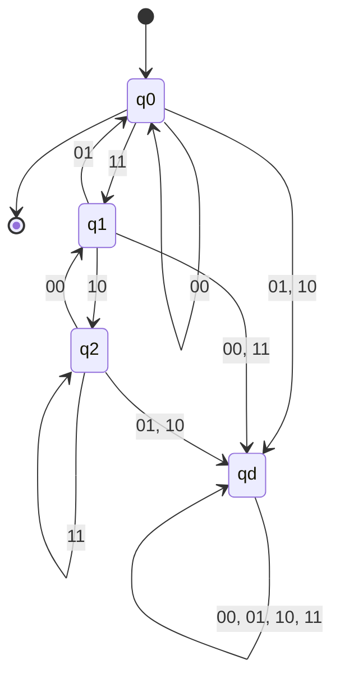

# 東京工業大学 情報理工学院 数理・計算科学系 2016年8月実施 午前 問7

## **Author**

祭音Myyura (co-authored with GPT 5.6 SOL)&#x20;

## **Description**

アルファベット

$$
\Sigma=\left\{\binom00,\binom01,\binom10,\binom11\right\}
$$

上の言語を考える。

(1) 上段の文字列が回文である文字列全体を $A$ とする。空列 $\varepsilon$ も $A$ に含める。ポンピング補題を用いて $A$ が正規言語でないことを示せ。

(2) $A$ を生成する文脈自由文法を与えよ。

(3) 各行を左端が最上位ビットである二進数とみなし、下段の数が上段の 3 倍となる文字列全体を $B$ とする。空列も $B$ に含める。

$$
B^R=\{w^R\mid w\in B\}
$$

（$w^R$ は $w$ を逆から読んだ文字列）を認識する、4 状態の決定性有限オートマトンの状態遷移図を与えよ。

### 题目描述

令字母表

$$
\Sigma=\left\{
\binom00,\binom01,\binom10,\binom11
\right\}.
$$

这里每个字符串可看成上下两行等长的二进制串。

1. 令 $A$ 为所有“上方一行是回文串”的字符串组成的语言，并约定空串 $\varepsilon\in A$。使用抽引引理证明 $A$ 不是正则语言。
2. 给出一个生成 $A$ 的上下文无关文法。
3. 把每一行都视为最高位在最左侧的二进制数，令 $B$ 为满足“下方一行表示的数是上方一行的三倍”的字符串集合，并约定 $\varepsilon\in B$。定义反转语言

   $$
   B^R=\{w^R\mid w\in B\}.
   $$

   给出一个恰有四个状态、能够识别 $B^R$ 的确定有限自动机。

## **Kai**
以下では列記号 $\binom{x}{y}$ を単に $xy$ と書く。第 1 ビットが上段、第 2 ビットが下段である。

### (1)

$A$ が正則で、ポンピング長が $p$ であると仮定する。文字列

$$
w=(00)^p(10)(00)^p
$$

を取る。これは上段が $0^p10^p$ なので $A$ に属する。任意の分解 $w=xyz$ で $|xy|\leq p$, $|y|>0$ を満たすものを考えると、$y=(00)^r$ $(r\geq1)$ である。

$i=0$ として $y$ を除くと、上段は $0^{p-r}10^p$ となり回文ではない。したがって $xy^0z\notin A$ であり、ポンピング補題に矛盾する。よって

$$
\boxed{A\text{ は正則言語ではない}}.
$$

### (2)

非終端記号を $S,Z,O$、開始記号を $S$ とし、次の生成規則を取る。

$$
\begin{aligned}
S&\to\varepsilon\mid Z\mid O\mid ZSZ\mid OSO,\\
Z&\to00\mid01,\\
O&\to10\mid11.
\end{aligned}
$$

$Z$ は上段ビット 0、$O$ は上段ビット 1 の任意の列を生成する。$ZSZ$ と $OSO$ は同じ上段ビットを両端に付け、下段ビットは左右で独立に選べる。したがってこの文法は、上段が回文で下段が任意の文字列をちょうど生成する。

### (3)

$B^R$ では最下位ビットから順に読むことになる。3 倍算の現在の桁への繰上がりを $c$、入力列を $xy$ とすると、遷移条件は

$$
y\equiv3x+c\pmod2,
\qquad
c'=\left\lfloor\frac{3x+c}{2}\right\rfloor.
$$

到達し得る繰上がりは $0,1,2$ であり、これらに不正入力用のデッド状態を加えれば 4 状態になる。$q_c$ を繰上がり $c$ の状態、$q_d$ をデッド状態とする。

初期状態かつ唯一の受理状態は $q_0$ である。入力を読み終えたとき繰上がりが 0 であることが、同じ桁数の下段が上段のちょうど 3 倍であることに対応する。$q_0$ を受理状態にすることで空文字列も受理される。
