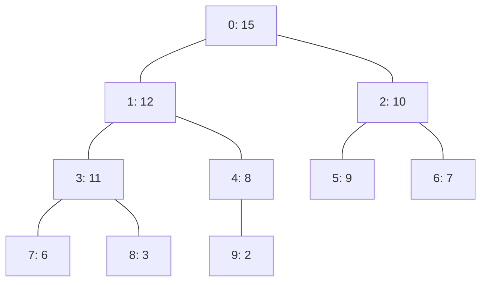

# 東京工業大学 情報理工学院 数理・計算科学系 2016年8月実施 午前 問8


## **Author**

祭音Myyura (co-authored with GPT 5.6 SOL)&#x20;

## **Description**
最大の深さを除く節点が完全に詰まり、最深の葉が左詰めになった二分木を考える。節点を幅優先順に 0 から番号づけし、配列 $A$ で表す。根以外の任意の節点 $i$ について

$$
A[\operatorname{parent}(i)]\geq A[i]
$$

が成り立つとき、ヒープと呼ぶ。



| 番号 $i$ | 0 | 1 | 2 | 3 | 4 | 5 | 6 | 7 | 8 | 9 |
|---:|---:|---:|---:|---:|---:|---:|---:|---:|---:|---:|
| $A[i]$ | 15 | 12 | 10 | 11 | 8 | 9 | 7 | 6 | 3 | 2 |

節点の高さは、その節点から葉までの最長経路の辺の数とする。次の性質を用いてよい。

- **(P1)** $n$ 要素のヒープの根の高さは $\lfloor\log_2n\rfloor$ である。
- **(P2)** 高さ $h$ の節点は $\lceil n/2^{h+1}\rceil$ 個以下である。

次のコードは配列からヒープを構築する。`heapify(a,i,n)` は左右の部分木がヒープであるとき、節点 $i$ を根とする部分木をヒープにする。

```c
void heapify(int a[], int i, int n) {
    int k = 2*i+1;             /* 節点 k は節点 i の左の子 */
    while (k < n) {
        if (k+1 < n && a[k+1] > a[k]) k = k+1;
        if (a[i] >= a[k]) return;
        int tmp = a[i];
        a[i] = a[k];
        a[k] = tmp;
        i = k; k = 2*i+1;
    }
}

void build_heap(int a[], int n) {
    for (int i = n-1; i >= 0; i--) {
        heapify(a, i, n);
    }
}
```

(1) 1 から 7 の整数を一つずつ含む、要素数 7 のヒープ（配列表現）は何種類あるか。

(2) $a_1=\{2,6,7,3,9,11,8,10,15,4\}$ に対して `build_heap(a1,10)` を実行した後の配列を書け。

(3) 高さ $h$ の節点に対し、`heapify(a,i,n)` の実行時間が $O(h)$ となる理由を説明せよ。

(4) (P1)、(P2) を用いて `build_heap(a,n)` の実行時間が $O(n)$ であることを示せ。$\sum_{k=1}^m k/2^k=2-(m+2)/2^m$ を用いてよい。

### 题目描述

一棵近似完全二叉树除最深层外各层均填满，最深层的结点从左向右填充。按层序从 $0$ 开始给结点编号，可得到数组表示 $A$；若每个非根结点 $i$ 都满足

$$
A[\operatorname{parent}(i)]\geq A[i],
$$

则称其为堆。题面给出的树形图及对应表格展示了数组

$$
(A[0],\ldots,A[9])=(15,12,10,11,8,9,7,6,3,2)
$$

所表示的一个堆。结点的高度定义为从该结点到叶结点的最长路径所含边数。可以使用以下性质：

- **(P1)** 含 $n$ 个元素的堆，其根结点高度为 $\lfloor\log_2 n\rfloor$；
- **(P2)** 高度为 $h$ 的结点至多有 $\lceil n/2^{h+1}\rceil$ 个。

给定题面中的 C 代码：`heapify(a,i,n)` 从结点 $i$ 开始，反复选择两个孩子中键值较大者；若父结点已不小于它便返回，否则交换并继续向下；`build_heap(a,n)` 则按 $i=n-1,n-2,\ldots,0$ 的顺序对每个结点调用 `heapify`。回答：

1. 求由整数 $1$ 至 $7$ 各使用一次所能构成的不同七元素堆的数量。
2. 对

   $$
   a_1=\{2,6,7,3,9,11,8,10,15,4\}
   $$

   执行 `build_heap(a1,10)`，写出执行结束后的数组。
3. 说明为什么对高度为 $h$ 的结点，`heapify(a,i,n)` 的运行时间为 $O(h)$。
4. 使用 (P1)、(P2) 以及

   $$
   \sum_{k=1}^m\frac{k}{2^k}=2-\frac{m+2}{2^m}
   $$

   证明 `build_heap(a,n)` 的运行时间为 $O(n)$。

## **Kai**
### (1)

根には最大値 7 を置く必要がある。残り 6 個から左の 3 頂点部分木に置く値を選ぶ方法は $\binom63$ 通りである。各 3 頂点部分木では最大値が根に決まり、残り 2 値の左右への配置が 2 通りある。したがって

$$
\boxed{\binom63\cdot2\cdot2=80}.
$$

### (2)

値が変化する呼び出しを追うと次のようになる。

| 処理後 | 配列 |
|---|---|
| 初期状態（$i=4$ の処理後も同じ） | $\{2,6,7,3,9,11,8,10,15,4\}$ |
| $i=3$ | $\{2,6,7,15,9,11,8,10,3,4\}$ |
| $i=2$ | $\{2,6,11,15,9,7,8,10,3,4\}$ |
| $i=1$ | $\{2,15,11,10,9,7,8,6,3,4\}$ |
| $i=0$ | $\{15,10,11,6,9,7,8,2,3,4\}$ |

よって

$$
\boxed{a_1=\{15,10,11,6,9,7,8,2,3,4\}}.
$$

### (3)

ループ 1 回の比較・交換は定数時間であり、交換後は注目節点が子へ 1 段下がる。高さ $h$ の節点から葉まで高々 $h$ 段なので、反復回数は高々 $h$、実行時間は $O(h)$ である。

### (4)

$H=\lfloor\log_2n\rfloor$ とし、高さ $h$ の節点数を $N_h$ とする。葉を含む各呼び出しの定数時間を $c_0n$、下向き処理を節点当たり $c_1h$ 以下と評価すると、(P2) より

$$
\begin{aligned}
T(n)
&\leq c_0n+c_1\sum_{h=1}^HN_hh\\
&\leq c_0n+c_1\left(
\frac n2\sum_{h=1}^H\frac{h}{2^h}+\sum_{h=1}^Hh
\right)\\
&=c_0n+c_1\left[
\frac n2\left(2-\frac{H+2}{2^H}\right)+\frac{H(H+1)}2
\right].
\end{aligned}
$$

$H=O(\log n)$ かつ $(\log n)^2=O(n)$ なので

$$
\boxed{T(n)=O(n)}.
$$
