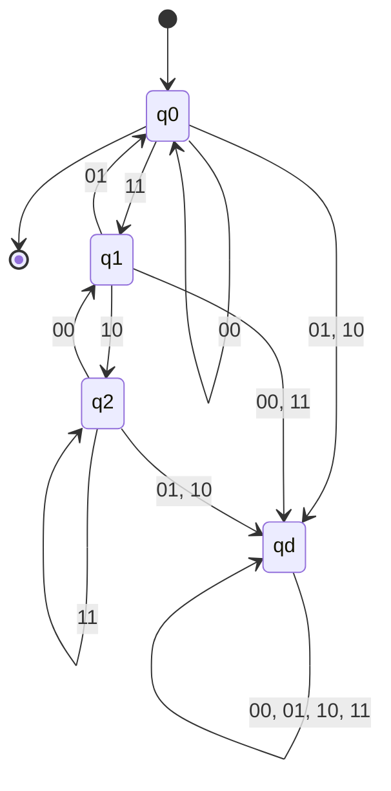

# 東京工業大学 情報理工学院 数理・計算科学系 2016年8月実施 午前 問7

:::danger[留学警示（商务部公告2026年第12号）]

根据中华人民共和国商务部公告2026年第12号，东京科学大学（東京科学大学/Institute of Science Tokyo）已被列入关注名单。请中国留学申请者慎重考虑相关风险，在做出留学决定前充分了解相关政策及其可能带来的影响。

:::

## **Author**
GPT-5

## **Description**
Let

$$
\Sigma=\left\{
\binom00,\binom01,\binom10,\binom11
\right\}.
$$

(1) Let $A$ be the language of strings whose upper-row string is a palindrome; $\varepsilon\in A$. Show using the pumping lemma that $A$ is not regular.

(2) Give a context-free grammar generating $A$.

(3) Regard each row as a binary number whose leftmost position is the most significant bit, and let $B$ consist of strings whose lower row is three times the upper row; $\varepsilon\in B$. Let $B^R=\{w^R\mid w\in B\}$. Give a four-state deterministic finite automaton recognizing $B^R$.

## **Kai**
以下では列記号 $\binom{x}{y}$ を単に $xy$ と書く。第 1 ビットが上段、第 2 ビットが下段である。

### (1)

$A$ が正則で、ポンピング長が $p$ であると仮定する。文字列

$$
w=(00)^p(10)(00)^p
$$

を取る。これは上段が $0^p10^p$ なので $A$ に属する。任意の分解 $w=xyz$ で $|xy|\leq p$, $|y|>0$ を満たすものを考えると、$y=00^r$ $(r\geq1)$ である。

$i=0$ として $y$ を除くと、上段は $0^{p-r}10^p$ となり回文ではない。したがって $xy^0z\notin A$ であり、ポンピング補題に矛盾する。よって

$$
\boxed{A\text{ は正則言語ではない}}.
$$

### (2)

非終端記号を $S,Z,O$、開始記号を $S$ とし、次の生成規則を取る。

$$
\begin{aligned}
S&\to\varepsilon\mid Z\mid O\mid ZSZ\mid OSO,\\
Z&\to00\mid01,\\
O&\to10\mid11.
\end{aligned}
$$

$Z$ は上段ビット 0、$O$ は上段ビット 1 の任意の列を生成する。$ZSZ$ と $OSO$ は同じ上段ビットを両端に付け、下段ビットは左右で独立に選べる。したがってこの文法は、上段が回文で下段が任意の文字列をちょうど生成する。

### (3)

$B^R$ では最下位ビットから順に読むことになる。3 倍算の現在の桁への繰上がりを $c$、入力列を $xy$ とすると、遷移条件は

$$
y\equiv3x+c\pmod2,
\qquad
c'=\left\lfloor\frac{3x+c}{2}\right\rfloor.
$$

到達し得る繰上がりは $0,1,2$ であり、これらに不正入力用のデッド状態を加えれば 4 状態になる。$q_c$ を繰上がり $c$ の状態、$q_d$ をデッド状態とする。

初期状態かつ唯一の受理状態は $q_0$ である。入力を読み終えたとき繰上がりが 0 であることが、同じ桁数の下段が上段のちょうど 3 倍であることに対応する。$q_0$ を受理状態にすることで空文字列も受理される。
