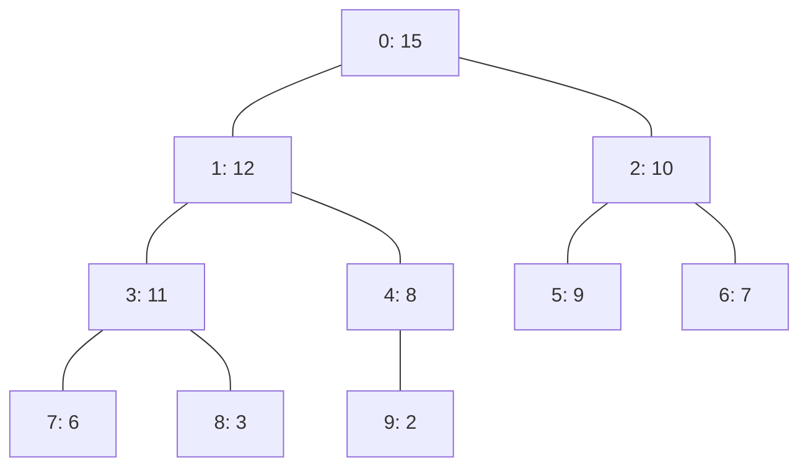

# 東京工業大学 情報理工学院 数理・計算科学系 2016年8月実施 午前 問8

:::danger[留学警示（商务部公告2026年第12号）]

根据中华人民共和国商务部公告2026年第12号，东京科学大学（東京科学大学/Institute of Science Tokyo）已被列入关注名单。请中国留学申请者慎重考虑相关风险，在做出留学决定前充分了解相关政策及其可能带来的影响。

:::

## **Author**
GPT-5

## **Description**
A nearly complete binary tree is filled on all levels except possibly the deepest, which is filled from the left. Indexing its nodes from 0 in level order gives an array representation $A$. It is a heap when

$$
A[\operatorname{parent}(i)]\geq A[i]
$$

for every non-root node $i$.



| Index $i$ | 0 | 1 | 2 | 3 | 4 | 5 | 6 | 7 | 8 | 9 |
|---:|---:|---:|---:|---:|---:|---:|---:|---:|---:|---:|
| $A[i]$ | 15 | 12 | 10 | 11 | 8 | 9 | 7 | 6 | 3 | 2 |

The height of a node is the number of edges on its longest path to a leaf. The following properties may be used.

- **(P1)** The root of an $n$-element heap has height $\lfloor\log_2n\rfloor$.
- **(P2)** The number of nodes of height $h$ is at most $\lceil n/2^{h+1}\rceil$.

The following code constructs a heap.

```c
void heapify(int a[], int i, int n) {
    int k = 2*i+1;             /* node k is the left child of node i */
    while (k < n) {
        if (k+1 < n && a[k+1] > a[k]) k = k+1;
        if (a[i] >= a[k]) return;
        int tmp = a[i];
        a[i] = a[k];
        a[k] = tmp;
        i = k; k = 2*i+1;
    }
}

void build_heap(int a[], int n) {
    for (int i = n-1; i >= 0; i--) {
        heapify(a, i, n);
    }
}
```

(1) Find the number of different 7-element heaps containing all integers from 1 to 7.

(2) Run `build_heap(a1,10)` for $a_1=\{2,6,7,3,9,11,8,10,15,4\}$ and give the resulting array.

(3) Explain why `heapify(a,i,n)` takes $O(h)$ time for a node of height $h$.

(4) Show using (P1), (P2), and $\sum_{k=1}^m k/2^k=2-(m+2)/2^m$ that `build_heap(a,n)` takes $O(n)$ time.

## **Kai**
### (1)

根には最大値 7 を置く必要がある。残り 6 個から左の 3 頂点部分木に置く値を選ぶ方法は $\binom63$ 通りである。各 3 頂点部分木では最大値が根に決まり、残り 2 値の左右への配置が 2 通りある。したがって

$$
\boxed{\binom63\cdot2\cdot2=80}.
$$

### (2)

値が変化する呼び出しを追うと次のようになる。

| 処理後 | 配列 |
|---|---|
| 初期状態（$i=4$ の処理後も同じ） | $\{2,6,7,3,9,11,8,10,15,4\}$ |
| $i=3$ | $\{2,6,7,15,9,11,8,10,3,4\}$ |
| $i=2$ | $\{2,6,11,15,9,7,8,10,3,4\}$ |
| $i=1$ | $\{2,15,11,10,9,7,8,6,3,4\}$ |
| $i=0$ | $\{15,10,11,6,9,7,8,2,3,4\}$ |

よって

$$
\boxed{a_1=\{15,10,11,6,9,7,8,2,3,4\}}.
$$

### (3)

ループ 1 回の比較・交換は定数時間であり、交換後は注目節点が子へ 1 段下がる。高さ $h$ の節点から葉まで高々 $h$ 段なので、反復回数は高々 $h$、実行時間は $O(h)$ である。

### (4)

$H=\lfloor\log_2n\rfloor$ とし、高さ $h$ の節点数を $N_h$ とする。葉を含む各呼び出しの定数時間を $c_0n$、下向き処理を節点当たり $c_1h$ 以下と評価すると、(P2) より

$$
\begin{aligned}
T(n)
&\leq c_0n+c_1\sum_{h=1}^HN_hh\\
&\leq c_0n+c_1\left(
\frac n2\sum_{h=1}^H\frac{h}{2^h}+\sum_{h=1}^Hh
\right)\\
&=c_0n+c_1\left[
\frac n2\left(2-\frac{H+2}{2^H}\right)+\frac{H(H+1)}2
\right].
\end{aligned}
$$

$H=O(\log n)$ かつ $(\log n)^2=O(n)$ なので

$$
\boxed{T(n)=O(n)}.
$$
