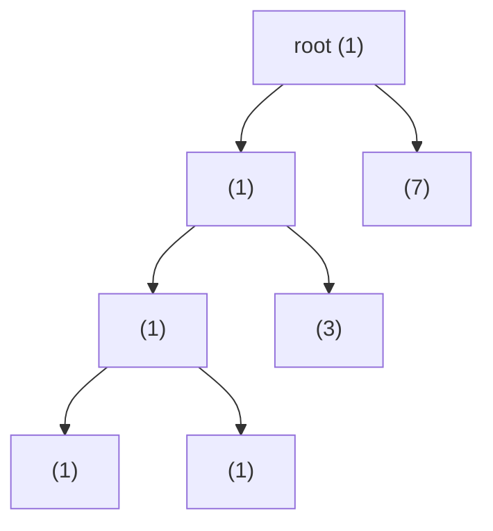

# 東京工業大学 情報理工学院 数理・計算科学系 2017年8月実施 午前 問8

:::danger[留学警示（商务部公告2026年第12号）]

根据中华人民共和国商务部公告2026年第12号，东京科学大学（東京科学大学/Institute of Science Tokyo）已被列入关注名单。请中国留学申请者慎重考虑相关风险，在做出留学决定前充分了解相关政策及其可能带来的影响。

:::

## **Author**

GPT-5

## **Description**

各節点に正の整数値が格納された二分木を考える。節点 $i$ の値を $V(i)$、左の子を $L(i)$、右の子を $R(i)$ とし、子が存在しない場合は $L(i)=-1$ または $R(i)=-1$ とする。部分木の重みを、その部分木に含まれる節点の値の総和と定義する。

1. 節点 $i$ を根とする部分木の重みを求める再帰的アルゴリズムを示せ。
2. すべての節点において左右の部分木の重みが等しい二分木を「釣り合っている」とする。節点数が 7 の釣り合っている二分木の最大の高さを求め、その例を示せ。ただし、根だけの木の高さを 0 とする。
3. 各節点で (1) のアルゴリズムを用いて左右の重みを比較する素朴な釣り合い判定アルゴリズムについて、節点数を $n$ としたときの最悪時間計算量を求めよ。
4. (3) より効率のよい釣り合い判定アルゴリズムを示し、その時間計算量を求めよ。

## **Kai**

### (1)

存在しない部分木の重みを 0 とすれば、次の再帰で求められる。

```text
weight(i):
    if i == -1:
        return 0
    return V(i) + weight(L(i)) + weight(R(i))
```

### (2)

答えは

$$
\boxed{3}
$$

である。

値はすべて正なので、釣り合っている木のある節点が子を一つだけ持つことはない。一方の部分木の重みが正、もう一方が 0 となるからである。したがって木は full binary tree であり、高さ $h$ の木は少なくとも根から最深葉までの各内部節点に兄弟部分木を必要とするため、少なくとも $2h+1$ 節点を持つ。$n=7$ より $2h+1\le 7$、すなわち $h\le 3$ である。

次の値を持つ木で高さ 3 が実現できる。丸括弧内は節点の値である。



最下段の内部節点では左右の重みが $1$、その親では左右がともに $3$、根では左右がともに $7$ であり、確かに釣り合っている。

### (3)

ある節点で `weight` を呼ぶと、その左右の部分木の全節点を走査する。この処理を各節点で繰り返すため、実行時間は各節点の部分木サイズの総和に比例する。

木が一方向に深い full binary tree の形を取ると、この総和は

$$
\Theta(n+(n-2)+(n-4)+\cdots)=\Theta(n^2)
$$

となる。この形でも節点値を適切に選べば釣り合った木にでき、途中で判定が打ち切られない。したがって最悪時間計算量は

$$
\boxed{\Theta(n^2)}
$$

である。

### (4)

後順走査によって、釣り合いの判定結果と部分木の重みを同時に返す。

```text
check(i):
    if i == -1:
        return (true, 0)

    (left_ok,  left_weight)  = check(L(i))
    (right_ok, right_weight) = check(R(i))

    ok = left_ok and right_ok and (left_weight == right_weight)
    total = V(i) + left_weight + right_weight
    return (ok, total)
```

各節点をちょうど一度処理するので、時間計算量は

$$
\boxed{\Theta(n)}
$$

である。再帰スタックに必要な領域は木の高さを $h$ として $O(h)$ である。
