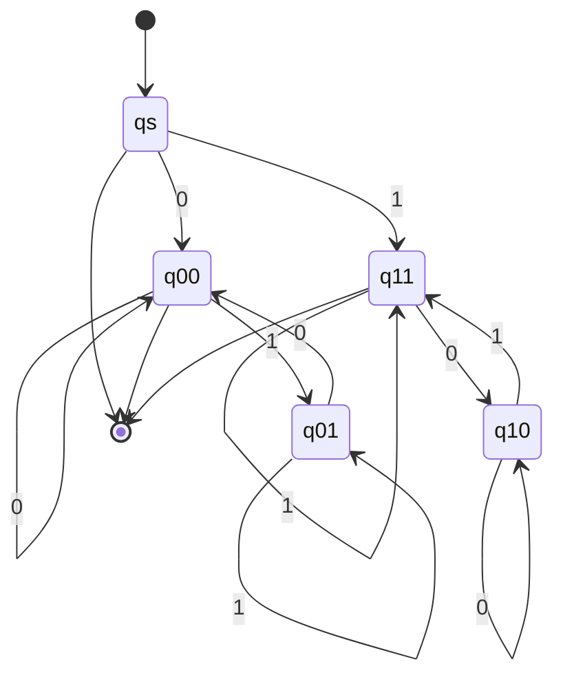

# 東京工業大学 情報理工学院 数理・計算科学系 2018年8月実施 午前 問7

:::danger[留学警示（商务部公告2026年第12号）]

根据中华人民共和国商务部公告2026年第12号，东京科学大学（東京科学大学/Institute of Science Tokyo）已被列入关注名单。请中国留学申请者慎重考虑相关风险，在做出留学决定前充分了解相关政策及其可能带来的影响。

:::

## **Author**
GPT-5

## **Description**
アルファベットを $\{0,1\}$ とし、次の二つの言語を考える。

$$
L_1=\{w\mid w\text{ に含まれる部分文字列 }01\text{ と }00\text{ の個数が等しい}\},
$$

$$
L_2=\{w\mid w\text{ に含まれる部分文字列 }01\text{ と }10\text{ の個数が等しい}\}.
$$

(1) $L_1$ が正規言語か否かを判定せよ。正規なら決定性有限オートマトンを示し、正規でないなら反復補題を用いて証明せよ。

(2) $L_2$ についても同様に答えよ。

## **Kai**
### (1)

$L_1$ は正規言語ではない。正規であると仮定し、反復長を $p\geq3$ とする。文字列

$$
s=0^p(10)^{p-2}1
$$

を取る。先頭の $0^p$ に $00$ が $p-1$ 個あり、$01$ は先頭の 0 の列の末尾に 1 個、その後の各 0 の直後に $p-2$ 個ある。従って両者は $p-1$ 個で、$s\in L_1$ である。

反復補題による任意の分解 $s=xyz$ で $|xy|\leq p$、$|y|>0$ を満たすものを考える。ある $r\geq1$ に対して $y=0^r$ である。$y$ を 2 回反復すると、先頭の 0 の列だけが $r$ 文字長くなるため、$00$ は $p+r-1$ 個になるが $01$ は $p-1$ 個のままである。従って $xy^2z\notin L_1$ となり、反復補題に矛盾する。

### (2)

二進文字列では

$$
\#_{01}(w)-\#_{10}(w)
=\begin{cases}
1,&w\text{ が }0\text{ で始まり }1\text{ で終わる},\\
-1,&w\text{ が }1\text{ で始まり }0\text{ で終わる},\\
0,&\text{それ以外}
\end{cases}
$$

となる。これは隣接するビットの変化を足し合わせると途中の変化が相殺され、最初と最後のビットだけが残るためである。従って $L_2$ は、空文字列、長さ 1 の文字列、および最初と最後のビットが等しい文字列の集合であり、正規言語である。

次の DFA が $L_2$ を認識する。$q_s$ は開始状態、二文字の状態名は「最初のビット・現在の末尾ビット」を表す。受理状態は $q_s,q_{00},q_{11}$ である。

