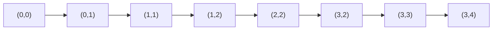

# 東京工業大学 工学院 情報通信系 2016年8月実施 S5 格子経路の動的計画法

## **Author**
祭音Myyura (co-authored with GPT 5.6 SOL)

## **Description**

$(0,0)$ から $(m,n)$ まで下または右へ1単位ずつ進む単調経路を考える。格子点 $(i,j)$ の得点は非負の $R(i,j)$，$R(0,0)=R(m,n)=0$ とする。

1. 経路上の全格子点の得点和を最大にする。$f[i][j]$ を $(0,0)$ から $(i,j)$ までの最大値として，境界を累積和で初期化し，$f[i][j]=\max(f[i][j-1]+R[i][j],f[i-1][j]+R[i][j])$ で計算する。次の $m=3,n=4$ の例の空欄（ア）～（カ）と，最大経路の一例を答えよ。

$$
R=\begin{pmatrix}0&1&1&2&3\\1&2&3&2&1\\2&1&2&1&1\\3&1&2&1&0\end{pmatrix}.
$$

空欄は順に $f[1][3],f[1][4],f[2][3],f[2][4],f[3][3],f[3][4]$。

2. 得点を「進行方向が変わる格子点の得点和」に変更する。
   a) $(i,j)$ から右に出ると仮定した最大値 $f_{\rm right}[i][j]$ と，下に出ると仮定した最大値 $f_{\rm down}[i][j]$ を用いる。前者は $\max(f_{\rm right}[i][j-1],f_{\rm down}[i-1][j]+R[i][j])$。後者と最終出力の空欄（キ）（ク）を埋めよ。
   b) 左から到着する最大値 $f_{\rm left}[i][j]$ と，上から到着する最大値 $f_{\rm up}[i][j]$ を用いる。ただし到着点の得点は未加算とする。両更新式と最終出力の空欄（ケ）（コ）（サ）を埋めよ。

### 题目描述

用动态规划分别最大化格点路径的全部顶点得分、仅转弯顶点得分，并填写两种方向状态定义下的递推式。

## **Kai**

### 1)a)

$$
f=\begin{pmatrix}0&1&2&4&7\\1&3&6&8&9\\3&4&8&9&10\\6&7&10&11&11\end{pmatrix}.
$$

したがって（ア）～（カ）は $\boxed{8,9,9,10,11,11}$。

### 1)b)

最大得点は $11$。例えば次の経路が得られる。



### 2)a)

下向きに出るとき，上から来れば直進，左から来れば曲がる。よって

```text
(キ) max(f_down[i-1][j], f_right[i][j-1] + R[i][j])
(ク) max(f_right[m][n], f_down[m][n])
```

右向きの場合も同様であり，$R(m,n)=0$ なので終点で方向を仮定しても得点は変わらない。

### 2)b)

到着点 $(i,j)$ の得点はまだ加えず，一つ前の点で曲がった場合のみその点の得点を加える。

```text
(ケ) max(f_left[i][j-1], f_up[i][j-1] + R[i][j-1])
(コ) max(f_up[i-1][j], f_left[i-1][j] + R[i-1][j])
(サ) max(f_left[m][n], f_up[m][n])
```

どちらの方法も最後の進行方向ごとに最適な部分経路を保持するため正しい。時間・記憶量はともに $O(mn)$（前行のみ保持すれば記憶量は $O(n)$）。
