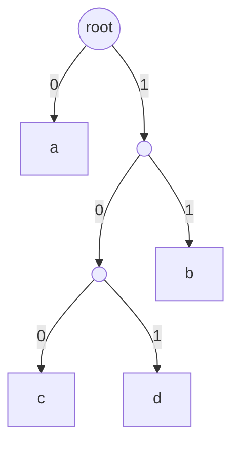

# 東京工業大学 工学院 情報通信系 2018年8月実施 S2 二元符号とHuffman符号の最適性

## **Author**
祭音Myyura (co-authored with GPT 5.6 SOL)

## **Description**

1. 情報源 $X$ の記号 $a,b,c,d$ の確率をそれぞれ $1/2,1/6,2/9,1/9$ とする。

| 記号 | 符号 $C$ | 符号 $C'$ |
|---|---|---|
| $a$ | 00 | 0 |
| $b$ | 01 | 11 |
| $c$ | 10 | 100 |
| $d$ | 11 | 101 |

   a) $C'$ の符号木を描け。
   b) $C,C'$ の平均符号長を求めよ。
   c) Huffman 符号の一例とその平均符号長を求めよ。
   d) エントロピーを $A+B\log_2 3$（$A,B$ は既約分数）の形で求めよ。
2. Huffman 符号の最適性を記号数について帰納法で示す。$k$ 記号の情報源 $Y$ の最小確率の2記号 $x_i,x_j$ を合併した情報源を $Z$，新記号を $x'$ とする。Huffman 符号 $C_k$ の兄弟葉 $x_i,x_j$ を親 $x'$ に置換した符号を $C_{k-1}$，同じ縮約を最適符号 $C'_k$ に行ったものを $C'_{k-1}$ とする。
   a) 合併後のアルファベット（ア），$L(C_{k-1})$（イ），$L(C'_{k-1})$（ウ），差 $L(C'_{k-1})-L(C_{k-1})$（エ），仮に $C_k$ が最適でなければ $L(C'_k)<$（オ）となる右辺を答えよ。
   b) $P_Z$ を $P_Y$ で表せ。
   c) 最適符号で最小確率の2記号を最深の兄弟葉に置けることを示せ。

### 题目描述

绘制前缀码树，计算平均码长、Huffman 编码和熵，并用交换论证与归纳法证明最优性。

## **Kai**

### 1)a)

### 1)b)

$$
\boxed{L(C)=2},\qquad
L(C')=\frac12+\frac26+3\left(\frac29+\frac19\right)=\boxed{\frac{11}{6}}.
$$

### 1)c)

最小の $d,b$ を合併して $5/18$，次に $c$ と合併して $1/2$，最後に $a$ と合併する。一例は

$$
\boxed{a:0,\quad c:10,\quad b:110,\quad d:111}.
$$

平均符号長は

$$
\frac12+2\cdot\frac29+3\left(\frac16+\frac19\right)=\boxed{\frac{16}{9}}.
$$

### 1)d)

$$
\begin{aligned}
H(X)&=\frac12+\frac16\log_2 6+\frac29\log_2\frac92+\frac19\log_2 9\\
&=\boxed{\frac49+\frac56\log_2 3}.
\end{aligned}
$$

### 2)a),b)

$p=P_Y(x_i)+P_Y(x_j)$ とおく。二つの符号語を1ビットずつ短縮するため

$$
\begin{aligned}
(\text{ア})&=(\mathcal M_k\setminus\{x_i,x_j\})\cup\{x'\},\\
(\text{イ})&=L(C_k)-p,\\
(\text{ウ})&=L(C'_k)-p,\\
(\text{エ})&=L(C'_k)-L(C_k),\\
(\text{オ})&=L(C_k).
\end{aligned}
$$

$$
\boxed{P_Z(x')=p,\qquad P_Z(x)=P_Y(x)\quad(x\ne x')}.
$$

$L(C'_k)<L(C_k)$ なら縮約後にも $L(C'_{k-1})<L(C_{k-1})$ となり，帰納法の仮定に矛盾する。

### 2)c)

確率 $p\le q$ の記号がそれぞれ深さ $l\le L$ にあるとき，位置を交換した平均長の変化は

$$
pL+ql-(pl+qL)=(p-q)(L-l)\le0.
$$

よって最小確率の記号を最深葉へ移しても平均長は増えない。最適な符号木には子が一つだけの内部節点は存在せず，最深葉の兄弟も最深葉である。最小確率の2記号をこの兄弟葉に置くように交換すれば，最適性を保ったまま縮約可能な配置を得る。
