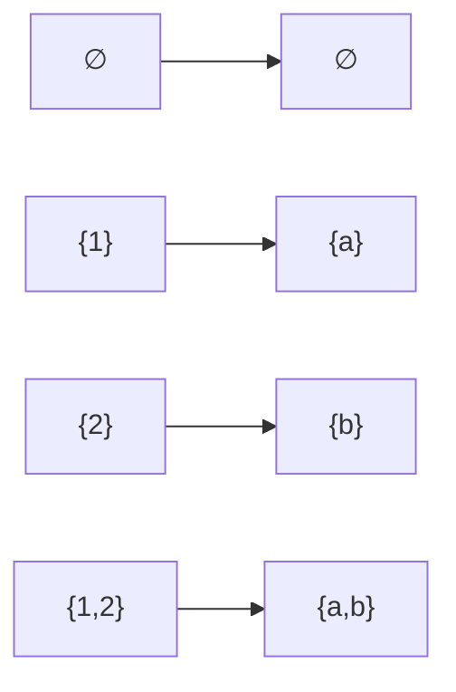
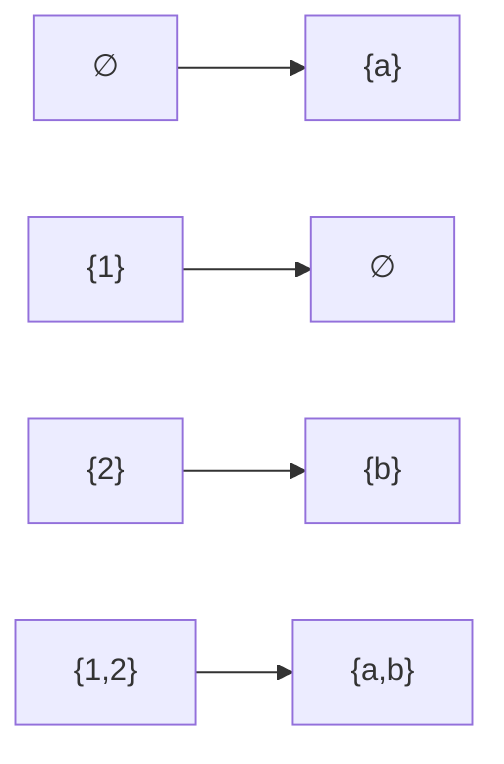

# 電気通信大学 情報理工学研究科 情報学専攻 2020年8月実施 選択問題 離散数学

## **Author**
GPT-5.6 Sol

## **Description**

### 問1

$X,Y$ を集合、$f:X\to Y$ を写像とする。$A\subseteq X$, $B\subseteq Y$ に対して

$$
f(A)=\{f(a)\mid a\in A\},
\qquad
f^{-1}(B)=\{a\mid f(a)\in B\}
$$

と定義する。空欄 1 から 8 に、選択肢

$$
\text{⓪ }=,\quad
\text{① }\in,\quad
\text{② }\subset,\quad
\text{③ }\supseteq,\quad
\text{④ }\to,\quad
\text{⑤ }\mapsto
$$

から適切なものを入れよ。

1. $a\ \boxed{1}\ \{a,b\}$
2. $\{a\}\ \boxed{2}\ \{a,b\}$
3. $\{a\}\ \boxed{3}\ \{\{a\},\{a,b\}\}$
4. $\{\{a,b\}\}\ \boxed{4}\ \{\{a\},\{a,b\}\}$
5. $f:\{1,2,3\}\to\{a,b\}$ に対して $f(\{1,2\})=\{a\}$、$f(3)=b$ であるとき、$f:2\ \boxed{5}\ a$ であり、$f(\{2,3\})\ \boxed{6}\ \{a,b\}$ である。
6. 写像 $f:X\to Y$ と集合 $A\subseteq X$, $B\subseteq Y$ に対して次を埋めよ。
   - $f$ が単射なら一般に $f^{-1}(f(A))\ \boxed{7}\ A$。
   - $f$ が単射なら一般に $f(f^{-1}(B))\ \boxed{8}\ B$。

### 問2

述語を

$$
P(x,y)=\text{「図書館 }x\text{ は本 }y\text{ を所有する」},
\qquad
Q(y)=\text{「本 }y\text{ は数学の本である」}
$$

と定義する。空欄 9 から 24 に、選択肢

$$
\text{⓪ }\forall x,\quad
\text{① }\forall y,\quad
\text{② }\exists x,\quad
\text{③ }\exists y,\quad
\text{④ }\neg,\quad
\text{⑤ }\lor,\quad
\text{⑥ }\land,\quad
\text{⑦ }\Rightarrow,\quad
\text{⑧ }\Leftrightarrow
$$

から適切なものを入れよ。

1. 「どの図書館も本を所有する」: $\boxed{9}\ \boxed{10}\ P(x,y)$
2. 「ありとあらゆる本を所有する図書館は存在しない」を次の三通りで表せ。
   - $\boxed{11}\ \exists x\ \boxed{12}\ P(x,y)$
   - $\boxed{13}\ \neg\ \boxed{14}\ P(x,y)$
   - $\boxed{15}\ \exists y\ \boxed{16}\ P(x,y)$
3. 「数学の本であるなら全て所有する図書館がある」: $\boxed{17}\ \boxed{18}\ (Q(y)\ \boxed{19}\ P(x,y))$
4. 「全ての図書館に必ず置いてある本がある」: $\boxed{20}\ \boxed{21}\ P(x,y)$
5. 「全ての図書館に必ず置いてある数学の本がある」: $\boxed{22}\ \boxed{23}\ (Q(y)\ \boxed{24}\ P(x,y))$

### 問3

$n\ge2$ の自然数に対して、次の不等式を数学的帰納法で証明せよ。

$$
\sum_{t=1}^n\frac1{t^2}<2-\frac1n.
$$

### 問4

集合 $X,Y$ と写像 $f:X\to Y$ に対し、$f$ の順像を与える写像

$$
I_f:2^X\to2^Y,
\qquad
I_f(A)=\{f(a)\mid a\in A\}
$$

を定義する。$|X|=|Y|$ とし、写像の集合

$$
\Gamma=\{I_h\mid h:X\to Y,\ h\text{ は全単射}\},
$$

$$
\Delta=\{J\mid J:2^X\to2^Y,\ J\text{ は全単射}\}
$$

を考える。

1. $X=\{1,2\}$、$Y=\{a,b\}$ とする。
   - $\Gamma$ の要素を一つ図示せよ。
   - $\Delta\setminus\Gamma$ の要素を一つ図示せよ。
2. $|X|=|Y|=n$ とする。
   - $|\Gamma|$ を求めよ。
   - $|\Delta|$ を求めよ。

## **Kai**

### 問1

| 空欄 | 選択肢 | 記号 |
|:---:|:---:|:---:|
| 1 | ① | $\in$ |
| 2 | ② | $\subset$ |
| 3 | ① | $\in$ |
| 4 | ② | $\subset$ |
| 5 | ⑤ | $\mapsto$ |
| 6 | ⓪ | $=$ |
| 7 | ⓪ | $=$ |
| 8 | ② | $\subset$ |

空欄 7 について、任意の写像では $A\subseteq f^{-1}(f(A))$ であり、単射なら逆向きの包含も成立するため等号となる。
空欄 8 については一般に

$$
f(f^{-1}(B))=B\cap f(X)\subseteq B
$$

である。ここで選択肢 ② の $\subset$ は包含関係を表す。

### 問2

| 空欄 | 選択肢 | 内容 |
|:---:|:---:|:---:|
| 9 | ⓪ | $\forall x$ |
| 10 | ③ | $\exists y$ |
| 11 | ④ | $\neg$ |
| 12 | ① | $\forall y$ |
| 13 | ⓪ | $\forall x$ |
| 14 | ① | $\forall y$ |
| 15 | ⓪ | $\forall x$ |
| 16 | ④ | $\neg$ |
| 17 | ② | $\exists x$ |
| 18 | ① | $\forall y$ |
| 19 | ⑦ | $\Rightarrow$ |
| 20 | ③ | $\exists y$ |
| 21 | ⓪ | $\forall x$ |
| 22 | ③ | $\exists y$ |
| 23 | ⓪ | $\forall x$ |
| 24 | ⑥ | $\land$ |

完成した論理式は次のとおりである。

1. $\forall x\,\exists y\,P(x,y)$
2. 次の三式は De Morgan の法則により同値である。

   $$
   \neg\exists x\,\forall y\,P(x,y),
   $$

   $$
   \forall x\,\neg\forall y\,P(x,y),
   $$

   $$
   \forall x\,\exists y\,\neg P(x,y).
   $$

3. $\exists x\,\forall y\,(Q(y)\Rightarrow P(x,y))$
4. $\exists y\,\forall x\,P(x,y)$
5. $\exists y\,\forall x\,(Q(y)\land P(x,y))$。これは $Q(y)$ が $x$ に依存しないため、$\exists y\,(Q(y)\land\forall x\,P(x,y))$ と同値である。

### 問3

$S_n=\sum_{t=1}^n1/t^2$ とおく。

$n=2$ のとき

$$
S_2=1+\frac14=\frac54<\frac32=2-\frac12
$$

なので成立する。

$k\ge2$ で $S_k<2-1/k$ が成立すると仮定する。$k<k+1$ より

$$
\frac1{(k+1)^2}<\frac1{k(k+1)}
$$

であるから、

$$
\begin{aligned}
S_{k+1}
&=S_k+\frac1{(k+1)^2}\\
&<2-\frac1k+\frac1{k(k+1)}\\
&=2-\frac1{k+1}.
\end{aligned}
$$

よって数学的帰納法により、すべての $n\ge2$ で不等式が成立する。

### 問4

#### (1-1)

$h(1)=a$, $h(2)=b$ とする。このとき $I_h\in\Gamma$ は次の対応である。

#### (1-2)

次の $J$ は $2^X$ から $2^Y$ への全単射である。

しかし任意の写像 $h$ について $I_h(\varnothing)=\varnothing$ であるため、この $J$ は $I_h$ の形ではない。したがって $J\in\Delta\setminus\Gamma$ である。

#### (2-1)

$X$ から $Y$ への全単射は $n!$ 個ある。異なる $h$ は単元集合 $\{x\}$ の像で区別でき、異なる $I_h$ を与える。よって

$$
\boxed{|\Gamma|=n!}.
$$

#### (2-2)

$|2^X|=|2^Y|=2^n$ なので、この二つの集合の間の全単射の個数は

$$
\boxed{|\Delta|=(2^n)!}
$$

である。
