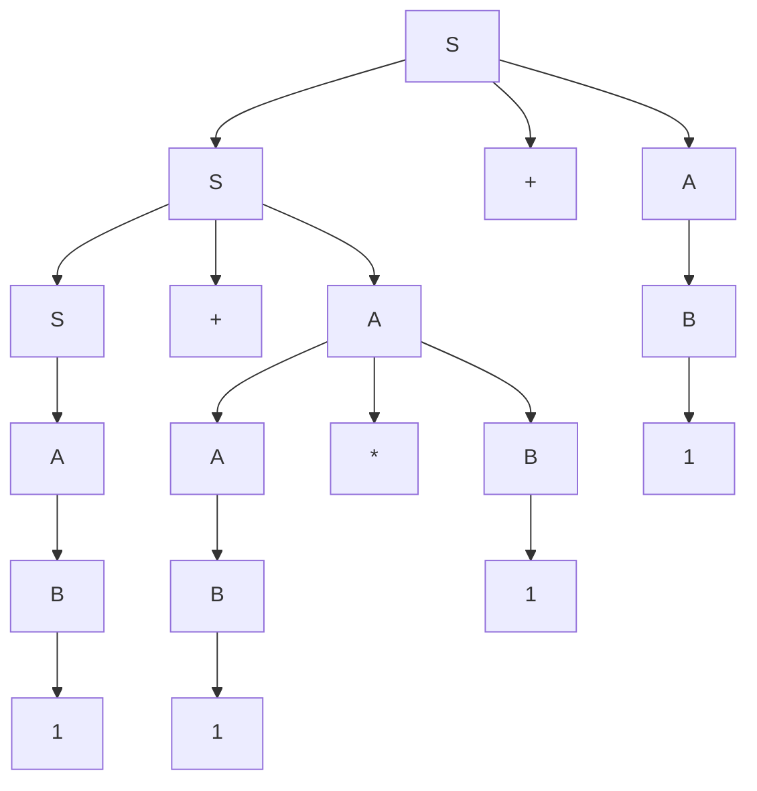
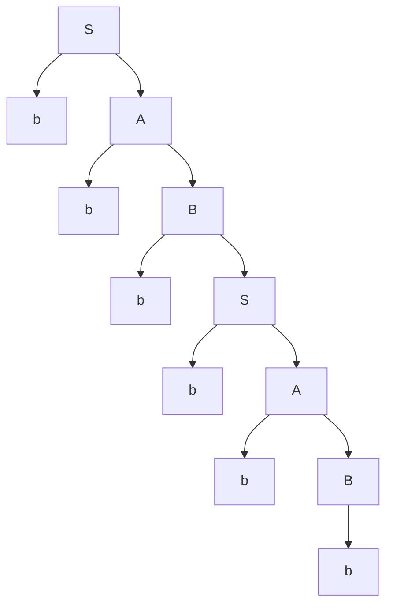
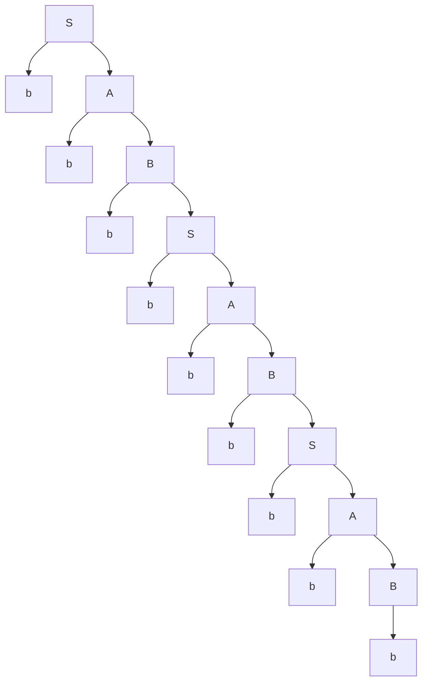
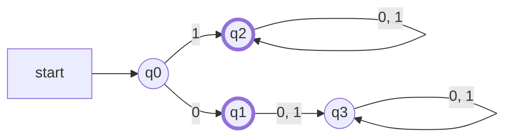
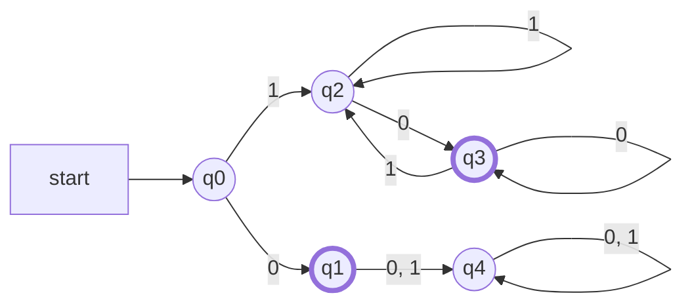

# 電気通信大学 情報理工学研究科 情報学専攻 2020年8月実施 選択問題 計算機工学 4-1 形式言語理論

## **Author**
GPT-5.6 Sol

## **Description**

### 問1

非終端記号を $S,A,B$、終端記号を $1,+,*$、開始記号を $S$ とし、生成規則を

$$
S\to S+A\mid A,
\qquad
A\to A*B\mid B,
\qquad
B\to1
$$

とする。

1. この文法が生成する長さ 5 の終端記号列を一つ、導出過程とともに示せ。
2. この文法を用いて、終端記号列 $1+1*1+1$ の構文木を示せ。

### 問2

非終端記号を $S,A,B$、終端記号を $b$、開始記号を $S$ とし、生成規則を

$$
S\to bA,
\qquad
A\to bB,
\qquad
B\to bS\mid b
$$

とする。

1. この文法が生成する長さ 5 以上の終端記号列を二つ、導出木とともに示せ。
2. この文法が生成する終端記号列の集合を記述せよ。

### 問3

二進数は 0 と 1 だけからなる数字列で表す。値が 0 のときは一つの 0 で表し、値が 0 でないときは左端の数字を必ず 1 とする。

1. 0 と 1 からなるが二進数ではない数字列を三つ示せ。
2. 二進数のみを受理する有限オートマトンの状態遷移図を示せ。状態は $q_0,q_1,q_2,q_3$、初期状態は $q_0$ とする。
3. (2) の状態遷移関数をすべて書け。
4. 偶数の二進数のみを受理する、状態数最小の決定性有限オートマトンを示せ。初期状態は $q_0$ とする。

## **Kai**

### 問1

#### (1)

例えば $1+1*1$ は長さ 5 であり、次のように導出できる。

$$
\begin{aligned}
S&\Rightarrow S+A
\Rightarrow A+A
\Rightarrow B+A
\Rightarrow1+A\\
&\Rightarrow1+A*B
\Rightarrow1+B*B
\Rightarrow1+1*B
\Rightarrow1+1*1.
\end{aligned}
$$

#### (2)

この文法では乗算が加算より深い位置に現れ、加算と乗算はいずれも左結合になる。

葉を左から読むと $1+1*1+1$ となる。

### 問2

#### (1)

一つ目として $b^6$ を取る。導出は

$$
S\Rightarrow bA\Rightarrow bbB\Rightarrow bbbS
\Rightarrow bbbbA\Rightarrow bbbbbB\Rightarrow bbbbbb
$$

であり、導出木は次のとおりである。

二つ目として $b^9$ を取る。

$$
\begin{aligned}
S&\Rightarrow bA\Rightarrow bbB\Rightarrow bbbS
\Rightarrow bbbbA\Rightarrow bbbbbB\\
&\Rightarrow bbbbbbS\Rightarrow bbbbbbbA
\Rightarrow bbbbbbbbB\Rightarrow bbbbbbbbb.
\end{aligned}
$$

#### (2)

$S\Rightarrow bA\Rightarrow bbB$ の後、$B\to b$ なら導出が終わり、$B\to bS$ なら同じ過程を繰り返す。したがって生成言語は

$$
\boxed{L=\{b^{3k}\mid k=1,2,3,\ldots\}}
$$

である。

### 問3

#### (1)

例えば

$$
\boxed{00,\quad01,\quad001}
$$

はいずれも不要な先頭の 0 をもつため、定められた二進数表現ではない。

#### (2)

太枠の $q_1,q_2$ を受理状態とする。

$q_1$ は数字列 `0` だけを読んだ状態、$q_2$ は先頭が 1 の有効な数字列を読んだ状態、$q_3$ は無効な先頭 0 の後にさらに文字を読んだ死状態である。

#### (3)

| $q$ | $\delta(q,0)$ | $\delta(q,1)$ |
|:---:|:---:|:---:|
| $q_0$ | $q_1$ | $q_2$ |
| $q_1$ | $q_3$ | $q_3$ |
| $q_2$ | $q_2$ | $q_2$ |
| $q_3$ | $q_3$ | $q_3$ |

#### (4)

太枠の $q_1,q_3$ を受理状態とする。

各状態の意味は次のとおりである。

| 状態 | 意味 | 受理 |
|:---:|:---|:---:|
| $q_0$ | まだ入力がない | しない |
| $q_1$ | 数字列がちょうど `0` | する |
| $q_2$ | 1 で始まる正の奇数 | しない |
| $q_3$ | 1 で始まる正の偶数 | する |
| $q_4$ | 先頭 0 に文字が続いた死状態 | しない |

接頭辞 $\varepsilon,0,1,10,00$ の右商は互いに異なる。例えば $0$ と $10$ は接尾辞 `0` に対する受理結果が異なり、$1$ と $00$ も接尾辞 `0` で区別できる。受理状態と非受理状態は空の接尾辞で区別できる。よって少なくとも 5 状態が必要であり、上の DFA は状態数最小である。
