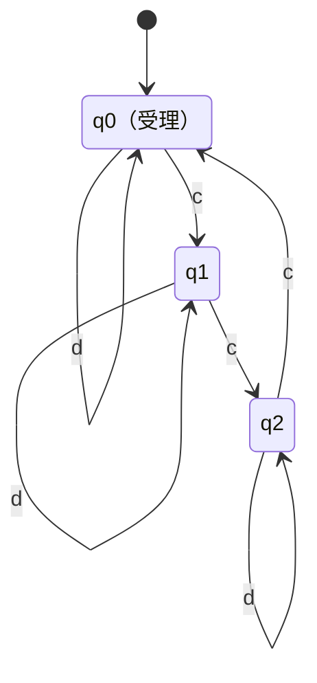

# 電気通信大学 情報理工学研究科 情報学専攻 2021年8月実施 選択問題 計算機工学 4-1

## **Author**

祭音Myyura (co-authored with GPT 5.6 SOL)

## **Description**

### 問1

文法

$$
S\to AB,\qquad A\to eAf\mid ef,\qquad B\to gBh\mid gh
$$

について、長さ $10$ 以上の生成列を二つ、導出とともに示し、生成言語を記述せよ。

### 問2

アルファベット $\{c,d\}$ 上で、$c$ の個数が $3$ の倍数である語だけを受理する最小状態数の有限オートマトン $M$ を構成し、状態遷移関数を示せ。

### 問3

文法

$$
S\to aSa\mid bSb\mid a\mid b\mid\varepsilon
$$

が生成する語が回文全体に一致することを数学的帰納法で証明せよ。

### 题目描述

求文法生成的语言并展示推导；构造识别字符 $c$ 的数量为 3 的倍数的最小 DFA；证明给定文法恰好生成所有回文。

## **Kai**

### 問1

例えば、

$$
\begin{aligned}
S&\Rightarrow AB\Rightarrow eAfB\Rightarrow eeffB
\Rightarrow eeffgBh\Rightarrow eeffggBhh
\Rightarrow eeffggghhh,\\
S&\Rightarrow AB\Rightarrow eAfB\Rightarrow eeAffB
\Rightarrow eeefffB\Rightarrow eeefffgBh
\Rightarrow eeefffgghh.
\end{aligned}
$$

いずれも長さは $10$ である。$A$ と $B$ の生成列より、生成言語は

$$
\boxed{L=\{e^nf^ng^mh^m\mid n,m\ge1\}}
$$

である。

### 問2

$q_i$ を「これまでに読んだ $c$ の個数が $3$ で割って $i$ 余る状態」とする。開始状態・受理状態はいずれも $q_0$ であり、

$$
\boxed{
\delta(q_i,c)=q_{(i+1)\bmod3},\qquad
\delta(q_i,d)=q_i
}
$$

である。

$q_0$ と他の状態は空語で、$q_1$ と $q_2$ は接尾語 $c$ で区別できる。したがって三状態は互いに同値でなく、この DFA は最小である。

### 問3

長さ $n$ に関する帰納法を用いる。

$n=0,1$ の回文 $\varepsilon,a,b$ は生成できる。また、生成済みの回文 $w$ に規則 $S\to aSa$ または $S\to bSb$ を適用して得る $awa,bwb$ も回文である。よって生成される語はすべて回文である。

逆に、長さ $n\ge2$ の回文 $w$ を考える。両端は同じ文字であり、

$$
w=ava\quad\text{または}\quad w=bvb
$$

と書ける。$v$ は長さ $n-2$ の回文なので、帰納法の仮定より $S\Rightarrow^*v$ である。したがって

$$
S\Rightarrow aSa\Rightarrow^*ava,
\qquad\text{または}\qquad
S\Rightarrow bSb\Rightarrow^*bvb.
$$

以上より、この文法の生成言語は回文全体に一致する。
