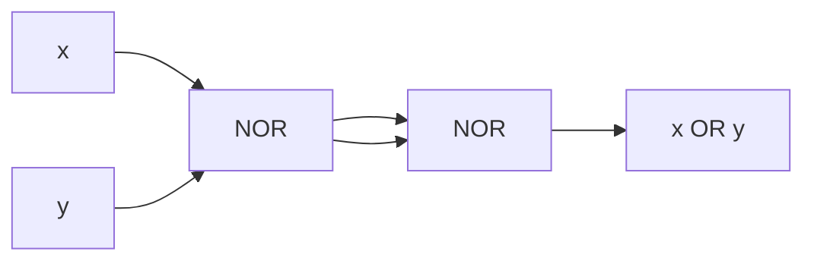
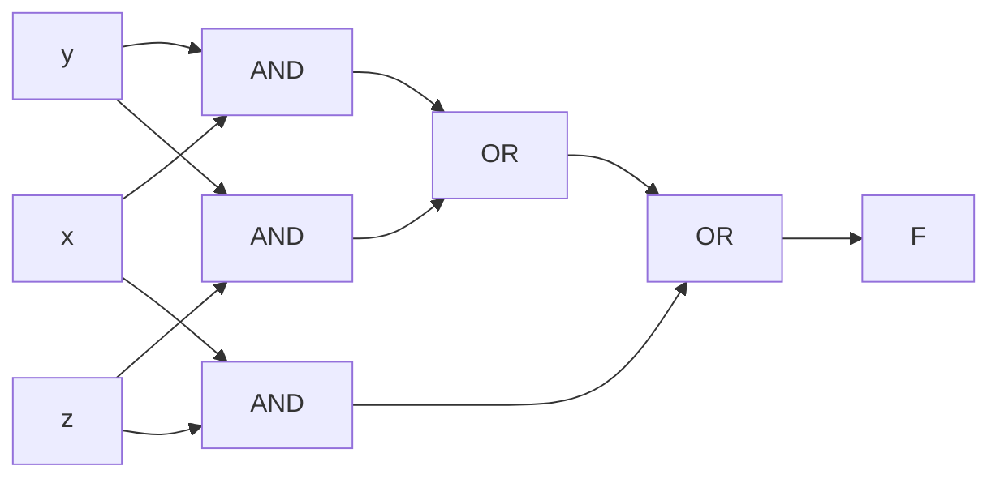

# 電気通信大学 情報理工学研究科 情報学専攻 2021年8月実施 選択問題 計算機工学 4-2

## **Author**

祭音Myyura (co-authored with GPT 5.6 SOL)

## **Description**

### 問1 数表現

1. $(2021)_{16}$ を8進数で表せ。
2. $(0.18)_{16}$ を10進数の分数で表せ。
3. 8 ビット2の補数表現 $(10111000)_2$ が表す負数の絶対値を10進数で求めよ。
4. 正の整数 $x$ を格納したレジスタを3ビット左シフトしてから $x$ を加えると、結果は $x$ の何倍になるか。ただしオーバフローはない。

### 問2 キャッシュと性能

キャッシュと主記憶のアクセス時間を、システム A では $20,40\,\mathrm{ns}$、システム B では $10,70\,\mathrm{ns}$ とする。ミス時は表の主記憶時間だけを数える。

1. A のヒット率が $0.5$ のときの実効アクセス時間を求めよ。
2. A と B でヒット率および実効アクセス時間が等しいとき、そのヒット率を求めよ。
3. A の性能が $100\,\mathrm{MIPS}$、CPI が $2$ のとき、CPU の周波数を求めよ。

### 問3 論理回路

1. 二入力がともに1のときだけ出力が0になるゲートを答えよ。
2. NOR ゲートだけで OR を構成せよ。
3. 二入力 AND と二入力 OR を用いて三入力多数決回路を構成せよ。

### 题目描述

本题考查进制和补码、缓存平均访问时间与 CPU 性能，以及 NAND/NOR 和三输入多数表决组合逻辑。

## **Kai**

### 問1

#### (1)

$$
(2021)_{16}=2\cdot16^3+2\cdot16+1=8225=(20041)_8.
$$

よって、$\boxed{(20041)_8}$ である。

#### (2)

$$
(0.18)_{16}=\frac1{16}+\frac8{16^2}
=\boxed{\frac3{32}}.
$$

#### (3)

ビット反転して1を加えると

$$
01000111+1=01001000=72
$$

なので、絶対値は $\boxed{72}$ である。

#### (4)

左シフト後は $8x$ であり、さらに $x$ を加えるので、$\boxed{9\text{ 倍}}$ である。

### 問2

#### (1)

$$
T_A=0.5\cdot20+0.5\cdot40
=\boxed{30\,\mathrm{ns}}.
$$

#### (2)

共通のヒット率を $h$ とすると、

$$
20h+40(1-h)=10h+70(1-h).
$$

したがって、$40h=30$ より

$$
\boxed{h=0.75}.
$$

#### (3)

$$
f=(100\times10^6)\times2
=2.0\times10^8\,\mathrm{Hz}.
$$

よって、$\boxed{200\,\mathrm{MHz}}$ である。

### 問3

#### (1)

求めるゲートは $\boxed{\mathrm{NAND}}$ である。

#### (2)

まず $u=\overline{x+y}$ を作り、その出力を同じ NOR ゲートの二入力へ接続すれば、

$$
\overline{u+u}=\bar u=x+y
$$

を得る。

#### (3)

多数決関数は

$$
\boxed{F=xy+yz+zx}
$$

である。三個の AND 出力を二個の OR で結合すればよい。

