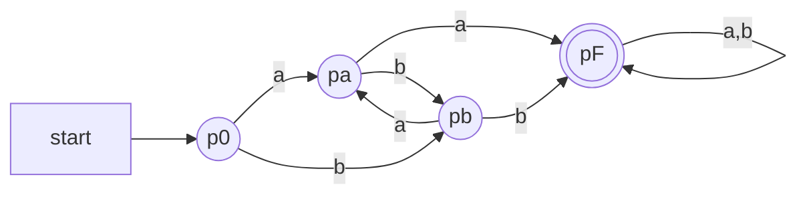
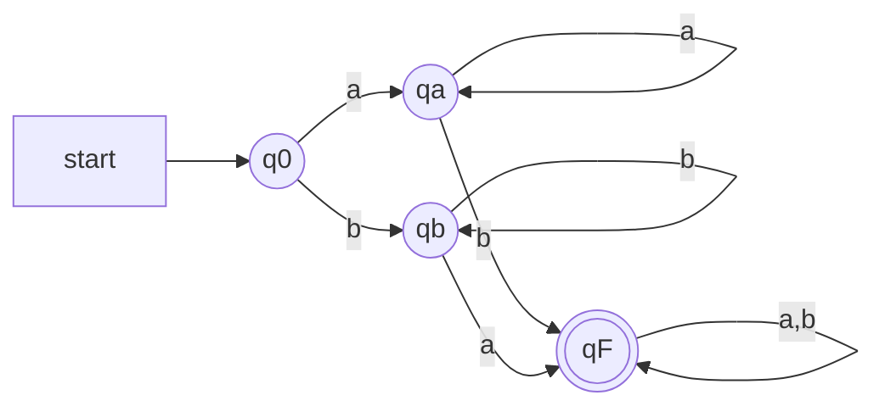
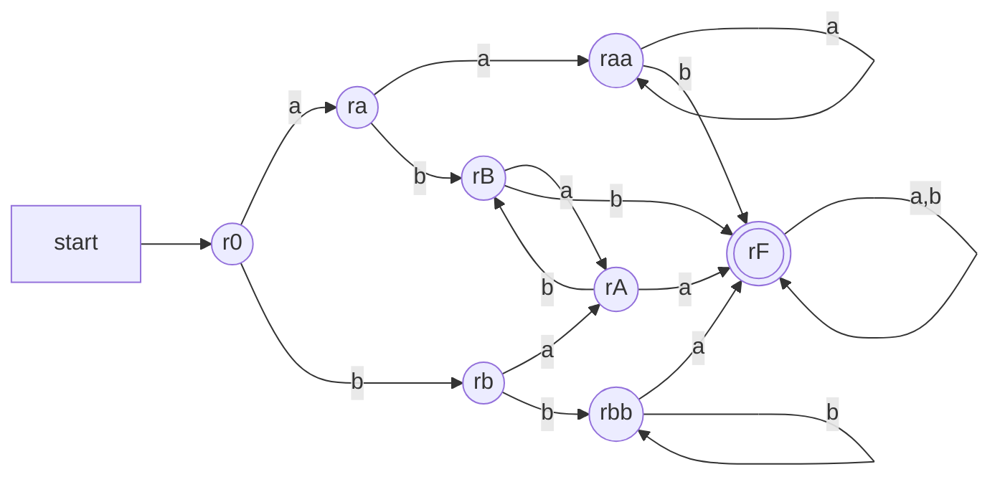

# 電気通信大学 情報理工学研究科 情報学専攻 2024年8月実施 選択問題 計算機工学 4-1

## **Author**

祭音Myyura (co-authored with GPT 5.6 SOL)

## **Description**

### 問1 文脈自由文法

$$
P_1=\{S_1\to a, S_1\to S_1S_1\},
$$

$$
P_2=\{S_2\to AB, S_2\to AC, A\to b, B\to c, C\to S_2B\}
$$

で定義される文法 $G_1,G_2$ について、生成言語を求めよ。$L_3=L(G_1)L(G_2)$ の文法を構成せよ。また、

$$
L_4=\{a^ib^ic^j\mid i,j\geq1\}
$$

の文法と、`abcc`、`aabbc` の導出木を示せ。最後に $L_3\cup L_4$ と $L_3\cap L_4$ を記述し、文脈自由言語か答えよ。

### 問2 決定性有限オートマトン

$\Sigma=\{a,b\}$ とする。`aa` または `bb` を連続部分文字列として含む語の言語を $L_1$、$a,b$ をともに一個以上含む語の言語を $L_2$ とする。各言語および $L_1\cap L_2$ に属する語を三つずつ挙げ、それぞれを受理する DFA の状態遷移図を描け。さらに $L_1,L_2$ の状態遷移関数をすべて書け。

### 题目描述

根据给定生成规则写出语言，构造语言连接与指定语言的上下文无关文法，判断并集和交集是否为上下文无关语言；再为两个字符串条件及其交集构造确定有限自动机。

## **Kai**

### 問1

#### (1)

$$
\boxed{L(G_1)=\{a^i\mid i\geq1\}},
\qquad
\boxed{L(G_2)=\{b^jc^j\mid j\geq1\}}.
$$

#### (2)

新しい開始記号を $S_3$ とすれば、

$$
\boxed{P_3=P_1\cup P_2\cup\{S_3\to S_1S_2\}}
$$

でよい。このとき

$$
L_3=\{a^ib^jc^j\mid i,j\geq1\}.
$$

#### (3)

例えば

$$
\boxed{
P_4=\{S_4\to TC, T\to aTb\mid ab, C\to cC\mid c\}}
$$

とすれば $L(G_4)=L_4$ である。

#### (4)

導出は

$$
S_4\Rightarrow TC\Rightarrow abC\Rightarrow abcC\Rightarrow abcc,
$$

$$
S_4\Rightarrow TC\Rightarrow aTbC\Rightarrow aabbC\Rightarrow aabbc
$$

であり、対応する導出木は次のとおりである。

```text
        S4                      S4
       /  \                    /  \
      T    C                  T    C
     / \  / \              / | \   \
    a   b c   C            a  T  b   c
              |              / \
              c             a   b
```

#### (5)

$$
\boxed{
L_3\cup L_4
=\{a^ib^jc^k\mid i,j,k\geq1, j=k\text{ または }i=j\}}
$$

は文脈自由言語の和なので文脈自由言語である。一方、

$$
\boxed{L_3\cap L_4=\{a^nb^nc^n\mid n\geq1\}}
$$

は文脈自由言語ではない。

### 問2

#### (1)

例として

$$
L_1:\ aa,bb,abb,\qquad
L_2:\ ab,ba,aab
$$

が挙げられる。

#### (2) $L_1$ の DFA

$p_0$ を初期状態、$p_F$ のみを受理状態とする。



遷移関数は次のとおりである。

| $\delta_1$ | $a$ | $b$ |
| --- | --- | --- |
| $p_0$ | $p_a$ | $p_b$ |
| $p_a$ | $p_F$ | $p_b$ |
| $p_b$ | $p_a$ | $p_F$ |
| $p_F$ | $p_F$ | $p_F$ |

#### (3) $L_2$ の DFA

$q_0$ を初期状態、$q_F$ のみを受理状態とする。



遷移関数は次のとおりである。

| $\delta_2$ | $a$ | $b$ |
| --- | --- | --- |
| $q_0$ | $q_a$ | $q_b$ |
| $q_a$ | $q_a$ | $q_F$ |
| $q_b$ | $q_F$ | $q_b$ |
| $q_F$ | $q_F$ | $q_F$ |

#### (4)

$L_1\cap L_2$ に属する語の例は

$$
\boxed{aab, abb, baa}
$$

である。

#### (5) $L_1\cap L_2$ の DFA

$r_A,r_B$ は「両記号を見たが同一記号の連続はなく、末尾がそれぞれ $a,b$」を表す。$r_0$ を初期状態、$r_F$ のみを受理状態とする。



| $\delta_3$ | $a$ | $b$ |
| --- | --- | --- |
| $r_0$ | $r_a$ | $r_b$ |
| $r_a$ | $r_{aa}$ | $r_B$ |
| $r_b$ | $r_A$ | $r_{bb}$ |
| $r_{aa}$ | $r_{aa}$ | $r_F$ |
| $r_{bb}$ | $r_F$ | $r_{bb}$ |
| $r_A$ | $r_F$ | $r_B$ |
| $r_B$ | $r_A$ | $r_F$ |
| $r_F$ | $r_F$ | $r_F$ |
