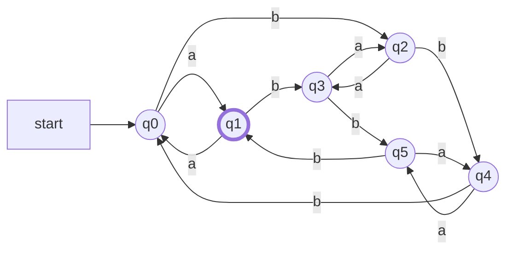

# 電気通信大学 情報理工学研究科 情報学専攻 2025年8月実施 選択問題 計算機工学

## **Author**
祭音Myyura (co-authored with GPT 5.6 SOL)

## **Description**

### 問1

1. 8 進数 $(2025)_8$ を 10 進数へ変換せよ。
2. 1 ビット全加算器において、$P=A\oplus B$, $G=A\cdot B$ とする。
   $P,G,C_{in}$ を用いて和ビット $S$ とキャリー出力 $C_{out}$ を
   最小のブール式で表せ。
3. 正の整数 $x$ を 8 ビット符号なしレジスタ $R$ にロードし、
   $R$ を 2 ビット左シフトしてから $x$ を加える。
   オーバフローしない最大の $x$ を 2 進数で表せ。

### 問2

L1 キャッシュのヒット時間を $1\,\mathrm{ns}$、ミスペナルティを
$20\,\mathrm{ns}$ とする。

1. ヒット率が $96\%$ のとき、平均メモリアクセス時間を求めよ。
2. 平均メモリアクセス時間を $2\,\mathrm{ns}$ 以下にできる最大ミス率を求めよ。

### 問3

$\Sigma=\{a,b\}$ とし、$a$ を奇数個、$b$ を 3 の倍数個（0 個を含む）含む
記号列全体を $L$ とする。

1. 次から $L$ に属するものをすべて選べ。

   ```text
   aaa, abb, bbb, babb, abaab, bbaba, aaabab, ababba, bbaaab
   ```

2. $L$ を受理する 6 状態の決定性有限オートマトンを描け。
   状態は $Q=\{q_0,q_1,\ldots,q_5\}$、初期状態は $q_0$ であり、

   $$
   \delta(q_0,a)=q_1,\quad\delta(q_0,b)=q_2,\quad
   \delta(q_2,a)=q_3,\quad\delta(q_2,b)=q_4
   $$

   とする。
3. 状態遷移関数をすべて書き、最終状態の集合 $F$ を求めよ。

### 問4

次の文脈自由文法を考える。

$$
\begin{aligned}
G_1:\quad&S_1\to aS_1\mid b,\\
G_2:\quad&S_2\to aA,\quad A\to aAB\mid b,\quad B\to b.
\end{aligned}
$$

1. $L(G_1)$ と $L(G_2)$ を集合の形で表せ。
2. $L_3=L(G_1)L(G_2)$ とする。次から $L_3$ に属するものをすべて選べ。

   ```text
   aab, bab, aabb, abab, aabab, ababb, baabb, aabbb, abaabb
   ```

3. 新しい開始記号 $S_3$ を加え、一つの生成規則で $L_3$ を生成するように
   $G_1,G_2$ を結合せよ。

### 题目描述

题目包括八进制转换、全加器布尔表达式、8 位无符号运算的溢出条件，
以及缓存平均访问时间。形式语言部分要求构造一个同时记录 `a` 的奇偶性与
`b` 的个数模 3 的 DFA，并求两个上下文无关语言及其连接语言。

## **Kai**

### 問1

#### (1)

$$
(2025)_8=2\cdot8^3+2\cdot8+5
=\boxed{(1045)_{10}}.
$$

#### (2)

$$
\boxed{S=P\oplus C_{in}},
\qquad
\boxed{C_{out}=G+P\cdot C_{in}}.
$$

#### (3)

演算結果は $4x+x=5x$ であり、8 ビット符号なし整数の最大値は 255 である。

$$
5x\le255\quad\Longrightarrow\quad x\le51.
$$

したがって

$$
\boxed{x=(00110011)_2}.
$$

### 問2

#### (1)

$$
1+0.04\cdot20=\boxed{1.8\,\mathrm{ns}}.
$$

#### (2)

ミス率を $r$ とすると

$$
1+20r\le2
$$

なので、

$$
\boxed{r\le0.05,\quad\text{最大ミス率 }5\%}.
$$

### 問3

#### (1)

各記号の個数を数えると、

$$
\boxed{\texttt{aaa},\quad\texttt{babb},\quad
\texttt{ababba},\quad\texttt{bbaaab}}
$$

である。

#### (2)

$q_0,q_2,q_4$ は $a$ が偶数個、$q_1,q_3,q_5$ は $a$ が奇数個の状態とし、
縦方向に $b$ の個数を 3 を法として数える。



#### (3)

| $q$ | $\delta(q,a)$ | $\delta(q,b)$ |
|:---:|:---:|:---:|
| $q_0$ | $q_1$ | $q_2$ |
| $q_1$ | $q_0$ | $q_3$ |
| $q_2$ | $q_3$ | $q_4$ |
| $q_3$ | $q_2$ | $q_5$ |
| $q_4$ | $q_5$ | $q_0$ |
| $q_5$ | $q_4$ | $q_1$ |

最終状態は

$$
\boxed{F=\{q_1\}}
$$

である。

### 問4

#### (1)

$G_1$ は任意個の $a$ の後に一つの $b$ を生成する。
$G_2$ では $A\to aAB$ を使うたびに $a$ と $b$ が一つずつ増える。よって

$$
\boxed{L(G_1)=\{a^ib\mid i\ge0\}},
\qquad
\boxed{L(G_2)=\{a^ib^i\mid i\ge1\}}.
$$

#### (2)

$$
L_3=\{a^ib\,a^jb^j\mid i\ge0,\ j\ge1\}
$$

なので、該当する記号列は

$$
\boxed{\texttt{bab},\quad\texttt{abab},\quad\texttt{aabab},
\quad\texttt{baabb},\quad\texttt{abaabb}}
$$

である。

#### (3)

新しい生成規則は

$$
\boxed{S_3\to S_1S_2}
$$

である。
