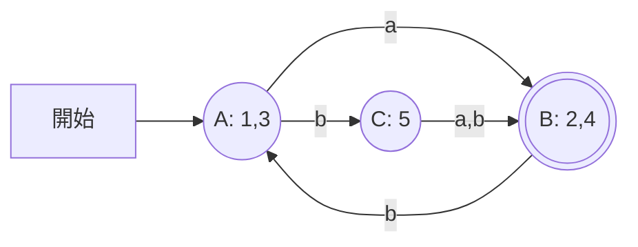

# 東京工業大学 情報理工学院 情報工学系 2017年8月実施 午前 2.

## **Author**
祭音Myyura (co-authored with GPT 5.6 SOL)

## **Description**

1. 初期状態1、受理状態2,4の有限オートマトンを最少状態の等価なものにせよ（最小性の証明は不要）。遷移は次表のとおりで、空欄は遷移なしを表す。

| 状態 | a | b |
|---|---|---|
| 1 | 2 | 5 |
| 2 | — | 3 |
| 3 | 2 | 5 |
| 4 | — | 3 |
| 5 | 2 | 4 |

2. $\{ww\mid w\in\{a,b\}^*\}$ は文脈自由言語か。そうなら生成文法を、そうでなければ証明を与えよ。
3. (a) 正規言語、(b) 文脈自由言語が、補集合と積集合の各々について閉じているか、証明とともに答えよ。

### 题目描述

将给定自动机最小化；判断复制语言 $\{ww\}$ 是否为上下文无关语言并证明；证明正则语言及上下文无关语言对补集、交集的闭包性质。

## **Kai**

### 1)

$A=\{1,3\}$、$B=\{2,4\}$、$C=\{5\}$ をそれぞれ併合する。開始状態は $A$、受理状態は $B$ である。

$B$ で $a$ を読む場合は遷移なしとして拒否する。全域的な DFA で表す場合は死状態 $D$ を追加し、$B\xrightarrow{a}D$、$D\xrightarrow{a,b}D$ とする。

### 2)

文脈自由言語ではない。もし $L=\{ww\}$ が文脈自由なら、正規言語 $R=a^+b^+a^+b^+$ との交わり

$$
L\cap R=\{a^i b^j a^i b^j:i,j\ge1\}
$$

も文脈自由である。

その反復長を $p$ とし、$w_0=a^pb^pa^pb^p=uvxyz$ と分解する。ただし $|vxy|\le p$、$|vy|>0$ とする。$vxy$ は高々隣接する2ブロックしか含まないので、$v,y$ の削除で変化するブロックには、変化しない対応ブロック（第1と第3、第2と第4）が存在する。ブロックが消滅すれば $R$ から外れ、残れば対応する長さが不一致になる。従って $uxz\notin L\cap R$ となり、反復補題に矛盾する。

### 3)

(a) **両方について閉じている。** 完全 DFA の受理・非受理状態を交換すれば補集合を得る。2つの DFA の積状態を作り、両成分が受理状態の場合のみ受理させれば積集合を得る。

(b) **両方について閉じていない。**

$$
L_1=\{a^n b^n c^m:n,m\ge0\},\qquad L_2=\{a^m b^n c^n:n,m\ge0\}
$$

は文脈自由だが、$L_1\cap L_2=\{a^n b^n c^n:n\ge0\}$ は文脈自由ではない。実際、$a^pb^pc^p$ に反復補題を適用すると、長さ $p$ 以下の部分の反復では3ブロックを同時に増減できず、三者の長さの一致が壊れる。

さらに文脈自由言語は和集合で閉じているため、補集合でも閉じていると仮定すると、De Morgan 則

$$
L_1\cap L_2=\overline{\overline{L_1}\cup\overline{L_2}}
$$

により積集合でも閉じることになり、上の反例に矛盾する。
