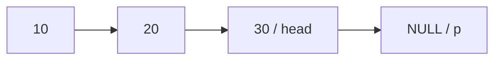
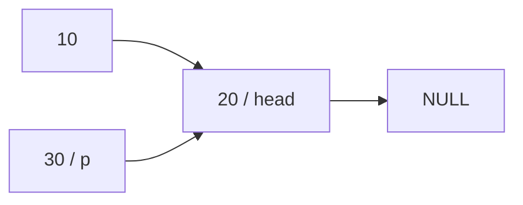

# 東京工業大学 情報理工学院 情報工学系 2017年8月実施 午前 3.

## **Author**
祭音Myyura (co-authored with GPT 5.6 SOL)

## **Description**
### 1) **(短絡評価，優先順位, 結合性)**
次の問いに答えよ。

a) C言語の演算子である論理積「&&」と論理和「||」の評価方法は短絡評価なので、オペランドの評価順序に注意が必要である。すなわち、2つの式 $e_1$, $e_2$ に対して、

- i) $e_1$ && $e_2$ の評価では、まず $e_1$ を評価し、$e_1$ の評価結果が真 (0 でない整数) の場合のみ、$e_2$ を評価する。$e_1$ 評価結果が偽 (0) の場合は、$e_2$ は評価されない。
- ii) $e_1$ || $e_2$ の評価では、まず $e_1$ を評価し、$e_1$ の評価結果が偽 (0) の場合のみ、$e_2$ を評価する。$e_1$ の評価結果が真 (0 でない整数) の場合は、$e_2$ は評価されない。

短絡評価に注意して、図 3.1 のプログラムの出力結果を答えよ。なお printf の返り値は (ヌル文字を除いた)出力文字数である。

```text
#include <stdio.h>
int main() {
    if (0 && printf("A")) { printf("B"); }
    if (1 && printf("C")) { printf("D"); }
    if (0 || printf("E")) { printf("F"); }
    if (1 || printf("G")) { printf("H"); }
}
```
#### <center> 図3.1: 短絡評価に注意が必要なプログラム</center>

b) 異なる演算子からなる式では、優先順位に従って、どの演算子を先に適用するかが決まる。 
例えば、C言語 では、引き算「-」よりも割り算「/」の優先順位が高いので, 1 - 2 / 3 は 1 - (2 / 3) と同じ意味になる。C言語では、直接メンバー選択「.」と間接メンバー選択「->」は同じ優先順位である。
また、アドレス演算「&」と間接演算「\*」は同じ優先順位である. 
直接メンバー選択「.」と間接メンバー選択「->」はアドレス演算「&」と間接演算「\*」よりも優先順位が高い。
次の式にカッコをつけて優先順位を明確にせよ。

- i) \*x->y
- ii) &x.y

なお、間接メンバー選択を使った式 e->id は (*e).id と同等である (ただし、e は式，id は識別子)。

c) 同じ優先順位を持つ演算子からなる式では、結合性に従って、どの演算子を先に適用するかが決まる。
例えば、C言語では、引き算「-」は左側の演算子を優先 (左結合) するので、1 - 2 - 3 は (1 - 2) - 3 と同じ意味になる。
また代入「=」は右結合なので、x = y = 2 は x = (y = 2) と同じ意味になる。
C言語では、直接メンバー選択 「.」と間接メンバー選択 「->」は左結合、また，アドレス演算「&」と間
接演算「\*」は右結合である。
次の式にカッコをつけて結合性を明確にせよ。

- i) x->y->z
- ii) *&x

### 2) **(線形リスト・挿入)**
次の問いに答えよ。

a) **(素朴なプログラム)** 図 3.2 はC言語による線形リストの素朴な挿入プログラムである。
図 3.2 中の関数 insert1 は, 昇順にデータがソートされるように、線形リスト head 中に新たなデータ data を挿入する。
この動作となるように, 図 3.2 中の空欄 \[ A \] ~ \[ D \] に最も適切な式を、図 3.5 の選択肢群から選んで, その番号を解答せよ.
同じ選択肢を何度選んでもよい。
例えば、図 3.2 の main 関数の実行終了直前の線形リストは図 3.3 の通りになる。
なお、NULL は「どこも指していないことを示す, 特別なポインタ値 (ヌルポインタ) であり、値は 0 である。

```text
#include <stdio.h>
#include <stdlib.h>
typedef struct CELL {
    int data; struct CELL *next;
} CELL;
CELL * CELL_alloc (int data) {
    CELL *p = malloc (sizeof (CELL));
    p->data = data; p->next = NULL; return p;
}
CELL * insert1 (CELL *head, int data) {
    CELL *new = CELL_alloc (data);
    CELL *p = head;
    if (空欄[ A ] || 空欄[ B ]) { // 先頭に挿入する条件
        new->next = p;           // 先頭に挿入
        return new;
    } else {
        while (空欄[ C ] && 空欄[ D ]) { // 挿入箇所を探す
            p = p->next;
        }
        new->next = p->next; p->next = new;
        return head;
    }
}
int main () {
    CELL *head = NULL;
    head = insert1 (head, 10);
    head = insert1 (head, 30);
    head = insert1 (head, 20);
}
```
#### <center> 図3.2: 素朴な挿入プログラム</center>

<figure style="text-align:center;">
  
</figure>

#### <center> 図3.3: main関数終了直前の線形リスト</center>

b) **(ポインタのポインタを使うプログラム)** 図 3.2 のプログラムでは、空リストや先頭に挿入する場合、場合分けが必要になり、プログラムの見通しが悪い。 
この場合分けを不要にするには、先頭にダミーセルを置く方法や、ポインタのポインタを使う方法がある。
ここでは図 3.4 に示す通りポインタのポインタを使う。
ただし、構造体 CELL と関数 CELL_alloc は図 3.2 と同じとする。
図 3.4 中の関数 insert2 が、図 3.2 中の関数 insert1 と同じ挿入結果を得られるように, 図 3.4 中の空欄 \[ E \] ~ \[ G \] に最も適切な式を、図 3.5 の選択肢群から選んで, その番号を解答せよ.
同じ選択肢を何度選んでもよい。

```text
void insert2 (CELL **head_p, int data) {
    CELL *new = CELL_alloc (data);
    CELL **p = head_p;
    while (空欄[ E ] && 空欄[ F ]) {
        p = 空欄[ G ]; // 次の next メンバーを指す
    }
    new->next = *p;
    *p = new;
}
int main () {
    CELL *head = NULL;
    insert2 (&head, 10);
    insert2 (&head, 30);
    insert2 (&head, 20);
}
```
#### <center> 図3.4: ポインタのポインタを用いた挿入プログラム</center>

```text
(1) p == NULL   (2) p != NULL   (3) p->next == NULL   (4) p->next != NULL   (5) (*p) == NULL
(6) (*p) != NULL   (7) data < p->data   (8) p->data < data   (9) data < p->next->data
(10) p->next->data < data   (11) data < (*p)->data   (12) (*p)->data < data   (13) p->next
(14) (*p)->next   (15) *p->next   (16) &*p->next   (17) &(*p)->next   (18) (&*p)->next
```
#### <center> 図3.5: 選択肢群</center>

### 3) **(線形リスト・逆順並び替え)**
次の問いに答えよ、ただし、構造体 CELL は図 3.2 と同じとする。

a) **(素朴な再帰)** 図 3.6 の reverse1 は、再帰を用いた, 線形リストを逆順に並び替えるプログラムである。
図 3.3 の線形リスト head を引数として reverse1 を呼び出した時, reverse1 からリターンする直前の線形リストの接続状況を図 3.3 のような形式で示せよ.
また、図にはその時点で変数 head と p が線形リストのどの要素を指しているかも明示すること. 
reverse1 は 再帰呼び出しのため複数回リターンすることに注意せよ (リターンする回数分の図が必要。実行時系列順に解答すること).

```text
CELL * reverse1 (CELL *head) {
    CELL *p = NULL;
    if (head == NULL || head->next == NULL) {
        return head;
    }
    p = reverse1 (head->next);
    head->next->next = head;
    head->next = NULL;
    return p;
}
```
#### <center> 図3.6: 素朴な再帰で逆順にするプログラム</center>

b) **(途中状態を引数で渡す再帰)** 図 3.7 の reverse2 も与えられた線形リストを逆順に並び替えるプログラムである。
reverse2 (head, NULL); という形式で呼び出して用いる。
再帰呼び出しの際に、 reverse2 の第 1 引数は「元のリストをある位置で分割した後半のリスト」、第 2 引数は「元のリストを同じ位置で分割した前半を逆順に並び替えたリスト」となる.
新たに reverse2 を呼び出しするたびに、第 1 引数から先頭要素を削除し, その先頭要素を第 2 引数の先頭に加える。
空欄 \[ H \] と \[ J \] に式を、\[ I \] に代入文を入れて、プログラムを完成させよ。

```text
CELL * reverse2 (CELL *head1, CELL *head2) {
    if (head1 == NULL) {
        return head2;
    }
    CELL *new_head1 = [ 空欄 H ];
    [ 空欄 I ]
    CELL *new_head2 = [ 空欄 J ];
    return reverse2 (new_head1, new_head2);
}
```
#### <center> 図3.7: 途中状態を引数で渡す, 再帰逆順プログラム</center>

c) **(ループ)** 図 3.8 の reverse3 も与えられた線形リストを逆順に並び替えるプログラムである。
ループを使って線形リストを先頭から走査し、ポインタを逆順にしていく. 
図 3.9 に示すように、変数 p1, p2, p3 は連続する3つの要素を指し、1 回のループで1つのポインタを逆向きに張替える.
次に p1, p2, p3 が指す要素を右に1つずらす。
空欄 \[ K \], \[ L \], \[ M \] に、代入文をそれぞれ1つずつ入れて、プログラムを完成させよ。

```text
CELL *reverse3 (CELL *head) {
    CELL *p1 = NULL, *p2 = head, *p3;
    while (p2 != NULL) {
        [ 空欄 K ]
        p2->next = p1; // 逆向きにリンク
        [ 空欄 L ]
        [ 空欄 M ]
    }
    return p1;
}
```
#### <center> 図3.8: ループで逆順にするプログラム</center>

<figure style="text-align:center;">
  
</figure>

#### <center> 図3.9: 1回のループで、ポインタを1つ張替え、変数p1，p2, p3を1つ右に移動させる</center>

### 题目描述

本题考查 C 语言表达式求值以及单链表操作，共三部分。

1. **短路求值、优先级与结合性**

   1. C 的逻辑与 `&&` 和逻辑或 `||` 采用短路求值。对表达式 $e_1,e_2$：

      - 求值 `e1 && e2` 时先求 $e_1$；仅当其结果为真（非零整数）时才求 $e_2$，若为假（$0$）则不求 $e_2$；
      - 求值 `e1 || e2` 时先求 $e_1$；仅当其结果为假时才求 $e_2$，若为真则不求 $e_2$。

      考虑图 3.1 的程序；`printf` 的返回值为实际输出的字符数，不计字符串末尾的空字符。写出程序的输出：

      ```c
      #include <stdio.h>
      int main() {
          if (0 && printf("A")) { printf("B"); }
          if (1 && printf("C")) { printf("D"); }
          if (0 || printf("E")) { printf("F"); }
          if (1 || printf("G")) { printf("H"); }
      }
      ```

   2. 不同运算符按优先级决定先后。C 中 `/` 高于 `-`，故 `1 - 2 / 3` 等价于 `1 - (2 / 3)`；直接成员选择 `.` 与间接成员选择 `->` 同级，取地址 `&` 与解引用 `*` 同级，而 `.`、`->` 的优先级高于 `&`、`*`。给下列表达式加括号以明确优先级：

      1. `*x->y`
      2. `&x.y`

      其中 `e->id` 等价于 `(*e).id`，$e$ 为表达式，`id` 为标识符。
   3. 同级运算符按结合性决定先后。例如 `-` 左结合，故 `1 - 2 - 3` 等价于 `(1 - 2) - 3`；赋值 `=` 右结合，故 `x = y = 2` 等价于 `x = (y = 2)`。C 中 `.`、`->` 左结合，`&`、`*` 右结合。给下列表达式加括号以明确结合性：

      1. `x->y->z`
      2. `*&x`

2. **有序单链表插入**

   1. 图 3.2 的 `insert1` 把新数据 `data` 插入链表 `head`，使数据保持升序。为使程序完成该功能，从后面的图 3.5 选项中为［A］至［D］各选一个最合适表达式并回答编号；选项可重复使用。`NULL` 是表示不指向任何位置、值为 $0$ 的空指针。图 3.2 的 `main` 结束前，链表状态如原 Description 的图 3.3 所示。

      ```c
      #include <stdio.h>
      #include <stdlib.h>
      typedef struct CELL {
          int data; struct CELL *next;
      } CELL;
      CELL * CELL_alloc (int data) {
          CELL *p = malloc (sizeof (CELL));
          p->data = data; p->next = NULL; return p;
      }
      CELL * insert1 (CELL *head, int data) {
          CELL *new = CELL_alloc (data);
          CELL *p = head;
          if ([空格 A] || [空格 B]) {
              new->next = p;
              return new;
          } else {
              while ([空格 C] && [空格 D]) {
                  p = p->next;
              }
              new->next = p->next; p->next = new;
              return head;
          }
      }
      int main () {
          CELL *head = NULL;
          head = insert1 (head, 10);
          head = insert1 (head, 30);
          head = insert1 (head, 20);
      }
      ```

   2. 为避免对空链表和头部插入单独分支，图 3.4 使用二级指针；`CELL` 和 `CELL_alloc` 与图 3.2 相同。为使 `insert2` 获得与 `insert1` 相同的插入结果，从图 3.5 选项中为［E］至［G］各选一个最合适表达式并回答编号；选项可重复使用。

      ```c
      void insert2 (CELL **head_p, int data) {
          CELL *new = CELL_alloc (data);
          CELL **p = head_p;
          while ([空格 E] && [空格 F]) {
              p = [空格 G]; // 指向下一个 next 成员
          }
          new->next = *p;
          *p = new;
      }
      int main () {
          CELL *head = NULL;
          insert2 (&head, 10);
          insert2 (&head, 30);
          insert2 (&head, 20);
      }
      ```

      图 3.5 的选项为：

      ```text
      (1) p == NULL            (2) p != NULL
      (3) p->next == NULL      (4) p->next != NULL
      (5) (*p) == NULL         (6) (*p) != NULL
      (7) data < p->data       (8) p->data < data
      (9) data < p->next->data (10) p->next->data < data
      (11) data < (*p)->data   (12) (*p)->data < data
      (13) p->next             (14) (*p)->next
      (15) *p->next            (16) &*p->next
      (17) &(*p)->next         (18) (&*p)->next
      ```

3. **单链表反转**

   以下各问中的 `CELL` 结构均与图 3.2 相同。

   1. 图 3.6 的 `reverse1` 用朴素递归反转链表：

      ```c
      CELL * reverse1 (CELL *head) {
          CELL *p = NULL;
          if (head == NULL || head->next == NULL) {
              return head;
          }
          p = reverse1 (head->next);
          head->next->next = head;
          head->next = NULL;
          return p;
      }
      ```

      以图 3.3 的链表 `head` 调用它。每次 `reverse1` 即将返回时，都按图 3.3 的形式画出链表连接状态，并明确标出当时变量 `head`、`p` 分别指向哪个元素。递归会返回多次，因此须按实际时间顺序为每次返回分别作图。
   2. 图 3.7 的 `reverse2` 也反转链表，以 `reverse2(head,NULL)` 调用。每次递归调用时，第一个参数是把原链表在某处切分后的后半段；第二个参数是前半段反转后的链表。每次新调用都从第一参数移除头结点，再把它放到第二参数的头部。为［H］、［J］填表达式，为［I］填一条赋值语句：

      ```c
      CELL * reverse2 (CELL *head1, CELL *head2) {
          if (head1 == NULL) {
              return head2;
          }
          CELL *new_head1 = [空格 H];
          [空格 I]
          CELL *new_head2 = [空格 J];
          return reverse2 (new_head1, new_head2);
      }
      ```

   3. 图 3.8 的 `reverse3` 用循环从链表头开始扫描并逐条反转指针。原 Description 的图 3.9 表示 `p1,p2,p3` 指向连续三个位置；每轮先反转一条链接，再把三者各向右移动一位。分别为［K］、［L］、［M］各填一条赋值语句：

      ```c
      CELL *reverse3 (CELL *head) {
          CELL *p1 = NULL, *p2 = head, *p3;
          while (p2 != NULL) {
              [空格 K]
              p2->next = p1;
              [空格 L]
              [空格 M]
          }
          return p1;
      }
      ```

## **Kai**

### 1)

#### a)

```text
CDEFH
```

#### b)

(i) `*(x->y)`、(ii) `&(x.y)`。

#### c)

(i) `(x->y)->z`、(ii) `*(&x)`。

### 2)

#### a)

| 空欄 | 選択肢 | 式 |
|---|---|---|
| A | 1 | `p == NULL` |
| B | 7 | `data < p->data` |
| C | 4 | `p->next != NULL` |
| D | 10 | `p->next->data < data` |

#### b)

| 空欄 | 選択肢 | 式 |
|---|---|---|
| E | 6 | `(*p) != NULL` |
| F | 12 | `(*p)->data < data` |
| G | 17 | `&(*p)->next` |

いずれも左の条件で NULL を検査してから、右の条件で要素を参照する。

### 3)

#### a)

最初の復帰直前（`head` は30、`p` は NULL）：



2回目の復帰直前（`head` は20、`p` は30）：



最後の復帰直前（`head` は10、`p` は30）：


#### b)

H：`head1->next`、I：`head1->next = head2;`、J：`head1`。

#### c)

K：`p3 = p2->next;`、L：`p1 = p2;`、M：`p2 = p3;`。
