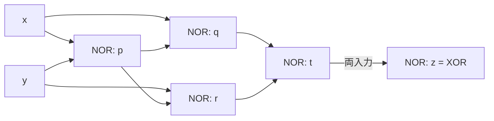

# 東京工業大学 情報理工学院 情報工学系 2018年8月実施 午前 5.

## **Author**
祭音Myyura (co-authored with GPT 5.6 SOL)

## **Description**

### 1)

空欄 A〜N に入る語を選べ。同じ語を何回用いてもよい。

0または1を取る変数を(A)と呼び、それを AND, OR, NOT で結んだ式を(B)と呼ぶ。NAND や(C)は1種類で全ての論理式を表せる。論理回路には、現在の入力だけで出力が決まる(D)と、過去からの入力系列にも依存する(E)がある。フリップフロップは(F)個の安定状態によって(G)ビットを表す(E)の基本要素である。状態を保持する装置を(H)と呼び、電力供給が必要な(I)メモリと、不要な(J)メモリに分類する。(I)メモリとして用いられる(K)は、(G)ビットの保持に(L)を用い、自然放電に対し定期的な(M)動作を必要とする。(N)はフリップフロップを用い、通電中は(M)不要である。

選択肢： (1)リフレッシュ、(2)DRAM、(3)組合せ回路、(4)SRAM、(5)演算装置、(6)不揮発性、(7)局所性、(8)論理変数、(9)1、(10)2、(11)3、(12)コンデンサ、(13)LRU、(14)AND、(15)昇順、(16)標準形、(17)水晶振動子、(18)ド・モルガンの定理、(19)ランダム、(20)記憶装置、(21)論理式、(22)極小万能、(23)順序回路、(24)ダイオード、(25)NOR、(26)揮発性、(27)二次電池、(28)NOT、(29)コイル、(30)多機能、(31)結合的、(32)OR。

### 2)

(a) 2入力 NOR だけを用い、AND は3個、OR は2個、NOT は1個、XOR は5個、NAND は4個で実現せよ。

(b) 1ビットの比較器は $A>B$ で $(X,Y,Z)=(1,0,0)$、$A=B$ で $(0,1,0)$、$A<B$ で $(0,0,1)$ を出力する。(ア) 真理値表を作れ。(イ) $X,Y,Z$ の論理式を求めよ。(ウ) 図5.3は、(i)に $A,\bar B$、(ii)に $\bar A,B$、(iii)に(i),(ii)の出力を入力し、出力をそれぞれ $X,Z,Y$ とする。各ゲートを (1)AND、(2)OR、(3)NOR、(4)XOR、(5)NAND から選べ。

(c) 2ビット入力 $A=A_1A_0$, $B=B_1B_0$ に対して同じ比較出力を作る。(ア) $X,Y$ の Karnaugh 図を作れ。(イ) $X,Y$ を積和標準形で積項数が最少となるよう簡単化せよ。

### 3)

$2^5$ 語のメモリ、8ブロックのダイレクトマップキャッシュ、1ブロック1語を考える。アドレス下位3ビットがインデックス、上位2ビットがタグで、初期状態は全行無効（N）。メモリのデータはそのアドレス自身とする。参照列は十進数で $10,15,2,15,10,2$。

(a) 各参照の二進アドレス、ヒット／ミス、割り当て先ブロックを示し、終了時のキャッシュ表（インデックス、有効 Y/N、タグ、データ）を作れ。
(b) 総ブロック数を保ち2ウェイ・セットアソシアティブ、LRU に変え、同じ参照を空の状態から行うとミスは何回か。
(c) ヒット率が異なる理由を100字以内で説明せよ。

### 题目描述

补全数字逻辑与存储器术语；以规定数量的 NOR 门实现基本门，设计1位、2位比较器并化简；模拟直接映射缓存及2路组相联缓存的访问结果。

## **Kai**

### 1)

| 空欄 | 番号 | 用語 |
|---|---|---|
| A | 8 | 論理変数 |
| B | 21 | 論理式 |
| C | 25 | NOR |
| D | 3 | 組合せ回路 |
| E | 23 | 順序回路 |
| F | 10 | 2 |
| G | 9 | 1 |
| H | 20 | 記憶装置 |
| I | 26 | 揮発性 |
| J | 6 | 不揮発性 |
| K | 2 | DRAM |
| L | 12 | コンデンサ |
| M | 1 | リフレッシュ |
| N | 4 | SRAM |

### 2)

#### a)

$N(x,y)=\overline{x+y}$ を1個の NOR ゲートとする。各行の中間信号は1度だけ生成して分岐させる。

| 出力 | ゲートの接続 | 個数 |
|---|---|---|
| $\bar x$ | $z=N(x,x)$ | 1 |
| $x+y$ | $p=N(x,y),\ z=N(p,p)$ | 2 |
| $xy$ | $p=N(x,x),\ q=N(y,y),\ z=N(p,q)$ | 3 |
| $\overline{xy}$ | $p=N(x,x),\ q=N(y,y),\ r=N(p,q),\ z=N(r,r)$ | 4 |
| $x\oplus y$ | $p=N(x,y),\ q=N(x,p),\ r=N(y,p),\ t=N(q,r),\ z=N(t,t)$ | 5 |

XOR の接続図は次のとおり（最終ゲートの両入力に $t$ を接続）。

#### b)

| $A$ | $B$ | $X$ | $Y$ | $Z$ |
|---|---|---|---|---|
| 0 | 0 | 0 | 1 | 0 |
| 0 | 1 | 0 | 0 | 1 |
| 1 | 0 | 1 | 0 | 0 |
| 1 | 1 | 0 | 1 | 0 |

$$
\boxed{X=A\bar B,\qquad Y=AB+\bar A\bar B=\overline{X+Z},\qquad Z=\bar AB}.
$$

従って (i) は **(1) AND**、(ii) は **(1) AND**、(iii) は **(3) NOR**。

#### c)

行 $A_1A_0$、列 $B_1B_0$ を Gray 順 $00,01,11,10$ に並べる。

| $X$ | 00 | 01 | 11 | 10 |
|---|---|---|---|---|
| 00 | 0 | 0 | 0 | 0 |
| 01 | 1 | 0 | 0 | 0 |
| 11 | 1 | 1 | 0 | 1 |
| 10 | 1 | 1 | 0 | 0 |

| $Y$ | 00 | 01 | 11 | 10 |
|---|---|---|---|---|
| 00 | 1 | 0 | 0 | 0 |
| 01 | 0 | 1 | 0 | 0 |
| 11 | 0 | 0 | 1 | 0 |
| 10 | 0 | 0 | 0 | 1 |

$X$ は4セルの群と2セルの群2つで覆い、$Y$ の4個の1は互いに隣接しない。最少積項数はそれぞれ3,4である。

$$
\boxed{X=A_1\bar B_1+A_0\bar B_1\bar B_0+A_1A_0\bar B_0},
$$

$$
\boxed{Y=\bar A_1\bar A_0\bar B_1\bar B_0+\bar A_1A_0\bar B_1B_0+A_1\bar A_0B_1\bar B_0+A_1A_0B_1B_0}.
$$

### 3)

#### a)

| アドレス | 二進表記 | ヒット／ミス | ブロック番号 |
|---|---|---|---|
| 10 | $01010_2$ | ミス | $010_2$ |
| 15 | $01111_2$ | ミス | $111_2$ |
| 2 | $00010_2$ | ミス | $010_2$ |
| 15 | $01111_2$ | ヒット | $111_2$ |
| 10 | $01010_2$ | ミス | $010_2$ |
| 2 | $00010_2$ | ミス | $010_2$ |

終了時は次のとおり。無効行のタグ・データは不定でよい。

| インデックス | 有効 | タグ | データ |
|---|---|---|---|
| $000_2$ | N | — | — |
| $001_2$ | N | — | — |
| $010_2$ | Y | $00_2$ | $00010_2$ |
| $011_2$ | N | — | — |
| $100_2$ | N | — | — |
| $101_2$ | N | — | — |
| $110_2$ | N | — | — |
| $111_2$ | Y | $01_2$ | $01111_2$ |

#### b)

4セットとなり、アドレス下位2ビットをセット番号とする。10と2は同じセット $10_2$ の2ウェイに共存できる。従って最初の3参照だけがミスで、$\boxed{3\text{回}}$。

#### c)

直接マップでは10と2が同じブロックを交互に置換する。2ウェイでは両方を同時に保持でき、競合ミスを除けるためヒット率が上がる。
