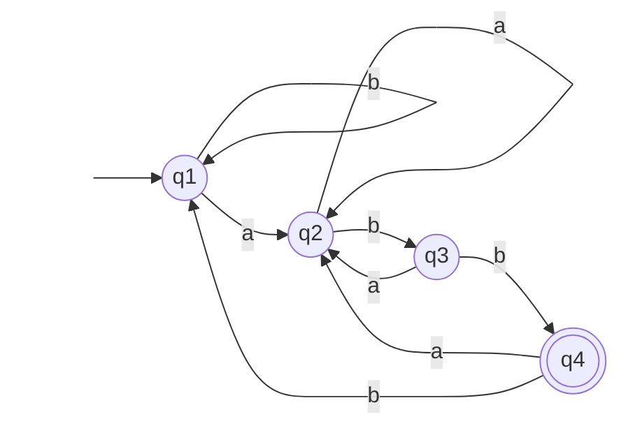
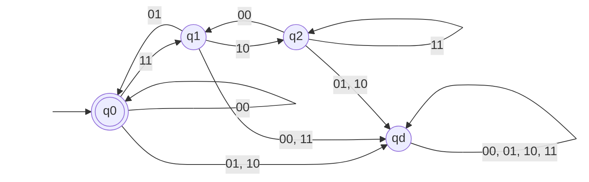

# 東京工業大学 情報理工学院 数理・計算科学系 2016年8月実施 午前 問7

## **Author**

祭音Myyura (co-authored with GPT 5.6 SOL)

## **Description**

アルファベット

$$
\Sigma=\left\{\binom00,\binom01,\binom10,\binom11\right\}
$$

上の言語を考える。

(1) 上段の文字列が回文である文字列全体を $A$ とする。回文とは前から読んでも後ろから読んでも同じになる文字列であり、空列 $\varepsilon$ も $A$ に含める。たとえば、$\binom01\binom11\binom00\binom00\binom10\binom00\in A$ である。ポンピング補題を用いて $A$ が正規言語でないことを示せ。

(2) $A$ を生成する文脈自由文法を与えよ。

(3) 各行を左端が最上位ビットである二進数とみなし、下段の数が上段の 3 倍となる文字列全体を $B$ とする。空列も $B$ に含める。たとえば、$\binom00\binom01\binom11\binom00\in B$ である。

$$
B^R=\{w^R\mid w\in B\}
$$

（$w^R$ は $w$ を逆から読んだ文字列）を認識する、4 状態の決定性有限オートマトンの状態遷移図を与えよ。

**注 1：ポンピング補題**

言語 $L$ が正規言語であるとき、次を満たす数 $p$（ポンピング長）が存在する。$s\in L$ が $|s|\geq p$ を満たすなら、$s=xyz$ と分割でき、

- (a) 各 $i\geq0$ に対して $xy^iz\in L$、
- (b) $|y|>0$、
- (c) $|xy|\leq p$

が成り立つ。$|s|$ は文字列の長さ、$y^i$ は $y$ を $i$ 個連結した文字列を表し、$y^0=\varepsilon$ は空列である。

**注 2：決定性有限オートマトンの状態遷移図**

アルファベット $\{\mathtt a,\mathtt b\}$ 上で、$\mathtt{abb}$ で終わる文字列全体を認識する状態遷移図の例を示す。開始状態は $q_1$、受理状態は二重丸の $q_4$ である。

### 题目描述

令字母表

$$
\Sigma=\left\{
\binom00,\binom01,\binom10,\binom11
\right\}.
$$

这里每个字符串可看成上下两行等长的二进制串。

1. 令 $A$ 为所有“上方一行是回文串”的字符串组成的语言，并约定空串 $\varepsilon\in A$。使用抽引引理证明 $A$ 不是正则语言。
2. 给出一个生成 $A$ 的上下文无关文法。
3. 把每一行都视为最高位在最左侧的二进制数，令 $B$ 为满足“下方一行表示的数是上方一行的三倍”的字符串集合，并约定 $\varepsilon\in B$。定义反转语言

   $$
   B^R=\{w^R\mid w\in B\}.
   $$

   画出一个恰有四个状态、能够识别 $B^R$ 的确定有限自动机的状态转移图。

题面中的两个示例分别为 $\binom01\binom11\binom00\binom00\binom10\binom00\in A$ 和 $\binom00\binom01\binom11\binom00\in B$。回文串是指正读和倒读相同的字符串。

**注 1（抽引引理）**：若 $L$ 正则，则存在抽引长度 $p$，使每个满足 $|s|\geq p$ 的 $s\in L$ 都可分解为 $s=xyz$，且对每个 $i\geq0$ 有 $xy^iz\in L$、$|y|>0$、$|xy|\leq p$。其中 $|s|$ 是串长，$y^i$ 表示串 $y$ 重复连接 $i$ 次，$y^0=\varepsilon$。

**注 2（状态转移图示例）**：上面的题面示例图识别字母表 $\{\mathtt a,\mathtt b\}$ 上以 $\mathtt{abb}$ 结尾的字符串；$q_1$ 是初态，双圆状态 $q_4$ 是接受态。

## **Kai**
以下では列記号 $\binom{x}{y}$ を単に $xy$ と書く。第 1 ビットが上段、第 2 ビットが下段である。

### (1)

$A$ が正則で、ポンピング長が $p$ であると仮定する。文字列

$$
w=(00)^p(10)(00)^p
$$

を取る。これは上段が $0^p10^p$ なので $A$ に属する。任意の分解 $w=xyz$ で $|xy|\leq p$, $|y|>0$ を満たすものを考えると、$y=(00)^r$ $(r\geq1)$ である。

$i=0$ として $y$ を除くと、上段は $0^{p-r}10^p$ となり回文ではない。したがって $xy^0z\notin A$ であり、ポンピング補題に矛盾する。よって

$$
\boxed{A\text{ は正則言語ではない}}.
$$

### (2)

非終端記号を $S,Z,O$、開始記号を $S$ とし、次の生成規則を取る。

$$
\begin{aligned}
S&\to\varepsilon\mid Z\mid O\mid ZSZ\mid OSO,\\
Z&\to00\mid01,\\
O&\to10\mid11.
\end{aligned}
$$

$Z$ は上段ビット 0、$O$ は上段ビット 1 の任意の列を生成する。$ZSZ$ と $OSO$ は同じ上段ビットを両端に付け、下段ビットは左右で独立に選べる。したがってこの文法は、上段が回文で下段が任意の文字列をちょうど生成する。

### (3)

$B^R$ では最下位ビットから順に読むことになる。3 倍算の現在の桁への繰上がりを $c$、入力列を $xy$ とすると、遷移条件は

$$
y\equiv3x+c\pmod2,
\qquad
c'=\left\lfloor\frac{3x+c}{2}\right\rfloor.
$$

到達し得る繰上がりは $0,1,2$ であり、これらに不正入力用のデッド状態を加えれば 4 状態になる。$q_c$ を繰上がり $c$ の状態、$q_d$ をデッド状態とする。

初期状態かつ唯一の受理状態は $q_0$ である。入力を読み終えたとき繰上がりが 0 であることが、同じ桁数の下段が上段のちょうど 3 倍であることに対応する。$q_0$ を受理状態にすることで空文字列も受理される。
