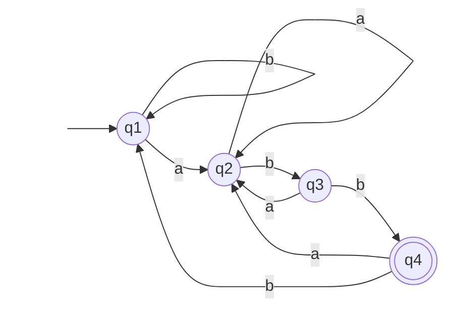
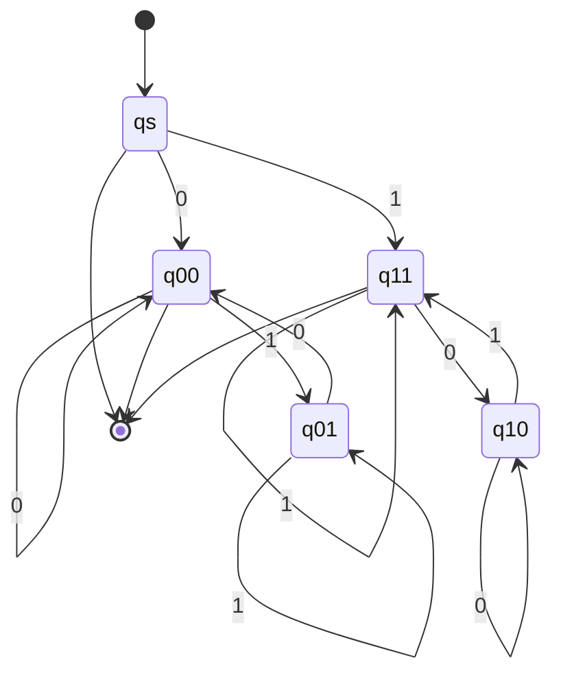

# 東京工業大学 情報理工学院 数理・計算科学系 2018年8月実施 午前 問7

## **Author**

祭音Myyura (co-authored with GPT 5.6 SOL)

## **Description**
アルファベットを $\{0,1\}$ とし、次の二つの言語を考える。

$$
L_1=\{w\mid w\text{ に含まれる部分文字列 }01\text{ と }00\text{ の個数が等しい}\},
$$

$$
L_2=\{w\mid w\text{ に含まれる部分文字列 }01\text{ と }10\text{ の個数が等しい}\}.
$$

例えば、

- $s_1=00011$ は $01$ を一つと $00$ を二つ含むので $s_1\notin L_1$ である。
- $s_2=0100$ は $01$ と $00$ を一つずつ含むので $s_2\in L_1$ である。
- $s_1$ は $01$ を一つ含むが $10$ を一つも含まないので $s_1\notin L_2$ である。
- $s_2$ は $01$ と $10$ を一つずつ含むので $s_2\in L_2$ である。

(1) $L_1$ が正規言語か否かを判定せよ。正規なら決定性有限オートマトンの状態遷移図（注 1）を示し、正規でないなら反復補題（注 2）を用いて証明せよ。

(2) $L_2$ についても同様に答えよ。

**注 1：状態遷移図**

以下は、アルファベットが $\{a,b\}$ である言語 $\{w\mid w\text{ は }abb\text{ で終わる}\}$ を認識する決定性有限オートマトンの状態遷移図の例である。開始状態は $q_1$、受理状態は $q_4$ である。

**注 2：ポンピング補題**

言語 $L$ が正規言語であるとき、次のような数 $p$（ポンピング長）が存在する。$s$ が $|s|\geq p$ を満たす $L$ の任意の文字列であるとき、$s$ は次の条件を満たすように三つの部分 $s=xyz$ に分割できる。

1. 各々の $i\geq0$ に対して $xy^iz\in L$。
2. $|y|>0$。
3. $|xy|\leq p$。

ただし、$|s|$ は文字列 $s$ の長さを表し、$y^i$ は $y$ を $i$ 回連結したものを表す。$y^0$ は空列 $\varepsilon$（文字を一つも含まない文字列）となる。

### 题目描述

字母表为 $\{0,1\}$，考虑两个语言

$$
L_1=\{w\mid w\text{ 中子串 }01\text{ 与 }00\text{ 的出现次数相等}\},
$$

$$
L_2=\{w\mid w\text{ 中子串 }01\text{ 与 }10\text{ 的出现次数相等}\}.
$$

这里子串按字符串中的相邻位置计数。例如：

- $s_1=00011$ 含一个 $01$ 和两个 $00$，因此 $s_1\notin L_1$。
- $s_2=0100$ 含一个 $01$ 和一个 $00$，因此 $s_2\in L_1$。
- $s_1$ 含一个 $01$，但不含 $10$，因此 $s_1\notin L_2$。
- $s_2$ 含一个 $01$ 和一个 $10$，因此 $s_2\in L_2$。

1. 判断 $L_1$ 是否为正则语言。若是，画出识别它的确定有限自动机的状态转移图；若不是，使用抽引引理证明。
2. 对 $L_2$ 作同样判断：若为正则语言则画出确定有限自动机的状态转移图，否则使用抽引引理证明。

**注 1：状态转移图**

上方注 1 的图是一个确定有限自动机状态转移图的例子。它识别字母表 $\{a,b\}$ 上以 $abb$ 结尾的字符串；初始状态为 $q_1$，接受状态为 $q_4$。

**注 2：抽引引理**

若语言 $L$ 是正则语言，则存在一个数 $p$（抽引长度），使任意满足 $s\in L$ 且 $|s|\geq p$ 的字符串都可以分解为 $s=xyz$，并满足：

1. 对每个 $i\geq0$，均有 $xy^iz\in L$。
2. $|y|>0$。
3. $|xy|\leq p$。

这里 $|s|$ 表示字符串 $s$ 的长度，$y^i$ 表示将 $y$ 连续拼接 $i$ 次，$y^0$ 为空串 $\varepsilon$（不含任何字符的字符串）。

## **Kai**
### (1)

$L_1$ は正規言語ではない。正規であると仮定し、反復長を $p\geq3$ とする。文字列

$$
s=0^p(10)^{p-2}1
$$

を取る。先頭の $0^p$ に $00$ が $p-1$ 個あり、$01$ は先頭の 0 の列の末尾に 1 個、その後の各 0 の直後に $p-2$ 個ある。従って両者は $p-1$ 個で、$s\in L_1$ である。

反復補題による任意の分解 $s=xyz$ で $|xy|\leq p$、$|y|>0$ を満たすものを考える。ある $r\geq1$ に対して $y=0^r$ である。$y$ を 2 回反復すると、先頭の 0 の列だけが $r$ 文字長くなるため、$00$ は $p+r-1$ 個になるが $01$ は $p-1$ 個のままである。従って $xy^2z\notin L_1$ となり、反復補題に矛盾する。

### (2)

二進文字列では

$$
\#_{01}(w)-\#_{10}(w)
=\begin{cases}
1,&w\text{ が }0\text{ で始まり }1\text{ で終わる},\\
-1,&w\text{ が }1\text{ で始まり }0\text{ で終わる},\\
0,&\text{それ以外}
\end{cases}
$$

となる。これは隣接するビットの変化を足し合わせると途中の変化が相殺され、最初と最後のビットだけが残るためである。従って $L_2$ は、空文字列、長さ 1 の文字列、および最初と最後のビットが等しい文字列の集合であり、正規言語である。

次の DFA が $L_2$ を認識する。$q_s$ は開始状態、二文字の状態名は「最初のビット・現在の末尾ビット」を表す。受理状態は $q_s,q_{00},q_{11}$ である。

