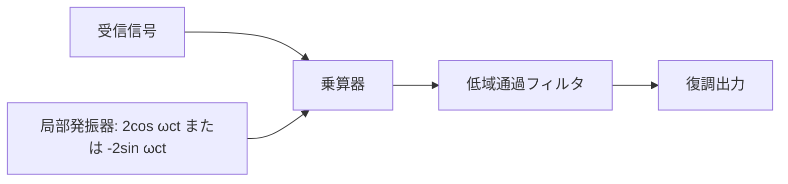

# 東京工業大学 工学院 情報通信系 2016年8月実施 S2 振幅変調と同期検波

## **Author**
祭音Myyura (co-authored with GPT 5.6 SOL)

## **Description**

$m(t)=V_m\cos\omega_mt$, $c(t)=V_c\cos\omega_ct$，$\omega_c\gg\omega_m$，変調指数 $m_a=V_m/V_c\in(0,1)$ とする。

1. AM 信号 $s(t)$ を求めよ。
2. $m_a=0.25$ の波形を，振幅の最大・最小が分かるように図示せよ。
3. 上側波帯 $u(t)$ と下側波帯 $l(t)$ を求めよ。
4. 受信側の側波帯が $\tilde u(t)=V_u\cos[(\omega_c+\omega_u)t]$, $\tilde l(t)=V_l\cos[(\omega_c-\omega_l)t]$ となったとき，同期検波により $V_u\cos\omega_ut+V_l\cos\omega_lt$ 成分を抽出せよ。
5. 同じ受信信号から $V_u\sin\omega_ut-V_l\sin\omega_lt$ 成分を抽出せよ。

### 题目描述

求单音 AM 的表达式、包络和上下边带，并用同相、正交本振及低通滤波提取指定分量。

## **Kai**

### 1)

$$
\boxed{s(t)=(V_c+V_m\cos\omega_mt)\cos\omega_ct}.
$$

### 2)

包絡線は $\pm V_c(1+0.25\cos\omega_mt)$。正の包絡線の最大値は $1.25V_c$，最小値は $0.75V_c$ となる。

### 3)

積和公式より

$$
s(t)=V_c\cos\omega_ct+\frac{V_m}{2}\cos[(\omega_c+\omega_m)t]+\frac{V_m}{2}\cos[(\omega_c-\omega_m)t].
$$

したがって $\boxed{u(t)=\frac{V_m}2\cos[(\omega_c+\omega_m)t]}$，$\boxed{l(t)=\frac{V_m}2\cos[(\omega_c-\omega_m)t]}$。

### 4)

受信信号に $2\cos\omega_ct$ を乗じ，$2\omega_c$ 付近の成分を低域通過フィルタで除く。搬送波による直流分も除けば

$$
\boxed{V_u\cos\omega_ut+V_l\cos\omega_lt}
$$

を得る。

### 5)

受信信号に $-2\sin\omega_ct$ を乗じ，低域通過フィルタを通す。

$$
\begin{aligned}
\operatorname{LPF}\{-2\sin\omega_ct\,\tilde u(t)\}&=V_u\sin\omega_ut,\\
\operatorname{LPF}\{-2\sin\omega_ct\,\tilde l(t)\}&=-V_l\sin\omega_lt.
\end{aligned}
$$

よって所望の差を得る。

