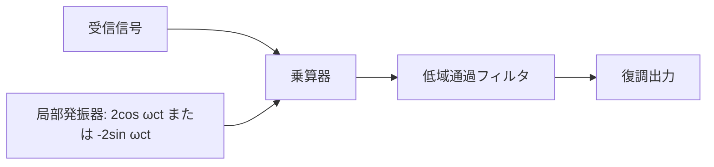

# 東京工業大学 工学院 情報通信系 2016年8月実施 S2 振幅変調と同期検波

## **Author**
祭音Myyura (co-authored with GPT 5.6 SOL)

## **Description**

S2. 変調信号 $m(t)$ が単一角周波数 $\omega_m$ の成分しか持たず，振幅 $V_m$（正の定数）を用いて

$$
m(t)=V_m\cos(\omega_mt)
$$

と与えられているとする。この信号を用いて，振幅 $V_c$，角周波数 $\omega_c$（ただし $\omega_c\gg\omega_m$）の搬送波

$$
c(t)=V_c\cos(\omega_ct)
$$

を振幅変調（AM）し，送信する。ただし，変調指数を

$$
m_a=\frac{V_m}{V_c},\qquad 0<m_a<1
$$

とする。以下の問に答えよ。

1. $c(t)$ を $m(t)$ で振幅変調した AM 信号 $s(t)$ を，$V_m,\omega_m,V_c,\omega_c$ を用いて表せ。
2. $m_a=0.25$ のときの $s(t)$ の概形を，横軸を時間 $t$，縦軸を $s(t)$ として，振幅の最大値及び最小値がわかるように図示せよ。
3. 問1の記号を用いて，$s(t)$ に含まれる USB（上側帯波，Upper Side Band）$u(t)$，および LSB（下側帯波，Lower Side Band）$l(t)$ をそれぞれ表せ。
4. 伝送路を通過した受信側の AM 信号 $\widetilde s(t)$ に含まれる USB $\widetilde u(t)$ および LSB $\widetilde l(t)$ が，それぞれ

   $$
   \widetilde u(t)=V_u\cos[(\omega_c+\omega_u)t],\qquad
   \widetilde l(t)=V_l\cos[(\omega_c-\omega_l)t]
   $$

   となったとする。ただし，$\omega_c\gg\omega_u$，$\omega_c\gg\omega_l$ とする。同期検波により，$\widetilde s(t)$ から信号

   $$
   V_u\cos(\omega_ut)+V_l\cos(\omega_lt)
   $$

   に比例する成分を抽出する手順を，数式を用いながら示せ。
5. 同期検波により，問4の $\widetilde s(t)$ から信号

   $$
   V_u\sin(\omega_ut)-V_l\sin(\omega_lt)
   $$

   に比例する成分を抽出する手順を，数式を用いながら示せ。

### 题目描述

调制信号 $m(t)=V_m\cos(\omega_mt)$ 仅含单一角频率 $\omega_m$，其中 $V_m$ 是正常数。用它对幅度为 $V_c$、角频率为 $\omega_c$ 的载波 $c(t)=V_c\cos(\omega_ct)$ 进行幅度调制（AM）并发送，其中 $\omega_c\gg\omega_m$。定义调制指数 $m_a=V_m/V_c$，且 $0<m_a<1$。

1. 用 $V_m,\omega_m,V_c,\omega_c$ 表示以 $m(t)$ 调制 $c(t)$ 得到的 AM 信号 $s(t)$。
2. 在 $m_a=0.25$ 时，以时间 $t$ 为横轴、$s(t)$ 为纵轴画出波形概略图，明确标出振幅的最大值与最小值。
3. 用第1问的符号分别表示 $s(t)$ 中的上边带（USB）$u(t)$ 和下边带（LSB）$l(t)$。
4. 经过传输信道后，接收端 AM 信号 $\widetilde s(t)$ 的两个边带变为

   $$
   \widetilde u(t)=V_u\cos[(\omega_c+\omega_u)t],\qquad
   \widetilde l(t)=V_l\cos[(\omega_c-\omega_l)t],
   $$

   其中 $\omega_c\gg\omega_u$、$\omega_c\gg\omega_l$。用公式说明如何通过同步检波，从 $\widetilde s(t)$ 中提取与 $V_u\cos(\omega_ut)+V_l\cos(\omega_lt)$ 成比例的分量。
5. 用公式说明如何通过同步检波，从同一接收信号中提取与 $V_u\sin(\omega_ut)-V_l\sin(\omega_lt)$ 成比例的分量。

## **Kai**

### 1)

$$
\boxed{s(t)=(V_c+V_m\cos\omega_mt)\cos\omega_ct}.
$$

### 2)

包絡線は $\pm V_c(1+0.25\cos\omega_mt)$。正の包絡線の最大値は $1.25V_c$，最小値は $0.75V_c$ となる。

### 3)

積和公式より

$$
s(t)=V_c\cos\omega_ct+\frac{V_m}{2}\cos[(\omega_c+\omega_m)t]+\frac{V_m}{2}\cos[(\omega_c-\omega_m)t].
$$

したがって $\boxed{u(t)=\frac{V_m}2\cos[(\omega_c+\omega_m)t]}$，$\boxed{l(t)=\frac{V_m}2\cos[(\omega_c-\omega_m)t]}$。

### 4)

受信信号に $2\cos\omega_ct$ を乗じ，$2\omega_c$ 付近の成分を低域通過フィルタで除く。搬送波による直流分も除けば

$$
\boxed{V_u\cos\omega_ut+V_l\cos\omega_lt}
$$

を得る。

### 5)

受信信号に $-2\sin\omega_ct$ を乗じ，低域通過フィルタを通す。

$$
\begin{aligned}
\operatorname{LPF}\{-2\sin\omega_ct\,\tilde u(t)\}&=V_u\sin\omega_ut,\\
\operatorname{LPF}\{-2\sin\omega_ct\,\tilde l(t)\}&=-V_l\sin\omega_lt.
\end{aligned}
$$

よって所望の差を得る。

