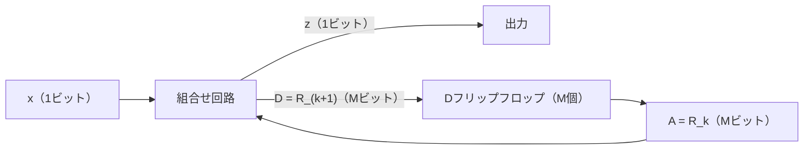

# 東京工業大学 工学院 情報通信系 2016年8月実施 S4 逐次除算器と状態遷移

## **Author**
祭音Myyura (co-authored with GPT 5.6 SOL)

## **Description**

S4. 非負整数を最上位ビットから1ビットずつ入力し，整数定数 $N\ge2$ で割った商を最上位ビットから1ビットずつ出力する順序回路を考える。時刻 $k\ge0$ の入力と出力を $x^{(k)},z^{(k)}$ とし，時刻0から $k$ までの入力列と出力列が表す整数を $X_k,Z_k=\lfloor X_k/N\rfloor$ とする。

$$
\begin{aligned}
X_0&=x^{(0)},&X_k&=2X_{k-1}+x^{(k)},\\
Z_0&=z^{(0)},&Z_k&=2Z_{k-1}+z^{(k)}.
\end{aligned}
$$

余りを $R_{k+1}=X_k\bmod N$ とすると，$R_0=0$，$R_{k+1}=(2R_k+x^{(k)})\bmod N$ である。図 S4.1 の回路は，出力 $z$ と $M$ ビット出力 $D$ の組合せ回路，および $M$ 個の D フリップフロップからなる。現状態 $A=R_k$ と入力 $x$ から次状態 $D=R_{k+1}$ と出力 $z$ を求める。

図 S4.2 の組合せ回路の動作は

$$
B=2A+x,\qquad
z=\begin{cases}1&(B\ge N),\\0&(B<N),\end{cases}\qquad
D=\begin{cases}B-N&(B\ge N),\\B&(B<N).\end{cases}
$$

である。$0\le A,D\le N-1$，$0\le B\le2N-1$ が成り立つ。否定を $\overline x$，論理積を $x\cdot y$，論理和を $x\vee y$ とする。論理式は最小数の AND 項からなる NOT–AND–OR 形式（積項の和形式）で答えよ。

1. $N=5$，入力列 $1011001$（$X_6=89$）に対する動作の一部を表 S4.1 に示す。

   | 時刻 $k$ | 0 | 1 | 2 | 3 | 4 | 5 | 6 |
   |---|---|---|---|---|---|---|---|
   | 入力 $x$ | 1 | 0 | 1 | 1 | 0 | 0 | 1 |
   | 現状態の余り $A=R_k$ | 0 | | | | | | |
   | $B=2A+x$ | 1 | | | | | | |
   | 出力 $z$ | 0 | | | | | | |
   | 次状態の余り $D=R_{k+1}$ | 1 | | | | | | |

   a) 表を完成せよ。\
   b) $Z_6$ と $R_7$ を求めよ。
2. $N=3$ では $0\le A\le2$，$0\le B\le5$ である。$A=(a_1a_0)_2$，$B=(b_2b_1b_0)_2$ として，$a_1,a_0,x$ を用いた論理式で $b_2,b_1,b_0$ をそれぞれ表せ。
3. $N=3$ のとき，$C=B-3$ を2の補数表現で出力する回路を考える。$0\le B\le5$，$-3\le C\le2$ なので，$B=(b_2b_1b_0)_2$，$C=(c_2c_1c_0)_2$ とする。表 S4.2 の範囲外の入力6と7では，出力はドントケア（$*$）である。

   | $B$ | $b_2b_1b_0$ | $C=B-3$ | $c_2c_1c_0$ |
   |---:|:---:|---:|:---:|
   | 0 | 000 | -3 | 101 |
   | 1 | 001 | -2 | 110 |
   | 2 | 010 | -1 | 111 |
   | 3 | 011 | 0 | 000 |
   | 4 | 100 | 1 | 001 |
   | 5 | 101 | 2 | 010 |
   | 6 | 110 | $*$ | $***$ |
   | 7 | 111 | $*$ | $***$ |

   a) $b_2,b_1,b_0$ を用いた論理式で $c_2,c_1,c_0$ をそれぞれ表せ。\
   b) 次式で $z,D$ を求める。

   $$
   z=\begin{cases}1&(C\ge0),\\0&(C<0),\end{cases}\qquad
   D=\begin{cases}C'&(C\ge0),\\B'&(C<0).\end{cases}
   $$

   ただし $D=(d_1d_0)_2$，$C'=(c_1c_0)_2$，$B'=(b_1b_0)_2$ とする。次の（ア）～（オ）に入る論理式を示せ。

   $$
   \begin{aligned}
   z&=\boxed{\text{ア}},\\
   d_1&=b_1\cdot\boxed{\text{イ}}\vee c_1\cdot\boxed{\text{ウ}},\\
   d_0&=b_0\cdot\boxed{\text{エ}}\vee c_0\cdot\boxed{\text{オ}}.
   \end{aligned}
   $$

4. 余り $R_k=0,1,\ldots,N-1$ に状態 $Q_0,Q_1,\ldots,Q_{N-1}$ を対応させ，現状態 $q$ と入力 $x$ に対する次状態 $q_n$ と出力 $z$ を考える。$N=3$ の例を表 S4.3 に示す。

   | 現状態 $q$ | $q_n$（$x=0$） | $q_n$（$x=1$） | $z$（$x=0$） | $z$（$x=1$） |
   |---|---|---|---:|---:|
   | $Q_0$ | $Q_0$ | $Q_1$ | 0 | 0 |
   | $Q_1$ | $Q_2$ | $Q_0$ | 0 | 1 |
   | $Q_2$ | $Q_1$ | $Q_2$ | 1 | 1 |

   例えば $q=Q_1$ は $A=1$ を表し，$x=0$ なら $B=2,z=0,q_n=Q_2$，$x=1$ なら $B=3,z=1,q_n=Q_0$ となる。

   a) $N=5$ の状態遷移表を，表 S4.3 の例にならって示せ。\
   b) $N=5$ で現状態を $q=(a_2a_1a_0)$，次状態を $q_n=(d_2d_1d_0)$ とする。表 S4.4 の状態割当て

   | 状態 | $a_2a_1a_0$ |
   |---|:---:|
   | $Q_0$ | 000 |
   | $Q_1$ | 001 |
   | $Q_2$ | 011 |
   | $Q_3$ | 010 |
   | $Q_4$ | 100 |

   を用い，$a_2,a_1,a_0,x$ を用いた論理式で $d_2,d_1,d_0,z$ をそれぞれ表せ。

### 题目描述

考虑一个时序电路：从最高位开始逐位输入非负整数，同时从最高位开始逐位输出该整数除以常数 $N\ge2$ 的商。时刻 $k\ge0$ 的输入和输出分别为 $x^{(k)}$、$z^{(k)}$。截至该时刻的输入整数为 $X_k$，输出整数为 $Z_k=\lfloor X_k/N\rfloor$，满足上面的 $X_k,Z_k$ 递推。令 $R_{k+1}=X_k\bmod N$，初值 $R_0=0$，则 $R_{k+1}=(2R_k+x^{(k)})\bmod N$。

图 S4.1 的电路由组合电路和 $M$ 个 D 触发器组成；现状态 $A=R_k$、输入 $x$ 经组合电路产生输出 $z$ 和下一状态 $D=R_{k+1}$。图 S4.2 给出的规则为 $B=2A+x$：若 $B\ge N$，则 $z=1,D=B-N$；否则 $z=0,D=B$。因此 $0\le A,D\le N-1$、$0\le B\le2N-1$。以下所有逻辑表达式都要写成 AND 项数最少的 NOT–AND–OR（积之和）形式。图、表及填空式沿用上面的编号。

1. 在 $N=5$、输入为 $1011001$（$X_6=89$）时：\
   a) 补全表 S4.1 的 $A,B,z,D$ 各项。\
   b) 求最终的商 $Z_6$ 和余数 $R_7$。
2. 在 $N=3$ 时，以两位 $A=(a_1a_0)_2$ 和三位 $B=(b_2b_1b_0)_2$ 表示数值，用 $a_1,a_0,x$ 分别写出 $b_2,b_1,b_0$。
3. 在 $N=3$ 时，将 $C=B-3$ 用三位二进制补码表示。有效输入为 $0\le B\le5$，对应 $-3\le C\le2$；表 S4.2 中输入6、7的输出作为无关项。\
   a) 用 $b_2,b_1,b_0$ 分别写出 $c_2,c_1,c_0$ 的最简积之和表达式。\
   b) 当 $C\ge0$ 时取 $z=1,D=C'$，否则取 $z=0,D=B'$，其中 $C'=(c_1c_0)_2$、$B'=(b_1b_0)_2$、$D=(d_1d_0)_2$。填写上面 $z,d_1,d_0$ 表达式中的（ア）～（オ）。
4. 将余数 $0,\ldots,N-1$ 分别对应到状态 $Q_0,\ldots,Q_{N-1}$。表 S4.3 给出除以3的状态转移示例。\
   a) 仿照该表写出 $N=5$ 时的状态转移表。\
   b) 采用表 S4.4 的编码 $Q_0=000,Q_1=001,Q_2=011,Q_3=010,Q_4=100$，以 $q=(a_2a_1a_0)$ 表示现状态、$q_n=(d_2d_1d_0)$ 表示下一状态，用 $a_2,a_1,a_0,x$ 分别写出 $d_2,d_1,d_0,z$。

## **Kai**

### 1)

| $k$ | 0 | 1 | 2 | 3 | 4 | 5 | 6 |
|---|---:|---:|---:|---:|---:|---:|---:|
| $x$ | 1 | 0 | 1 | 1 | 0 | 0 | 1 |
| $A$ | 0 | 1 | 2 | 0 | 1 | 2 | 4 |
| $B$ | 1 | 2 | 5 | 1 | 2 | 4 | 9 |
| $z$ | 0 | 0 | 1 | 0 | 0 | 0 | 1 |
| $D$ | 1 | 2 | 0 | 1 | 2 | 4 | 4 |

$89=5\cdot17+4$ なので $\boxed{Z_6=(0010001)_2=17,\ R_7=4}$。

### 2)

$B=2A+x$ は左シフトして $x$ を付ける操作なので

$$
\boxed{b_2=a_1,\quad b_1=a_0,\quad b_0=x}.
$$

### 3)a)

$B=0,1,2,3,4,5$ に対して $C$ は順に $101,110,111,000,001,010$。未使用入力を用いて簡単化すると

$$
\boxed{\begin{aligned}
c_2&=\bar b_2\bar b_0\vee\bar b_2\bar b_1,\\
c_1&=b_0\bar b_1\vee\bar b_0b_1,\\
c_0&=\bar b_0.
\end{aligned}}
$$

### 3)b)

符号ビットが $c_2$ だから

$$
\boxed{z=\bar c_2,\quad d_1=b_1c_2\vee c_1\bar c_2,\quad d_0=b_0c_2\vee c_0\bar c_2}.
$$

空欄（ア）～（オ）は $\bar c_2,c_2,\bar c_2,c_2,\bar c_2$。

### 4)a)

| 現状態 | $x=0$ の次状態 | $x=1$ の次状態 | $x=0$ の出力 | $x=1$ の出力 |
|---|---|---|---:|---:|
| $Q_0$ | $Q_0$ | $Q_1$ | 0 | 0 |
| $Q_1$ | $Q_2$ | $Q_3$ | 0 | 0 |
| $Q_2$ | $Q_4$ | $Q_0$ | 0 | 1 |
| $Q_3$ | $Q_1$ | $Q_2$ | 1 | 1 |
| $Q_4$ | $Q_3$ | $Q_4$ | 1 | 1 |

### 4)b)

未使用符号 $101,110,111$ を don't care とすると

$$
\boxed{\begin{aligned}
d_2&=a_2x\vee a_0a_1\bar x,\\
d_1&=a_0\bar a_1\vee a_2\bar x\vee\bar a_0a_1x,\\
d_0&=\bar a_0a_1\vee a_0\bar a_1\bar x\vee\bar a_0\bar a_2x,\\
z&=a_2\vee a_1x\vee\bar a_0a_1.
\end{aligned}}
$$
