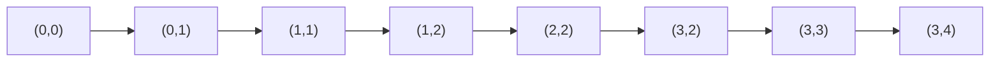

# 東京工業大学 工学院 情報通信系 2016年8月実施 S5 格子経路の動的計画法

## **Author**
祭音Myyura (co-authored with GPT 5.6 SOL)

## **Description**

S5. 縦幅が $m$，横幅が $n$ である2次元正方格子を考える。隣り合う点は互いに1離れている。左上の原点 $(0,0)$ から格子上を通り右下の終点 $(m,n)$ に至る単調な経路を考える。単調な経路とは，どこでも終点までの距離が減少する経路である。例えば $m=2,n=3$ のとき，

$$
(0,0)\to(1,0)\to(1,1)\to(1,2)\to(1,3)\to(2,3)
$$

は単調経路だが，

$$
(0,0)\to(1,0)\to(1,1)\to(0,1)\to(0,2)\to(0,3)\to(1,3)\to(2,3)
$$

は単調経路ではない。各格子点 $(i,j)$ には非負の得点 $R(i,j)$ が与えられ，$R(0,0)=R(m,n)=0$ とする。必要な配列は用意されており，$\max(x,y)$ は $x,y$ の大きい方を返す。疑似コードでは $R(i,j)$ を R[i][j] と書く。

1. 各単調経路の得点を，経路が通るすべての点の得点の合計とする。次の疑似コードは $(0,0)$ から $(m,n)$ までの得点の最大値 max_score を求める。

   ```c
   f[0][0] = 0;
   for (i=1; i<=m; i++) { f[i][0] = f[i-1][0] + R[i][0]; }
   for (j=1; j<=n; j++) { f[0][j] = f[0][j-1] + R[0][j]; }
   for (i=1; i<=m; i++) {
       for (j=1; j<=n; j++) {
           f[i][j] = max(f[i][j-1] + R[i][j], f[i-1][j] + R[i][j]);
       }
   }
   max_score = f[m][n];
   ```

   a) $m=3,n=4$ とし，各点の得点が次の行列で与えられるとする（行が $i$，列が $j$）。

   $$
   R=\begin{pmatrix}
   0&1&1&2&3\\
   1&2&3&2&1\\
   2&1&2&1&1\\
   3&1&2&1&0
   \end{pmatrix}.
   $$

   アルゴリズムを適用して各 f[i][j] を求め，次の（ア）～（カ）を埋めよ。（カ）は最終出力でもある。

   $$
   f=\begin{pmatrix}
   0&1&2&4&7\\
   1&3&6&\boxed{\text{ア}}&\boxed{\text{イ}}\\
   3&4&8&\boxed{\text{ウ}}&\boxed{\text{エ}}\\
   6&7&10&\boxed{\text{オ}}&\boxed{\text{カ}}
   \end{pmatrix}.
   $$

   b) 問1aの得点に対し，得点が最大となる単調経路を一つ答えよ。
2. 各単調経路の得点を，経路の方向が変わる点だけの得点の合計に変更する。問1aの例では，

   $$
   (0,0)\to(1,0)\to(1,1)\to(1,2)\to(1,3)\to(1,4)\to(2,4)\to(3,4)
   $$

   の得点は $R(1,0)+R(1,4)=1+1=2$ である。次の二つの考え方で最大値 max_score を求める。端点の得点は0なので，その点を足すか否かに注意する必要はない。

   a) f_right[i][j] は $(i,j)$ の次に右へ進むと仮定したときの，$(0,0)$ から $(i,j)$ までの最大得点，f_down[i][j] は次に下へ進むと仮定したときの最大得点を表す。（キ）（ク）に入る式を答えよ。（ク）は最終出力である。

   ```c
   f_right[0][0] = 0; f_down[0][0] = 0;
   for (i=1; i<=m; i++) { f_right[i][0] = R[i][0]; f_down[i][0] = 0; }
   for (j=1; j<=n; j++) { f_right[0][j] = 0; f_down[0][j] = R[0][j]; }
   for (i=1; i<=m; i++) {
       for (j=1; j<=n; j++) {
           f_right[i][j] = max(f_right[i][j-1], f_down[i-1][j] + R[i][j]);
           f_down[i][j] = /* キ */;
       }
   }
   max_score = /* ク */;
   ```

   b) f_left[i][j] は左から $(i,j)$ に到達すると仮定したときの最大得点を表す。ただし到着点 $(i,j)$ の得点は，加算すべきか未定なのでまだ加えない。f_up[i][j] は上から到達すると仮定したときの最大得点で，同様に $R(i,j)$ は未加算である。（ケ）（コ）（サ）に入る式を答えよ。（サ）は最終出力である。

   ```c
   f_left[0][0] = 0; f_up[0][0] = 0;
   for (i=1; i<=m; i++) { f_left[i][0] = 0; f_up[i][0] = 0; }
   for (j=1; j<=n; j++) { f_left[0][j] = 0; f_up[0][j] = 0; }
   for (i=1; i<=m; i++) {
       for (j=1; j<=n; j++) {
           f_left[i][j] = /* ケ */;
           f_up[i][j] = /* コ */;
       }
   }
   max_score = /* サ */;
   ```

### 题目描述

在相邻格点间距为1的二维方格中，考虑从左上角 $(0,0)$ 到右下角 $(m,n)$ 的单调路径，即每步仅向下或向右移动，使到终点的距离不断减小。上面的两个路径分别给出单调与非单调示例。每个格点有非负得分 $R(i,j)$，且 $R(0,0)=R(m,n)=0$。所需数组均已准备好，max(x,y) 返回较大值，代码中的 R[i][j] 表示 $R(i,j)$。以下各问使用上面的完整数据表和伪代码。

1. 路径得分为经过的所有格点得分之和。第一段伪代码用边界累加和与递推式计算最大值。\
   a) 对给出的 $m=3,n=4$ 的完整 $R$ 矩阵，实际执行算法，填写 $f$ 表中的（ア）～（カ），其中（カ）也是最终输出。\
   b) 给出一条取得最大得分的单调路径。
2. 将得分改为仅累加路径改变方向处的格点得分。例如上面的示例路径只在 $(1,0)$、$(1,4)$ 转弯，得分为 $1+1=2$。仍求从起点到终点的最大得分；由于端点得分为0，无须区分是否计入端点。\
   a) f_right[i][j] 表示假定下一步向右时，到达 $(i,j)$ 的最大得分；f_down[i][j] 表示假定下一步向下时的最大得分。按第二段伪代码所给的边界初始化和 f_right 更新式，填写（キ）（ク），后者为最终输出。\
   b) f_left[i][j]、f_up[i][j] 分别表示假定从左边、上边到达 $(i,j)$ 时的最大得分。由于尚未确定到达后是否转弯，两者均不包含到达点的 $R(i,j)$。按第三段伪代码的初始化填写两个更新式（ケ）（コ）以及最终输出（サ）。

## **Kai**

### 1)a)

$$
f=\begin{pmatrix}0&1&2&4&7\\1&3&6&8&9\\3&4&8&9&10\\6&7&10&11&11\end{pmatrix}.
$$

したがって（ア）～（カ）は $\boxed{8,9,9,10,11,11}$。

### 1)b)

最大得点は $11$。例えば次の経路が得られる。



### 2)a)

下向きに出るとき，上から来れば直進，左から来れば曲がる。よって

```text
(キ) max(f_down[i-1][j], f_right[i][j-1] + R[i][j])
(ク) max(f_right[m][n], f_down[m][n])
```

右向きの場合も同様であり，$R(m,n)=0$ なので終点で方向を仮定しても得点は変わらない。

### 2)b)

到着点 $(i,j)$ の得点はまだ加えず，一つ前の点で曲がった場合のみその点の得点を加える。

```text
(ケ) max(f_left[i][j-1], f_up[i][j-1] + R[i][j-1])
(コ) max(f_up[i-1][j], f_left[i-1][j] + R[i-1][j])
(サ) max(f_left[m][n], f_up[m][n])
```

どちらの方法も最後の進行方向ごとに最適な部分経路を保持するため正しい。時間・記憶量はともに $O(mn)$（前行のみ保持すれば記憶量は $O(n)$）。
