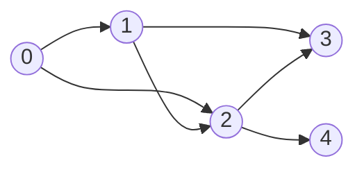

# 東京工業大学 工学院 情報通信系 2017年8月実施 S5 DAG上の最適行動選択

## **Author**
祭音Myyura (co-authored with GPT 5.6 SOL)

## **Description**

ゲームの場面を節点，遷移を有向枝とする有向非巡回グラフを考える。各節点で行動を一つ選ぶと，各枝の非負の遷移スコアが定まる。有向路のスコアは枝スコアの積，節点 $A$ から $B$ へのスコアは全有向路のスコアの和とする。行動選択配列 $p$ の第 $i$ 要素は節点 $i$ の行動番号。



| 節点 | 行動 | 各行先への遷移スコア |
|---:|---:|---|
| 0 | 0 | $1:0.8,\ 2:0.2$ |
| 0 | 1 | $1:0.3,\ 2:0.7$ |
| 1 | 0 | $2:0.6,\ 3:0.4$ |
| 1 | 1 | $2:0.1,\ 3:0.9$ |
| 1 | 2 | $2:0.8,\ 3:0.2$ |
| 2 | 0 | $3:0.7,\ 4:0.3$ |

1. 節点0から3への全有向路を列挙せよ。
2. a) $p=[0,2,0,0,0]$ のとき路 $\langle1,2,3\rangle$ のスコアを求めよ。
   b) $p=[0,0,0,0,0]$ と $p=[1,1,0,0,0]$ の0から3へのスコアを求め，比較せよ。
   c) $p=[0,0,0,0,0]$ のとき1から3へのスコアを $x_1$，2から3へのスコアを $x_2$ とし，0から3へのスコアを表せ。
   d) 任意の節点 $C,G$ についてスコアを最大にする行動配列をメモ化再帰で求める。`numArcs(s)` は出次数，`nextNode(s,i)` は第 $i$ 枝の行先，`numActions(s)` は行動数，`arcScore(s,a,i)` は枝スコア。下記の空欄を埋めよ。`visited` と `policy` は0初期化済みとする。

```c
float optPolicy(int curPos, int goal) {
    int i, a, opt;
    float acc, max;
    if (visited[curPos] == 1) return maxScore[curPos];
    if (curPos == /* ア */) {
        policy[curPos] = 0; maxScore[curPos] = 1.0;
        visited[curPos] = 1; return 1.0;
    }
    for (i = 0; i < numArcs(curPos); i++) {
        if (visited[curPos] == 0) { /* イ */; }
    }
    opt = 0; max = 0.0;
    for (a = 0; a < numActions(curPos); a++) {
        acc = 0.0;
        for (i = 0; i < numArcs(curPos); i++)
            acc = acc + /* ウ */ * maxScore[/* エ */];
        if (max < acc) { /* オ */; opt = a; }
    }
    policy[curPos] = opt; maxScore[curPos] = max;
    visited[curPos] = 1; return max;
}
```

### 题目描述

对 DAG 上的带权路径积求和，比较不同策略，并完成求目标到达分数最大值的记忆化动态规划。

## **Kai**

### 1)

$$
\boxed{\langle0,1,3\rangle,\quad\langle0,2,3\rangle,\quad\langle0,1,2,3\rangle}.
$$

### 2)a)

節点1の行動2では $1\to2$ のスコアが $0.8$ なので，$\boxed{0.8\cdot0.7=0.56}$。

### 2)b)

$p=[0,0,0,0,0]$ では

$$
0.8\cdot0.4+0.2\cdot0.7+0.8\cdot0.6\cdot0.7=\boxed{0.796}.
$$

$p=[1,1,0,0,0]$ では

$$
0.3\cdot0.9+0.7\cdot0.7+0.3\cdot0.1\cdot0.7=\boxed{0.781}.
$$

よって前者の方が大きい。

### 2)c)

最初の枝で場合分けすれば $\boxed{0.8x_1+0.2x_2}$。

### 2)d)

| 空欄 | 式 |
|---|---|
| ア | `goal` |
| イ | `optPolicy(nextNode(curPos, i), goal)` |
| ウ | `arcScore(curPos, a, i)` |
| エ | `nextNode(curPos, i)` |
| オ | `max = acc` |

目標への最大スコア $V(s)$ は

$$
V(G)=1,\qquad
V(s)=\max_a\sum_i\operatorname{arcScore}(s,a,i)V(\operatorname{nextNode}(s,i))
$$

を満たす。DAG なので後続節点の値を先に確定でき，非負の係数のため後続節点で最適な行動を用いればよい。到達不能なら値は0，行動は初期値0のままとなる。
