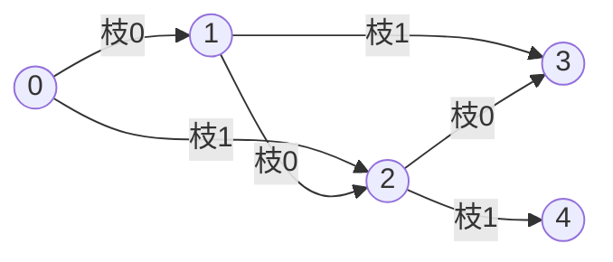

# 東京工業大学 工学院 情報通信系 2017年8月実施 S5 DAG上の最適行動選択

## **Author**
祭音Myyura (co-authored with GPT 5.6 SOL)

## **Description**

S5. プレーヤが行動を選択することで場面が変化するゲームを有向グラフで表す。節点は場面，有向枝は行動によって引き起こされる場面の遷移を表す。各節点には行動の選択肢が節点毎の行動番号として一つ以上割り当てられ，任意の2節点間の同じ向きの有向枝は高々1本である。有向枝に沿って移る節点列を有向路と呼ぶ。図 S5.1 で0から2を経て4に至る路は $\langle0,2,4\rangle$ であり，0から4への路はこれと $\langle0,1,2,4\rangle$ の2本である。行動を選択しても遷移先は一意には決まらず，各枝の非負の遷移スコアが行動に依存して定まる。スコアが大きいほど遷移しやすい。行動選択配列 $p$ の第 $i$ 要素（添字は0から）は節点 $i$ の行動番号を表す。有向路のスコアは枝スコアの積，節点 $A$ から $B$ へのスコアは全有向路のスコアの和とする。



| 節点 | 行動 | 各行先への遷移スコア |
|---:|---:|---|
| 0 | 0 | $1:0.8,\ 2:0.2$ |
| 0 | 1 | $1:0.3,\ 2:0.7$ |
| 1 | 0 | $2:0.6,\ 3:0.4$ |
| 1 | 1 | $2:0.1,\ 3:0.9$ |
| 1 | 2 | $2:0.8,\ 3:0.2$ |
| 2 | 0 | $3:0.7,\ 4:0.3$ |

図 S5.1 の節点0，1，2，3，4で選べる行動は，それぞれ $\{0,1\},\{0,1,2\},\{0\},\{0\},\{0\}$ である。

1. 節点0から3への全有向路を列挙せよ。
2. a) $p=[0,2,0,0,0]$ は節点1で行動2，他の全節点で行動0を選ぶことを表す。このとき，路 $\langle0,2,4\rangle$ のスコアは $0.2\times0.3=0.06$ である。$p=[0,2,0,0,0]$ のとき路 $\langle1,2,3\rangle$ のスコアを求めよ。
   b) $p=[0,0,0,0,0]$ と $p=[1,1,0,0,0]$ の1から3へのスコアを求め，比較せよ。
   c) $p=[0,0,0,0,0]$ のとき1から3へのスコアを $x_1$，2から3へのスコアを $x_2$ とし，0から3へのスコアを表せ。
   d) 任意の節点 $C,G$ についてスコアを最大にする行動配列をメモ化再帰で求める。`numArcs(s)` は出次数，`nextNode(s,i)` は第 $i$ 枝の行先，`numActions(s)` は行動数，`arcScore(s,a,i)` は枝スコア。下記の空欄を埋めよ。`visited` と `policy` は0初期化済みとする。

   $C$ から $G$ への最適行動配列 $p^*$ は，$C$ から $G$ への有向路上の任意の節点 $M$ から $G$ への最適行動配列でもある。この性質を用いて optPolicy(C,G) により policy に最適配列を求める。任意の節点から有向枝をたどってその節点へ戻ることはないとし，補助関数の実装は与えられている。節点数を $N$ とする。$C$ から $G$ への経路がない場合，便宜的に全節点で行動0を選ぶ。最適配列が複数ある場合はその一つを求めればよい。

```c
int numArcs(int s);
int nextNode(int s, int i);
int numActions(int s);
float arcScore(int s, int a, int i);
int policy[N] = {0};
int visited[N] = {0};
float maxScore[N];

float optPolicy(int curPos, int goal) {
    int i, a, opt;
    float acc, max;
    if (visited[curPos] == 1) return maxScore[curPos];
    if (curPos == /* ア */) {
        policy[curPos] = 0; maxScore[curPos] = 1.0;
        visited[curPos] = 1; return 1.0;
    }
    for (i = 0; i < numArcs(curPos); i++) {
        if (visited[curPos] == 0) { /* イ */; }
    }
    opt = 0; max = 0.0;
    for (a = 0; a < numActions(curPos); a++) {
        acc = 0.0;
        for (i = 0; i < numArcs(curPos); i++)
            acc = acc + /* ウ */ * maxScore[/* エ */];
        if (max < acc) { /* オ */; opt = a; }
    }
    policy[curPos] = opt; maxScore[curPos] = max;
    visited[curPos] = 1; return max;
}
```

### 题目描述

考虑玩家选择行动后场面发生变化的游戏。用有向图表示游戏模型：节点表示场面，有向边表示行动可能引起的转移。每个节点至少有一个以非负整数编号的可选行动；任意两节点之间至多有一条同方向边。沿边从节点 $A$ 到 $B$ 的节点序列称为有向路径。例如图 S5.1 中从0经2到4的路径是 $\langle0,2,4\rangle$，从0到4的两条路径是 $\langle0,2,4\rangle$、$\langle0,1,2,4\rangle$。即使选择了行动，也不一定唯一决定下一个节点；每条边都有依赖行动的非负转移分数，分数越大表示越容易转移。图、边编号和分数表见上方。

1. 列出图 S5.1 中从节点0到节点3的全部有向路径。
2. 行动选择数组 $p$ 的第 $i$ 个元素（从0计数）指定节点 $i$ 的行动。例如 $[0,2,0,0,0]$ 分别在节点0、1、2选择行动0、2、0，节点3、4均选择行动0。给定 $p$ 后，一条路径的分数是各边分数的乘积；从 $A$ 到 $B$ 的分数是两点间所有有向路径分数之和。小问 a～c 使用图 S5.1，d 使用任意游戏模型。

   a) 令 $p=[0,2,0,0,0]$，求路径 $\langle1,2,3\rangle$ 的分数。例如同一策略下 $\langle0,2,4\rangle$ 的分数为 $0.2\times0.3=0.06$。\
   b) 分别取 $p=[0,0,0,0,0]$、$p=[1,1,0,0,0]$，求从节点1到节点3的分数，并指出哪个较大。\
   c) 令 $p=[0,0,0,0,0]$，从1到3、从2到3的分数分别为 $x_1,x_2$。用 $x_1,x_2$ 表示从0到3的分数。\
   d) 对任意节点 $C,G$，称使从 $C$ 到 $G$ 的分数最大的行动数组为最优数组；存在多个时取任意一个。若 $p^*$ 是该最优数组，而 $M$ 是从 $C$ 到 $G$ 的某条路径上的节点，则 $p^*$ 也是从 $M$ 到 $G$ 的最优数组。利用这一性质补全图 S5.2 的（ア）～（オ），使调用 optPolicy(C,G) 后 policy 保存最优数组。假定图无有向环，各辅助函数均已实现可调用。节点总数为 $N$；若 $C$ 到 $G$ 没有路径，约定所有节点都选行动0。

   numArcs(s) 返回节点 $s$ 的出度；nextNode(s,i) 返回从 $s$ 出发的第 $i$ 条边（从0计数）的终点编号；numActions(s) 返回可选行动数；arcScore(s,a,i) 返回在 $s$ 选行动 $a$ 时第 $i$ 条出边的分数。policy 与 visited 的全部元素初始为0，maxScore 保存从各节点到目标的最优分数；完整函数与数组声明见上面的代码。

## **Kai**

### 1)

$$
\boxed{\langle0,1,3\rangle,\quad\langle0,2,3\rangle,\quad\langle0,1,2,3\rangle}.
$$

### 2)a)

節点1の行動2では $1\to2$ のスコアが $0.8$ なので，$\boxed{0.8\cdot0.7=0.56}$。

### 2)b)

$p=[0,0,0,0,0]$ では

$$
0.4+0.6\cdot0.7=\boxed{0.82}.
$$

$p=[1,1,0,0,0]$ では

$$
0.9+0.1\cdot0.7=\boxed{0.97}.
$$

よって後者の方が大きい。

### 2)c)

最初の枝で場合分けすれば $\boxed{0.8x_1+0.2x_2}$。

### 2)d)

| 空欄 | 式 |
|---|---|
| ア | `goal` |
| イ | `optPolicy(nextNode(curPos, i), goal)` |
| ウ | `arcScore(curPos, a, i)` |
| エ | `nextNode(curPos, i)` |
| オ | `max = acc` |

目標への最大スコア $V(s)$ は

$$
V(G)=1,\qquad
V(s)=\max_a\sum_i\operatorname{arcScore}(s,a,i)V(\operatorname{nextNode}(s,i))
$$

を満たす。DAG なので後続節点の値を先に確定でき，非負の係数のため後続節点で最適な行動を用いればよい。到達不能なら値は0，行動は初期値0のままとなる。
