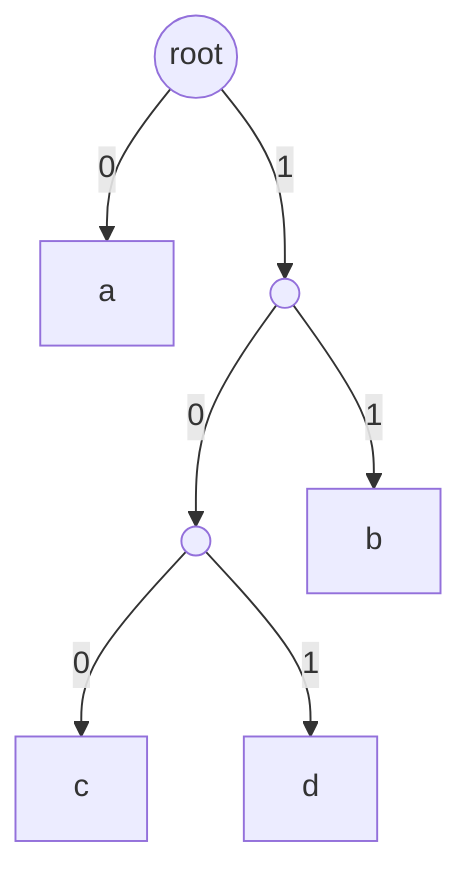

# 東京工業大学 工学院 情報通信系 2018年8月実施 S2 二元符号とHuffman符号の最適性

## **Author**
祭音Myyura (co-authored with GPT 5.6 SOL)

## **Description**

S2. 二元符号に関する以下の問に答えよ。

1. 情報源アルファベットが $M=\{a,b,c,d\}$ で，生起確率が

   $$
   P_X(a)=\frac12,\quad P_X(b)=\frac16,\quad
   P_X(c)=\frac29,\quad P_X(d)=\frac19
   $$

   である情報源 $X$ を二元符号で符号化する。

   | 記号 | 符号 $C$ | 符号 $C'$ |
   |---|---|---|
   | $a$ | 00 | 0 |
   | $b$ | 01 | 11 |
   | $c$ | 10 | 100 |
   | $d$ | 11 | 101 |

   a) $C,C'$ を表 S2.1 の符号とする。図 S2.1 に示す $C$ の符号木を参考に，$C'$ の符号木を描け。

   ```mermaid
   flowchart LR
     R(( )) -->|0| N0(( ))
     R -->|1| N1(( ))
     N0 -->|0| A["a"]
     N0 -->|1| B["b"]
     N1 -->|0| C["c"]
     N1 -->|1| D["d"]
   ```

   b) $C$ の平均符号長 $L(C)$ と $C'$ の平均符号長 $L(C')$ を求めよ。\
   c) 情報源 $X$ のハフマン符号の一例とその平均符号長を求めよ。\
   d) $X$ のエントロピーを $A+B\log_2 3$ の形で求めよ。$A,B$ は最も簡単な分数とする。
2. 次の文章を読み，後の a)～c) に答えよ。以下では，情報源が与えられたときにハフマン符号化で得られる符号をすべてハフマン符号と呼ぶ。

   任意の情報源に対して，ハフマン符号はコンパクト符号（平均符号長を最小にする語頭符号）である。これを記号数 $n$ に関する帰納法で証明する。

   (i) $n=2$，アルファベット $M_2=\{x_1,x_2\}$ のとき，確率によらずそれぞれ0と1に符号化されるので平均符号長は最小となる。\
   (ii) $n=k-1$ でハフマン符号がコンパクト符号であると仮定する〔下線部 A〕。$n=k$ の場合を示す。

   情報源 $Y$ のアルファベットを $M_k=\{x_1,\ldots,x_k\}$，確率を $P_Y(x)>0$ とし，ハフマン符号を $C_k$ とする。最小確率の2記号 $x_i,x_j$ は同じ親ノード $N'$ を持つ葉 $N_i,N_j$ に割り当てられている。この2葉を除き，$N'$ に新しい記号 $x'\notin M_k$ を割り当てた木を作る（図 S2.2）。対応する符号 $C_{k-1}$ のアルファベットは

   $$
   M_{k-1}=\boxed{\text{ア}}
   $$

   である。$Y$ の記号 $x_i,x_j$ を同一視した情報源を $Z$ とすると，$C_{k-1}$ は情報源 $Z$ のハフマン符号である〔下線部 B〕。平均符号長には

   $$
   L(C_{k-1})=\boxed{\text{イ}} \tag{S2.1}
   $$

   の関係がある。

   $C_k$ がコンパクト符号でないと仮定すると，ハフマン符号ではないコンパクト符号 $C'_k$ が存在し，$C'_k$ は $C_k$ より平均符号長が短い〔下線部 C〕。$C'_k$ の木では最小確率の2記号 $x_i,x_j$ が根から最も遠い葉に割り当てられ，さらに一般性を失わず同じ親を持つとできる〔下線部 D〕。

   $C_k$ と同様に $C'_k$ のこの2葉を縮約して $C'_{k-1}$ を作ると，

   $$
   L(C'_{k-1})=\boxed{\text{ウ}} \tag{S2.2}
   $$

   となる。(S2.1)，(S2.2) より

   $$
   L(C'_{k-1})-L(C_{k-1})=\boxed{\text{エ}}
   $$

   が得られる。下線部 C より $L(C'_k)<\boxed{\text{オ}}$ なので，$L(C'_{k-1})<L(C_{k-1})$ となり，下線部 B を考慮すると下線部 A に矛盾する。したがって $n=k$ でもハフマン符号はコンパクト符号である。

   a)（ア）～（オ）に入る式を答えよ。\
   b) 下線部 B の情報源 $Z$ の生起確率 $P_Z(x)$ を $P_Y$ で表せ。\
   c) 下線部 D が成り立つことを証明せよ。

### 题目描述

回答二元编码问题。第1问使用上面的完整概率、码表和 $C$ 的参考码树。

1. 信息源字母表为 $M=\{a,b,c,d\}$，概率分别为 $1/2,1/6,2/9,1/9$。\
   a) 根据表 S2.1 画出 $C'$ 的码树。\
   b) 分别计算平均码长 $L(C),L(C')$。\
   c) 给出一个 Huffman 码及其平均码长。\
   d) 将熵写成 $A+B\log_2 3$，其中 $A,B$ 为最简分数。
2. 阅读上面完整的归纳证明，完成 a～c。这里将对给定信息源使用 Huffman 算法可得到的所有编码均称为 Huffman 码；“紧致码”指平均码长最小的前缀码。

   两个符号时分配0、1即可达到最小平均码长。假定 $k-1$ 个符号时结论成立（A），考虑 $k$ 个正概率符号的信息源 $Y$。其 Huffman 码为 $C_k$，最小概率的两个符号 $x_i,x_j$ 位于同一父节点的两个叶子上。将它们合并为新符号 $x'\notin M_k$，得到信息源 $Z$ 及 Huffman 码 $C_{k-1}$（B）。其字母表是（ア），平均码长满足 (S2.1) 的（イ）。

   若 $C_k$ 不是最优前缀码，则存在平均码长更短的最优码 $C'_k$（C）。可使 $x_i,x_j$ 位于最深的叶子上，且不失一般性地让它们拥有共同父节点（D）。同样合并两叶得到 $C'_{k-1}$，其码长为 (S2.2) 的（ウ）。两种合并后码长之差为（エ）；由 $L(C'_k)<$（オ）推出 $C'_{k-1}$ 比 $C_{k-1}$ 更短，与归纳假设矛盾。

   a) 填写上面证明中的（ア）～（オ）。\
   b) 用 $P_Y$ 表示合并后信息源 $Z$ 的概率 $P_Z(x)$。\
   c) 证明最优码可以安排最小概率的两个符号处于最深的兄弟叶，即证明（D）。

## **Kai**

### 1)a)



### 1)b)

$$
\boxed{L(C)=2},\qquad
L(C')=\frac12+\frac26+3\left(\frac29+\frac19\right)=\boxed{\frac{11}{6}}.
$$

### 1)c)

最小の $d,b$ を合併して $5/18$，次に $c$ と合併して $1/2$，最後に $a$ と合併する。一例は

$$
\boxed{a:0,\quad c:10,\quad b:110,\quad d:111}.
$$

平均符号長は

$$
\frac12+2\cdot\frac29+3\left(\frac16+\frac19\right)=\boxed{\frac{16}{9}}.
$$

### 1)d)

$$
\begin{aligned}
H(X)&=\frac12+\frac16\log_2 6+\frac29\log_2\frac92+\frac19\log_2 9\\
&=\boxed{\frac49+\frac56\log_2 3}.
\end{aligned}
$$

### 2)a),b)

$p=P_Y(x_i)+P_Y(x_j)$ とおく。二つの符号語を1ビットずつ短縮するため

$$
\begin{aligned}
(\text{ア})&=(\mathcal M_k\setminus\{x_i,x_j\})\cup\{x'\},\\
(\text{イ})&=L(C_k)-p,\\
(\text{ウ})&=L(C'_k)-p,\\
(\text{エ})&=L(C'_k)-L(C_k),\\
(\text{オ})&=L(C_k).
\end{aligned}
$$

$$
\boxed{P_Z(x')=p,\qquad P_Z(x)=P_Y(x)\quad(x\ne x')}.
$$

$L(C'_k)<L(C_k)$ なら縮約後にも $L(C'_{k-1})<L(C_{k-1})$ となり，帰納法の仮定に矛盾する。

### 2)c)

確率 $p\le q$ の記号がそれぞれ深さ $l\le L$ にあるとき，位置を交換した平均長の変化は

$$
pL+ql-(pl+qL)=(p-q)(L-l)\le0.
$$

よって最小確率の記号を最深葉へ移しても平均長は増えない。最適な符号木には子が一つだけの内部節点は存在せず，最深葉の兄弟も最深葉である。最小確率の2記号をこの兄弟葉に置くように交換すれば，最適性を保ったまま縮約可能な配置を得る。
