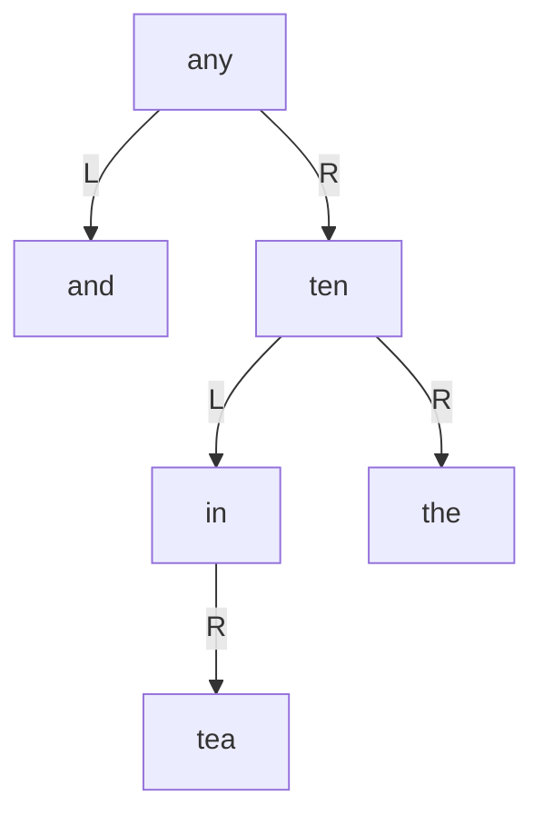
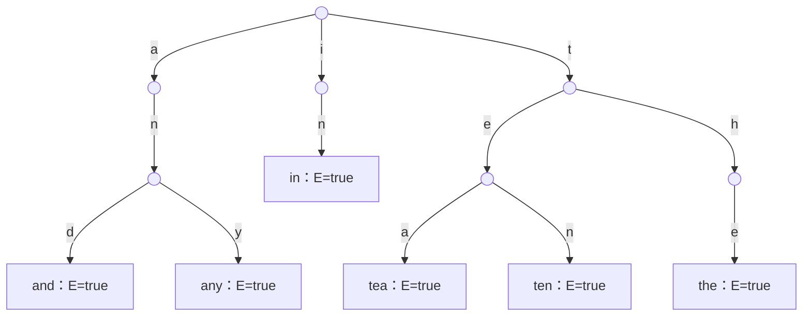
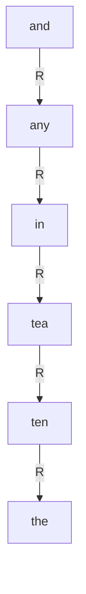

# 東京工業大学 工学院 情報通信系 2018年8月実施 S5 二分探索木とTrie

## **Author**
祭音Myyura (co-authored with GPT 5.6 SOL)

## **Description**

S5. 2分木の各ノードに英単語を一つずつ格納する。左部分木のすべての語はそのノードの語より辞書式順序で前，右部分木のすべての語は後にある。この形式を形式 A とする。各ノードは語を格納する変数 K，左右の子へのポインタ L,R を持ち，子がなければ NULL とする。木は根ポインタ T で与え，空の木は T=NULL とする。newNode(W) は K=W，L=R=NULL のノードを作り，そのポインタを返す。W1 < W2 は辞書式順序で W1 が先であることを表す。同じ単語は重複挿入しない。

図 S5.1，S5.2 は，6語 and, any, in, tea, ten, the を格納した木の例とそのポインタ表現である。



図の省略された子ポインタは NULL である。挿入アルゴリズム S5.1 と探索アルゴリズム S5.2 は次のとおり。

```c
insertA(T, W) {
    if (T == NULL) return newNode(W);
    if (W < T->K)
        T->L = insertA(T->L, W);
    else if (T->K < W)
        T->R = insertA(T->R, W);
    return T;
}
searchA(T, W) {
    if (T == NULL || T->K == W)
        return T;
    if (W < T->K)
        return searchA(T->L, W);
    else if (T->K < W)
        return searchA(T->R, W);
}
```

1. アルゴリズム S5.1 を用いて，空の木に $(\mathrm{and},\mathrm{any},\mathrm{in},\mathrm{tea},\mathrm{ten},\mathrm{the})$，および $(\mathrm{tea},\mathrm{any},\mathrm{and},\mathrm{in},\mathrm{ten},\mathrm{the})$ の順で挿入した木を描け。
2. アルゴリズム S5.2 を用いて，それぞれで `the` を探すときに訪れる節点数を求めよ。語長 $m$，節点数 $n$，深さ $d$ のとき検索計算量は何に比例するか。

形式Bは Trie で，各節点は26文字の子ポインタ配列 `C` と，語末を表す真偽値 `E` を持つ。空の Trie にも根は存在する。`char_to_index` は a–z を0–25に変換し，`getNode()` は子がすべて NULL，`E=false` の節点を作る。

図 S5.3 の形式 B の例は同じ6語 and, any, in, tea, ten, the を格納し，根の枝は a,i,t，a の次は n，その次が d または y，i の次は n，t の次は e または h，e の次は a または n，h の次は e である。図 S5.4 はこの木の一部の配列 C と語末フラグ E を示しており，省略された子は NULL である。以下では単語 W を文字配列とし，length(W) はその長さを返す。



語を記していないノードでは E=false，各枝に対応しない C の要素は NULL である。図 S5.4 で示す配列番号は，a:0，d:3，i:8，n:13，t:19，y:24 の対応を用いる。

3. 単語 W が存在すれば true，存在しなければ false を返す検索コードの（a）～（d）を，選択肢 S5.1 から選んで埋めよ。同じ選択肢を何度用いてもよい。
4. 探索する単語の文字列長を $m$，形式 B のノード数を $n$，深さを $d$ とするとき，成功検索の計算量は何に比例するか。
5. 新しい単語 W を挿入するコードの（e）～（i）を，同じ選択肢から選んで埋めよ。同じ選択肢を何度用いてもよい。

```c
searchB(T, W) {
    pCrawl = T;
    for (i = 0; i < length(W); i++) {
        index = char_to_index(W[i]);
        if (/* a */ == NULL) return /* b */;
        pCrawl = /* c */;
    }
    return (pCrawl != NULL && /* d */);
}
insertB(T, W) {
    pCrawl = T;
    for (i = 0; i < length(W); i++) {
        index = char_to_index(W[i]);
        if (/* e */ == NULL) /* f */ = getNode();
        pCrawl = /* g */;
    }
    /* h */ = /* i */;
}
```

選択肢は (1)`pCrawl->E`, (2)`pCrawl->C[index]`, (3)`true`, (4)`false`, (5)`pCrawl`, (6)`T`, (7)`W`, (8)`W[i]`, (9)`i`, (10)`index`, (11)`NULL`。

6. 空の木に `the, their, them, there, they` を挿入後，次の `walkB` が返す値と，求めるものを30字以内で答えよ。`countChildren` は非NULLの子の数を返し，子が1個ならその文字番号を `index` に格納する。

index_to_char は0～25を a～z に変換する。p は文字配列で，EOS は文字列の最後を表す記号である。

```c
walkB(T) {
    pCrawl = T; i = 0;
    while (countChildren(pCrawl, &index) == 1 && pCrawl->E == false) {
        p[i] = index_to_char(index); i++;
        pCrawl = pCrawl->C[index];
    }
    p[i] = EOS;
    return p;
}
```

### 题目描述

形式 A 是每个节点保存一个英文单词的二叉搜索树：左子树所有词按字典序小于当前词，右子树所有词大于当前词。节点包含词 K 及左右指针 L,R，没有子树时对应指针为 NULL。T 是根指针；空树为 NULL。newNode(W) 创建 K=W、L=R=NULL 的节点。上方图 S5.1、S5.2 的例树保存 and, any, in, tea, ten, the；完整插入、搜索代码分别为算法 S5.1、S5.2。

1. 使用 insertA，从空树开始，分别按 $(\mathrm{and},\mathrm{any},\mathrm{in},\mathrm{tea},\mathrm{ten},\mathrm{the})$、$(\mathrm{tea},\mathrm{any},\mathrm{and},\mathrm{in},\mathrm{ten},\mathrm{the})$ 的顺序插入，仿照图 S5.1 画出所得两棵树。
2. 分别使用 searchA 查找 the，求找到前必须经过的节点数。进一步设待查词长为 $m$，树有 $n$ 个节点，深度为 $d$，回答形式 A 的查找计算量与什么成正比。

形式 B 将英文字母作为边标签，用树管理单词集合。图 S5.3 的例子对应同一组6个词。每个节点有包含26个子指针的数组 C，以及表示当前位置是否为一个单词最后字符的布尔变量 E。空指针为 NULL；单词在后续算法中视为字符数组。即使尚未插入任何词，树仍有一个根节点，其26个指针均为 NULL、E=false。

3. 用选项 S5.1 填写 searchB 的（a）～（d），使词 W 存在时返回 true，否则返回 false。选项可重复。length(W) 返回长度，char_to_index 把 a～z 映射为0～25；查找按字符顺序沿根到子节点的边进行。
4. 设词长为 $m$，形式 B 的节点数为 $n$、深度为 $d$。成功查找时，计算量与什么成正比？
5. 用同一组选项填写 insertB 的（e）～（i）。getNode() 创建一个26个子指针均为 NULL、E=false 的节点并返回其指针。

代码和11个选项完整列于上方。最后，在空的形式 B 树中依次插入 the, their, them, there, they。countChildren 返回给定节点的非 NULL 子指针数；若恰有一个，则还把该边的字符编号写入第二个引用参数 index。index_to_char 把0～25转换为 a～z；p 为字符数组，EOS 为字符串终止符。

6. 给出调用 walkB(T) 的返回值，并在30字以内说明该算法对树中英文单词集合求出了什么。

## **Kai**

### 1)

辞書式順序で挿入した場合は，すべて右の子となる。



二つ目の順序では次の木となる。


### 2)

訪問節点数はそれぞれ $\boxed{6,3}$。1回の文字列比較に最悪 $O(m)$，比較回数に最悪 $O(d)$ を要するため，検索時間は $\boxed{O(md)}$。木が偏れば $d=\Theta(n)$，平衡なら $d=\Theta(\log n)$。

### 3),5)

| 空欄 | 選択肢 | 式 |
|---|---:|---|
| a | 2 | `pCrawl->C[index]` |
| b | 4 | `false` |
| c | 2 | `pCrawl->C[index]` |
| d | 1 | `pCrawl->E` |
| e | 2 | `pCrawl->C[index]` |
| f | 2 | `pCrawl->C[index]` |
| g | 2 | `pCrawl->C[index]` |
| h | 1 | `pCrawl->E` |
| i | 3 | `true` |

### 4)

各文字について定数時間の配列参照を1回行うため，$\boxed{\Theta(m)}$。

### 6)

`t`，`h`，`e` の順に進むと語 `the` の末端に達し，`E=true` で停止する。返り値は $\boxed{\texttt{"the"}}$。

30字以内の説明：**英単語集合の最長共通接頭辞を求める。**
