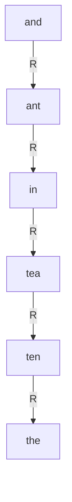
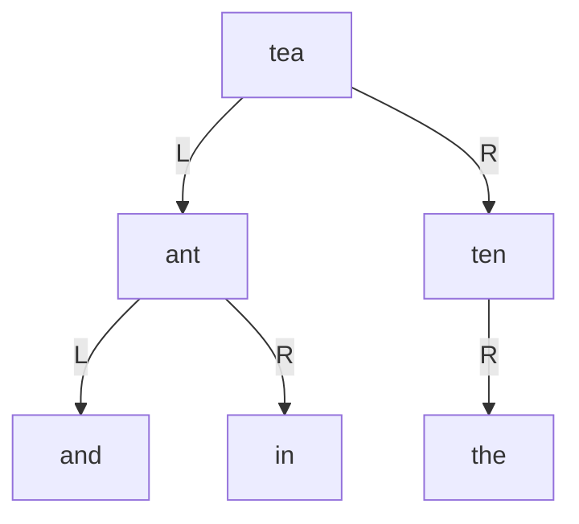

# 東京工業大学 工学院 情報通信系 2018年8月実施 S5 二分探索木とTrie

## **Author**
祭音Myyura (co-authored with GPT 5.6 SOL)&#x20;

## **Description**

形式Aは英単語を辞書式順序で格納する通常の二分探索木で，左部分木は小さい語，右部分木は大きい語を持つ。同じ語は重複挿入しない。

1. 空の木に $(\mathrm{and},\mathrm{ant},\mathrm{in},\mathrm{tea},\mathrm{ten},\mathrm{the})$，および $(\mathrm{tea},\mathrm{ant},\mathrm{and},\mathrm{in},\mathrm{ten},\mathrm{the})$ の順で挿入した木を描け。
2. それぞれで `the` を探すときに訪れる節点数を求めよ。語長 $m$，節点数 $n$，深さ $d$ のとき検索計算量は何に比例するか。

形式Bは Trie で，各節点は26文字の子ポインタ配列 `C` と，語末を表す真偽値 `E` を持つ。空の Trie にも根は存在する。`char_to_index` は a–z を0–25に変換し，`getNode()` は子がすべて NULL，`E=false` の節点を作る。

3. 検索コードの（a）～（d）を埋めよ。
4. Trie の成功検索の計算量は何に比例するか。
5. 挿入コードの（e）～（i）を埋めよ。

```c
searchB(T, W) {
    pCrawl = T;
    for (i = 0; i < length(W); i++) {
        index = char_to_index(W[i]);
        if (/* a */ == NULL) return /* b */;
        pCrawl = /* c */;
    }
    return (pCrawl != NULL && /* d */);
}
insertB(T, W) {
    pCrawl = T;
    for (i = 0; i < length(W); i++) {
        index = char_to_index(W[i]);
        if (/* e */ == NULL) /* f */ = getNode();
        pCrawl = /* g */;
    }
    /* h */ = /* i */;
}
```

選択肢は (1)`pCrawl->E`, (2)`pCrawl->C[index]`, (3)`true`, (4)`false`, (5)`pCrawl`, (6)`T`, (7)`W`, (8)`W[i]`, (9)`i`, (10)`index`, (11)`NULL`。

6. `the, their, them, there, they` を挿入後，次の `walkB` が返す値と，求めるものを30字以内で答えよ。`countChildren` は非NULLの子の数を返し，子が1個ならその文字番号を `index` に格納する。

```c
walkB(T) {
    pCrawl = T; i = 0;
    while (countChildren(pCrawl, &index) == 1 && pCrawl->E == false) {
        p[i] = index_to_char(index); i++;
        pCrawl = pCrawl->C[index];
    }
    p[i] = EOS;
    return p;
}
```

### 题目描述

比较不同插入次序的二叉搜索树，完成 Trie 的查找和插入代码，并辨识沿唯一分支行走的算法所求的最长公共前缀。

## **Kai**

### 1)

辞書式順序で挿入した場合は，すべて右の子となる。



二つ目の順序では次の木となる。



### 2)

訪問節点数はそれぞれ $\boxed{6,3}$。1回の文字列比較に最悪 $O(m)$，比較回数に最悪 $O(d)$ を要するため，検索時間は $\boxed{O(md)}$。木が偏れば $d=\Theta(n)$，平衡なら $d=\Theta(\log n)$。

### 3),5)

| 空欄 | 選択肢 | 式 |
|---|---:|---|
| a | 2 | `pCrawl->C[index]` |
| b | 4 | `false` |
| c | 2 | `pCrawl->C[index]` |
| d | 1 | `pCrawl->E` |
| e | 2 | `pCrawl->C[index]` |
| f | 2 | `pCrawl->C[index]` |
| g | 2 | `pCrawl->C[index]` |
| h | 1 | `pCrawl->E` |
| i | 3 | `true` |

### 4)

各文字について定数時間の配列参照を1回行うため，$\boxed{\Theta(m)}$。

### 6)

`t`，`h`，`e` の順に進むと語 `the` の末端に達し，`E=true` で停止する。返り値は $\boxed{\texttt{"the"}}$。

30字以内の説明：**英単語集合の最長共通接頭辞を求める。**
