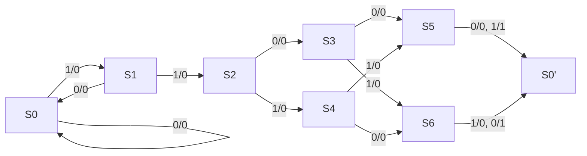

# 東京大学 情報理工学系研究科 コンピュータ科学専攻 2020年8月実施 専門科目 問題3

## **Author**
[zephyr](https://inshi-notes.zephyr-zdz.space/)

## **Description**
Consider bit-serial communication circuits which send and receive 5-bit information bit-by-bit in a noisy environment. The 5-bit information consists of a 2-bit start-bit signal, 2-bit payload data, and a 1-bit odd-parity signal.

The sender circuit always outputs '0' in the initial state. At the beginning of a communication, the sender outputs 2-bit data '11' bit-by-bit. It subsequently outputs 2-bit payload data bit-by-bit from the most significant bit. It finally outputs an odd-parity signal such that the number of '1's in the sent bit sequence including the 2-bit start-bit signal, the payload data, and the parity signal itself is an odd number. After sending the parity signal, the sender circuit goes to the initial state, and it outputs '0' until the next sending.

The receiver circuit has a 1-bit input A from the sender circuit, a 1-bit output B for the parity check result, and a 2-bit output for the received payload data. It obtains payload data from a received bit sequence and does the odd parity checking.

In the initial state, the receiver circuit waits for '1' corresponding to the first bit of a start-bit signal. In the next clock cycle after receiving the first bit of a start-bit signal, it receives a value corresponding to the second bit of a start-bit signal. If the received value corresponding to the second bit of a start-bit signal is '0', the receiver circuit judges that the first received bit '1' was an error caused by a noise, and goes back to the initial state. Otherwise, in the next 2 clock cycles, it stores each value of the input A as payload data. At the next clock cycle, it receives a parity-bit, and it verifies that the number of '1's in the received 5-bit sequence consisting of the 2-bit start-bit signal, the 2-bit payload data, and the parity-bit is odd. It assigns '1' to the output B if the number of '1's is odd, and it assigns '0' otherwise. The value of the output B is always '0', except in the clock cycles for receiving a parity-bit. The receiver circuit then goes to the initial state, regardless of the parity-check result.

Answer the following questions.

(1) Give the state transition diagram of a Mealy-type finite state machine (FSM), consisting of 6 states, for the parity check circuit with the input A and the output B in the receiver circuit. Based on the state transition diagram, give also a corresponding state transition table and an output table by using the one-hot encoding. One-hot encoding is a method for encoding each state as a bit sequence where only one bit is '1' and the other bits are '0'.

(2) Based on the state transition table and the output table in question (1), express the output B as a Boolean expression in terms of the input A and the one-hot encoding representation of the current state of the FSM. Based on the Boolean expression, give also a corresponding gate-level circuit of the parity check circuit that outputs B, given A and the one-hot encoding representation of the current state of the FSM as inputs. You are allowed to use only 2-input AND gates, 2-input OR-gates, and NOT-gates. There is no limitation on the number of gates. You need not describe unused input signals.

(3) According to the Boolean expression answered in question (2), give a CMOS transistor level circuit that outputs B, given A and the one-hot encoding representation of the current state of the FSM as inputs. You are not allowed to use more than 12 transistors. You may use the inverter mark, but the number of transistors required for the inverters must be included in the total number of transistors. You need not describe unused input signals.

## **Kai**
### (1)

#### State Transition Diagram

The Mealy-type FSM has 6 states:

- **S0**: Initial state, waiting for the first start bit. If '0' is received, return to the initial state. If the first start bit '1' is received, move to the next state.
- **S1**: Received the second start bit '1'. Waiting for the payload data. If '0' is received, return to the initial state. If the first payload bit '1' is received, move to the next state.
- **S2, S3, S4, S5, S6**: Received the second start bit '1' and the payload data. Waiting for the parity bit. They will transition to the initial state after the parity check. S5 & S6 stands for the parity check states to be even/odd.

State transitions and outputs B based on input A are as follows(A/B means input/output, S0 and S0' are the same as the initial state):



The corresponding state transition table and output table using one-hot encoding are as follows:

| State              | S0  | S1  | S2  | S3  | S4  | S5  | S6  |
| ------------------ | --- | --- | --- | --- | --- | --- | --- |
| Next State $(A=0)$ | S0  | S0  | S3  | S5  | S6  | S0  | S0  |
| Output B $(A=0)$   | 0   | 0   | 0   | 0   | 0   | 0   | 1   |
| Next State $(A=1)$ | S1  | S2  | S4  | S6  | S5  | S0  | S0  |
| Output B $(A=1)$   | 0   | 0   | 0   | 0   | 0   | 1   | 0   |

### (2)

Using one-hot encoding for states:

- S0: 000000
- S1: 100000
- S2: 010000
- S3: 001000
- S4: 000100
- S5: 000010
- S6: 000001

The output B will be '1' only in states S5 and S6. So the output B can be expressed as a Boolean function of the current state and input A:

- $B = A \cdot S6 + \overline{A} \cdot S5$

**Gate-Level Circuit:**
We can construct the circuit using 2-input AND gates, OR gates, and NOT gates.

- The circuit for $P$:
  - $Q1 = A \cdot S6$
  - $Q2 = \overline{A} \cdot S5$
  - $P = Q1 + Q2$

The circuit for $P$ can be implemented using the following logic gates:

```plaintext
S5 -------------\
               AND----\
  /-----NOT-----/      \
 /                      \
A                        OR----> P
 \                      /
  \-------------\      /
               AND----/
S6 -------------/
```

### (3)

Based on the Boolean expression for the output B, we can make some optimizations to reduce the number of transistors in the CMOS circuit. We will make use of the De Morgan's theorem to simplify the expression and maximize the use of complementary pairs.

The simplified expression for the output B is:

$$
B = A \cdot S6 + \overline{A} \cdot S5 = \overline{\overline{A} \cdot S6} \cdot \overline{A \cdot S5} = \overline{(\overline{A} + \overline{S6})} \cdot \overline{(A + S5)}
$$

## **Knowledge**

有限状态机 梅利型FSM 一热编码 布尔代数 逻辑电路 CMOS电路

### 难点解题思路

- 确保正确理解有限状态机的工作流程。
- 确保状态转移图正确，涵盖所有状态和过渡条件。
- 在布尔表达式的转换中，小心处理所有状态编码及其转换关系。

### 解题技巧和信息

- 在设计状态机时，使用一热编码可以简化状态转换逻辑。
- 对于布尔表达式，尝试先使用基本的逻辑门，再优化以满足设计约束。
- CMOS 电路设计中的每个逻辑门都需要考虑所使用的晶体管数量，确保优化。

### 重点词汇

finite state machine 有限状态机

Mealy-type FSM 梅利型有限状态机

one-hot encoding 一热编码

parity check 奇偶校验

boolean expression 布尔表达式

### 参考资料

1. "Digital Design and Computer Architecture" by David Harris, Sarah Harris, Chap. 3
2. "CMOS VLSI Design: A Circuits and Systems Perspective" by Neil Weste, David Harris, Chap. 4
