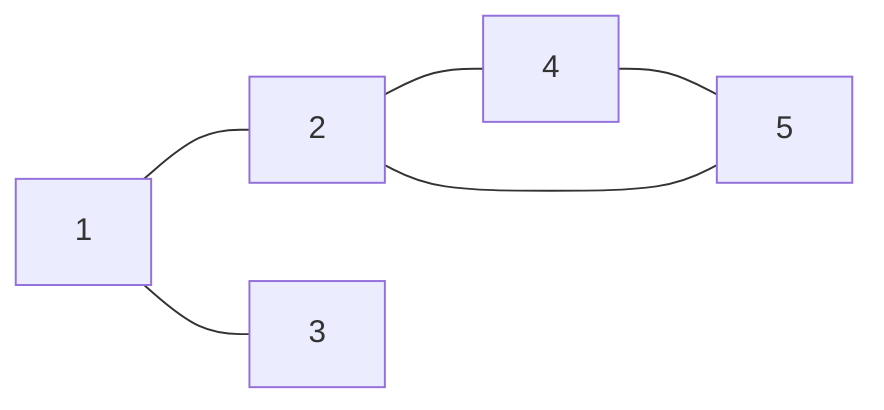
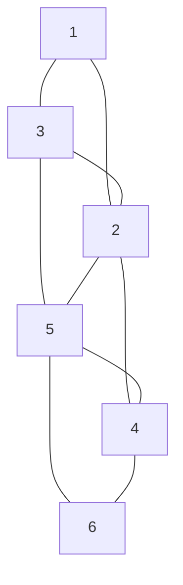
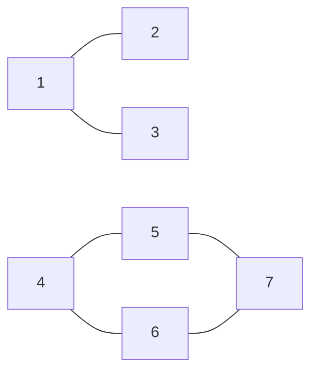

# 東京大学 新領域創成科学研究科 メディカル情報生命専攻 2023年8月実施 問題9

## **Author**
[zephyr](https://inshi-notes.zephyr-zdz.space/)

## **Description**

Here is an example of a graph, and its corresponding adjacency list:



$$
\begin{aligned}
1: & \ 2, 3 \\
2: & \ 1, 4, 5 \\
3: & \ 1 \\
4: & \ 2, 5 \\
5: & \ 2, 4 \\
\end{aligned}
$$

(1) Write the adjacency list for this graph:



(2) Draw the graph for this adjacency list:

$$
\begin{aligned}
1: & \ 2, 3 \\
2: & \ 1\\
3: & \ 1 \\
4: & \ 5, 6 \\
5: & \ 4, 6, 7 \\
6: & \ 4, 5, 7 \\
7: & \ 5, 6 \\
\end{aligned}
$$

(3) Suppose we perform a depth-first search of the graph at the top of this page, starting at node 2. Write a possible order in which we might visit the nodes. The first node should be node 2, and the second should be one of the nodes connected to node 2.

(4) Write a possible order in which we might visit the nodes, if we do breadth-first search of the graph at the top of this page, starting at node 2.

(5) Suppose a graph has $n$ nodes, and node $i$ has $m_i$ edges $(1 \leq i \leq n)$. The adjacency list is $A_{ij}$ $(1 \leq i \leq n, 1 \leq j \leq m_i)$. Write pseudocode for an algorithm that outputs the number of connected components, using depth-first search. The algorithm should explicitly use each element of $A_{ij}$.

(6) Write pseudocode for an algorithm that outputs the number of connected components, using breadth-first search. The algorithm should explicitly use each element of $A_{ij}$.

---

这里有一个图的例子及其对应的邻接表：


$$
\begin{aligned}
1: & \ 2, 3 \\
2: & \ 1, 4, 5 \\
3: & \ 1 \\
4: & \ 2, 5 \\
5: & \ 2, 4 \\
\end{aligned}
$$

(1) 为这个图写出邻接表：


(2) 画出这个邻接表的图：

$$
\begin{aligned}
1: & \ 2, 3 \\
2: & \ 1\\
3: & \ 1 \\
4: & \ 5, 6 \\
5: & \ 4, 6, 7 \\
6: & \ 4, 5, 7 \\
7: & \ 5, 6 \\
\end{aligned}
$$

(3) 假设我们从图的顶部从节点 2 开始进行深度优先搜索。写出可能访问节点的顺序。第一个节点应该是节点 2，第二个应该是与节点 2 相连的节点之一。

(4) 写出如果我们从节点 2 开始对图进行广度优先搜索时可能访问节点的顺序。

(5) 假设一个图有 $n$ 个节点，节点 $i$ 有 $m_i$ 条边 $(1 \leq i \leq n)$。邻接表是 $A_{ij}$ $(1 \leq i \leq n, 1 \leq j \leq m_i)$。写出一个使用深度优先搜索输出连通分量数的算法伪代码。该算法应明确使用每个 $A_{ij}$ 元素。

(6) 写出一个使用广度优先搜索输出连通分量数的算法伪代码。该算法应明确使用每个 $A_{ij}$ 元素。

## **Kai**

Written by [zephyr](https://inshi-notes.zephyr-zdz.space/)

### (1) Write the adjacency list for the given graph


The adjacency list for the given graph is:

$$
\begin{aligned}
1: & \ 2, 3 \\
2: & \ 1, 3, 4, 5 \\
3: & \ 1, 2, 5 \\
4: & \ 2, 5, 6 \\
5: & \ 3, 4, 2, 6 \\
6: & \ 5, 4 \\
\end{aligned}
$$

### (2) Draw the graph for the given adjacency list

$$
\begin{aligned}
1: & \ 2, 3 \\
2: & \ 1 \\
3: & \ 1 \\
4: & \ 5, 6 \\
5: & \ 4, 6, 7 \\
6: & \ 4, 5, 7 \\
7: & \ 5, 6 \\
\end{aligned}
$$



### (3) Depth-First Search (DFS) starting from node 2

A possible order to visit the nodes could be:

$$
2 \rightarrow 1 \rightarrow 3 \rightarrow 5 \rightarrow 4
$$

### (4) Breadth-First Search (BFS) starting from node 2

A possible order to visit the nodes could be:

$$
2 \rightarrow 1 \rightarrow 4 \rightarrow 5 \rightarrow 3
$$

### (5) Pseudocode for DFS to Find the Number of Connected Components with Explicit Use of $A_{ij}$

```c++
// Algorithm: CountConnectedComponentsDFS
int n; // Number of nodes
int m[n]; // Array storing the number of neighbors for each node
int A[n][max_m]; // Adjacency list representation, max_m is the maximum number of edges
bool visited[n]; // Array to keep track of visited nodes
int component_count = 0; // Counter for connected components

// Function to perform DFS
void DFS(int node) {
    visited[node] = true; // Mark the current node as visited
    for (int j = 0; j < m[node]; j++) {
        int neighbor = A[node][j];
        if (!visited[neighbor]) {
            DFS(neighbor); // Recursively visit the neighbors
        }
    }
}

// Main function to count connected components
int main() {
    // Initialize all nodes as not visited
    for (int i = 0; i < n; i++) {
        visited[i] = false;
    }
    // Iterate through all nodes
    for (int i = 0; i < n; i++) {
        if (!visited[i]) {
            DFS(i); // Start DFS from the unvisited node
            component_count++; // Increment component count
        }
    }
    return component_count; // Return the number of connected components
}
```

### (6) Pseudocode for BFS to Find the Number of Connected Components with Explicit Use of $A_{ij}$

```c++
// Algorithm: CountConnectedComponentsBFS
int n; // Number of nodes
int m[n]; // Array storing the number of neighbors for each node
int A[n][max_m]; // Adjacency list representation, max_m is the maximum number of edges
bool visited[n]; // Array to keep track of visited nodes
int component_count = 0; // Counter for connected components

// Function to perform BFS
void BFS(int start_node) {
    queue<int> Q; // Queue for BFS
    Q.push(start_node);
    visited[start_node] = true; // Mark the starting node as visited

    while (!Q.empty()) {
        int node = Q.front();
        Q.pop();
        for (int j = 0; j < m[node]; j++) {
            int neighbor = A[node][j];
            if (!visited[neighbor]) {
                visited[neighbor] = true; // Mark neighbor as visited
                Q.push(neighbor); // Enqueue the neighbor
            }
        }
    }
}

// Main function to count connected components
int main() {
    // Initialize all nodes as not visited
    for (int i = 0; i < n; i++) {
        visited[i] = false;
    }
    // Iterate through all nodes
    for (int i = 0; i < n; i++) {
        if (!visited[i]) {
            BFS(i); // Start BFS from the unvisited node
            component_count++; // Increment component count
        }
    }
    return component_count; // Return the number of connected components
}
```

## **Knowledge**
### 重点词汇

1. Depth-First Search (DFS) 深度优先搜索
2. Breadth-First Search (BFS) 广度优先搜索
3. Adjacency List 邻接表

### 参考资料

1. Introduction to Algorithms, Thomas H. Cormen, Charles E. Leiserson, Ronald L. Rivest, and Clifford Stein, Chap. 22.
2. Graph Theory with Applications, J.A. Bondy and U.S.R. Murty, Chap. 1.
