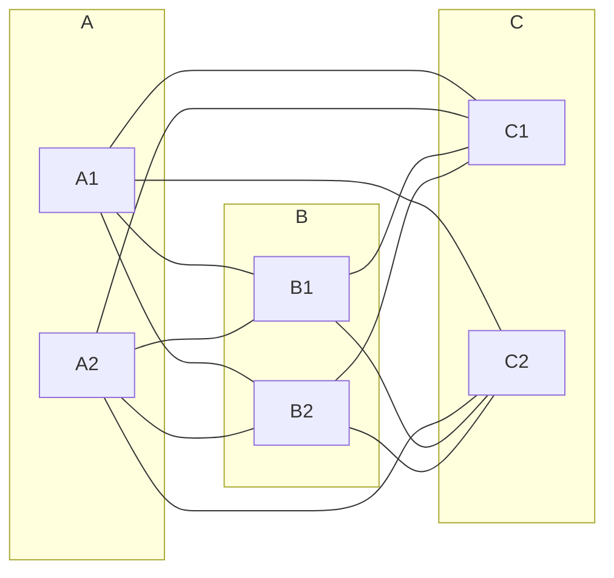

# 東京大学 新領域創成科学研究科 メディカル情報生命専攻 2024年1月実施 問題9

## **Author**
水月, 祭音Myyura, [zephyr](https://inshi-notes.zephyr-zdz.space/)

## **Description**
無向グラフに関する以下の問題に答えよ。

(1) 完全 $3$ 部グラフ $K_{r,s,t}$ とは、それぞれに属する点の個数が $r, s, t$ である三つの点集合からなり、異なる集合に属する二点は全て辺で結ばれており、同じ集合に属する二点は辺で結ばれていないグラフである。
$K_{2,2,2}$ を描け。

(2) $K_{r,s,t}$ の辺の数を示せ。

(3) $n$ をグラフの点数、$m$ をグラフの辺数とする。単純グラフとは、ループと多重辺が存在しないグラフである。
また、$\binom{a}{b}$ は、$a$ 個の元から $b$ 個選んで得られる組み合わせの数を表す。
以下の式を満たす単純グラフは、連結であることを示せ。

$$
m > \binom{n-1}{2}
$$

(4) オイラーグラフとは、オイラー閉路を持つグラフを指す。オイラーグラフにおいては、全ての点の次数が偶数になることを示せ。

(5) 連結グラフにおいて、全ての点の次数が全て偶数であれば、オイラーグラフとなることを示せ。

---

Answer the following problems regarding undirected graphs.

1. A complete tripartite graph $K_{r,s,t}$ consists of three vertex sets of size $r, s, t$. Every pair of vertices belonging to different sets is connected by an edge, and every pair of vertices belonging to the same set is not connected. Draw $K_{2,2,2}$.

2. Find the number of edges in $K_{r,s,t}$.

3. Let $n$ and $m$ denote the number of vertices and edges in a graph, respectively. A simple graph is a graph that does not contain any multi-edges or self-loops. Denote by $\binom{a}{b}$ the number of combinations of $b$ entities chosen from $a$ entities. Prove that a simple graph satisfying the following inequality is connected.

$$
m > \binom{n - 1}{2}
$$

4. An Eulerian graph is a graph with an Eulerian circuit. Show that the degree of every vertex of an Eulerian graph is even.

5. Show that a connected graph is an Eulerian graph, if the degree of every vertex is even.

---

解答以下关于无向图的问题。

1. 完全三分图 $K_{r,s,t}$ 由大小为 $r, s, t$ 的三个顶点集组成。每对属于不同集合的顶点由一条边连接，每对属于同一集合的顶点不连接。画出 $K_{2,2,2}$。

2. 找出 $K_{r,s,t}$ 中的边数。

3. 设 $n$ 和 $m$ 分别表示图中的顶点数和边数。简单图是指不包含任何多重边或自环的图。用 $\binom{a}{b}$ 表示从 $a$ 个实体中选取 $b$ 个实体的组合数。证明满足以下不等式的简单图是连通的。

$$
m > \binom{n - 1}{2}
$$

4. 欧拉图是具有欧拉回路的图。证明欧拉图的每个顶点的度数都是偶数。

5. 证明如果一个连通图的每个顶点的度数都是偶数，则该图是欧拉图。

## **Kai**
Written by 水月 and 祭音Myyura.

### (1)
<figure style="text-align:center;">
  
</figure>

### (2)

$$
K_{r,s,t} = r(s + t) + st = rs + rt + st
$$

### (3)
Let $G$ denote a simple undigraph of $n$ vertices and $m$ edges.

Assume that $G$ is not connected, and hence there are at least two connected components in $G$.
It is trivial to see that the more number of connected components in $G$, the less number of edges in $G$.
Hence w.l.o.g we assume that there are only two connected components (namely $G_1$ and $G_2$), in $G$.

Let $n_1$ and $n_2$ denote the number of vertices, $m_1$ and $m_2$ denote the number of edges of $G_1$ and $G_2$, respectively.
Since a complete simple undigraph of $n$ vertices has $\binom{n}{2}$ edges, we have

$$
\begin{aligned}
m_1 + m_2 &\leq \binom{n_1}{2} + \binom{n-n_1}{2} \\
&= \frac{n_1(n_1 - 1)}{2} + \frac{(n-n_1)(n-n_1-1)}{2} \\
&= \frac{1}{2} [(n_1^2 - n_1) + n(n-n_1-1) - n_1(n-n_1-1)] \\
&= \frac{1}{2} [n_1^2 - n_1 + n(n-1) - nn_1 - nn_1 + n_1^2 + n_1 + (2n-2) - (2n-2)] \\
&= \frac{1}{2} [n(n-1) + 2n_1^2 -2nn_1 + 2n-2 - 2(n-1)] \\
&= \frac{1}{2} [(n-1)(n-2) + 2(n_1^2 - 1) - 2n(n_1 - 1)] \\
&= \frac{1}{2}(n-1)(n-2) + (n_1-1)(n_1 - n + 1) \\
&\leq \frac{1}{2}(n-1)(n-2)  \qquad (\because n_1 - n + 1 \leq 0) \\
&= \binom{n-1}{2}
\end{aligned}
$$

Hence a disconnected graph can have at most $\binom{n-1}{2}$ edges.
Therefore, if a simple undigraph of $n$ vertices has more than $\binom{n-1}{2}$ edges, then the graph is connected.

### (4)
Since the number of incoming edges and the number of outgoing edges of a vertex in a cycle must be the same, a vertex appearing $k$ times in an Euler cycle must have degree $2k$.

### (5)
We prove the claim by induction on the number of vertices $n$.

For $n = 2$, the graph must be two vertices connected by two edges. It has an Euler circuit.

For $n > 2$, let $G=(V,E)$ denote the graph. Let $v \in V$ be an arbitrary vertex.
Pick an arbitrary edge adjacent to $v$.
Continue to pick edges and walk around the graph until we return to $v$ (we will never get stuck since every vertex has even degree, if there is an incoming edge, there is an outgoing edge).
Let $C_v$ be the circuit we found in above process.

Consider the graph $G_v = G - C_v$. If $G_v$ is empty, then $C_v$ is an Euler circuit.
Suppose that $G_v$ is not empty. Obviously each vertex in $G_v$ has even degree and the number of edges in $G_v$ is less than $G$.
Hence by induction, we can find an Euler circuit for each connected component of $G_v$.

Since $G$ is connected, each of these sub-circuits shares a vertex with $C_v$. We can join these circuits together at the shared vertex to form a circuit of all edges in $G$, which is an Euler circuit.

## **Kai**
Written by zephyr.

### 解题思路

1. **绘制图**：根据题目描述，需要绘制出一个包含三组顶点的三部完全图 $K_{2,2,2}$。三组顶点分别有 2 个顶点，每组内的顶点不相连，不同组间的顶点全连。
2. **计算边数**：分析 $K_{r,s,t}$ 的结构，每个顶点与其他两组的顶点相连，通过组合计数确定边的数量。
3. **证明图的连通性**：利用组合数学和图论基本定理证明在满足边数大于某一临界值的情况下图是连通的。
4. **证明欧拉图顶点度数为偶数**：利用欧拉回路的定义和图论定理，证明欧拉图中所有顶点的度数为偶数。
5. **证明度数为偶数的连通图是欧拉图**：结合欧拉定理，说明在连通图中如果所有顶点的度数为偶数，则该图是欧拉图。

### 1. Draw $K_{2,2,2}$

The complete tripartite graph $K_{2,2,2}$ consists of three sets of vertices: $\{A_1, A_2\}$, $\{B_1, B_2\}$, and $\{C_1, C_2\}$. Each vertex in a set is connected to all vertices in the other two sets, but not to vertices within its own set. The graph can be drawn as follows:

### 2. Find the number of edges in $K_{r,s,t}$

In $K_{r,s,t}$, every vertex in one set is connected to every vertex in the other two sets. Hence, the total number of edges is:

$$
\text{Number of edges} = rs + rt + st
$$

### 3. Prove that a simple graph satisfying the inequality $m > \left(\binom{n - 1}{2}\right)$ is connected

To prove the graph is connected, we assume the opposite and show that it leads to a contradiction.

1. **Assumption (Contradiction Hypothesis)**:
   Assume that the graph $G$ is not connected. This means $G$ can be split into at least two disconnected components.

2. **Properties of Disconnected Graphs**:
   - Let the graph $G$ have $k$ components, where $k \geq 2$.
   - Let the sizes of these components be $n_1, n_2, \ldots, n_k$ such that $n_1 + n_2 + \ldots + n_k = n$ and $n_i \geq 1$ for all $i$.
   - The maximum number of edges in a component with $n_i$ vertices is $\binom{n_i}{2}$.

3. **Total Number of Edges in a Disconnected Graph**:
   The total number of edges $m$ in a disconnected graph can be written as:

$$
m \leq \sum_{i=1}^{k} \binom{n_i}{2}
$$

   Since $\sum_{i=1}^{k} n_i = n$, and each component can at most have $\binom{n_i}{2}$ edges, the sum $\sum_{i=1}^{k} \binom{n_i}{2}$ reaches its maximum when one component has $n - 1$ vertices and the remaining component has 1 vertex. This configuration provides the maximum number of edges, which is given by:

$$
\sum_{i=1}^{k} \binom{n_i}{2} \leq \binom{n-1}{2}
$$

4. **Contradiction**:
   By the initial problem statement, $m > \binom{n - 1}{2}$. However, from the assumption of the graph being disconnected, we deduced that $m \leq \binom{n - 1}{2}$, which leads to a contradiction.

5. **Conclusion**:
   Since our assumption that the graph is disconnected leads to a contradiction, the graph must be connected. Hence, a simple graph with $m > \binom{n - 1}{2}$ edges must be connected.

### 4. Show that the degree of every vertex of an Eulerian graph is even

An Eulerian graph contains an Eulerian circuit, which is a closed trail that visits every edge exactly once and returns to the starting vertex. In such a circuit, every time a vertex is entered, it must be exited. Therefore, the number of edges incident to each vertex (the degree) must be even to ensure the vertex can be entered and exited the same number of times.

### 5. Show that a connected graph is an Eulerian graph if the degree of every vertex is even

- A connected graph is Eulerian if and only if all vertices have even degree (Euler's Theorem).
- Assume a connected graph where every vertex has an even degree.
- Starting from any vertex, traverse the graph using available edges, ensuring each edge is used exactly once until returning to the starting vertex.
- Since each vertex has an even degree, it is always possible to enter and exit every vertex during the traversal.
- Thus, the traversal forms an Eulerian circuit, proving the graph is Eulerian.

## **Knowledge**
### 解题技巧和信息

1. 在计算图的边数时，通常可以通过分析图的结构和顶点间的连通性来进行组合计数。
2. 对于连通图的证明，可以利用边数和顶点数之间的关系以及基本图论定理。
3. 证明欧拉图的性质时，常需要考虑图的边的遍历和顶点度数的关系。

### 重点词汇

- Complete tripartite graph 完全三部图
- Vertex 顶点
- Edge 边
- Connected 连通
- Eulerian graph 欧拉图
- Degree 度数

### 参考资料

1. West, D. B. (2001). Introduction to Graph Theory. Prentice Hall. Chap. 1-4.
2. Diestel, R. (2017). Graph Theory (5th ed.). Springer. Chap. 1-2.
