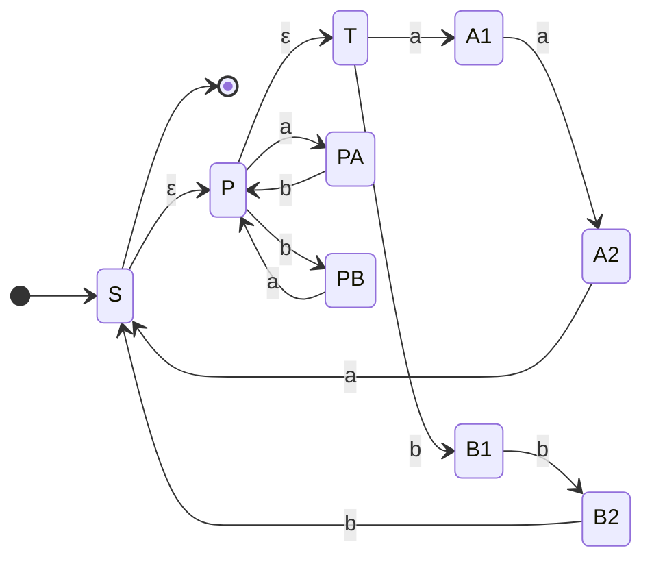
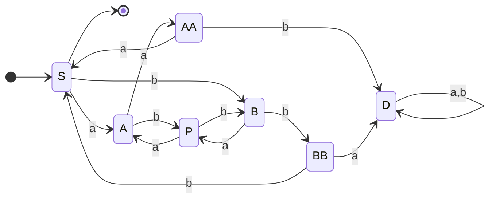
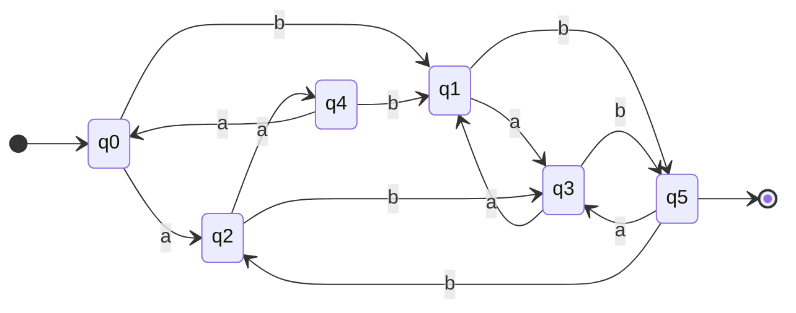
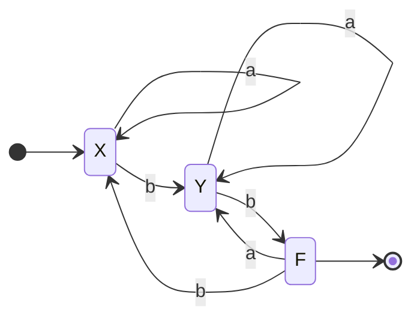

# 神戸大学 システム情報学研究科 2017年8月実施 専門科目 計算機科学 \[1\]

## **Author**
祭音Myyura (co-authored with GPT 5.6 SOL)

## **Description**
$a,b$ を記号とする。以下の問いに答えよ。

### (1)
$L$ を正規表現

```text
((ab+ba)*(aaa+bbb))*
```

で表される言語とする。

1. $L$ を受理言語とする、$\varepsilon$-NFA（$\varepsilon$-moves をもつ非決定性有限オートマトン）の遷移図を描け。
2. $L$ を受理言語とする DFA（決定性有限オートマトン）の遷移図を描け。

### (2)
つぎの DFA を $A$、$A$ の受理言語を $N$ とする。入力記号は $a,b$、状態は $q_0,q_1,q_2,q_3,q_4,q_5$、開始状態は $q_0$、受理状態は $q_5$ である。

| 状態 | $a$ | $b$ |
|---|---|---|
| $q_0$ | $q_2$ | $q_1$ |
| $q_1$ | $q_3$ | $q_5$ |
| $q_2$ | $q_4$ | $q_3$ |
| $q_3$ | $q_1$ | $q_5$ |
| $q_4$ | $q_0$ | $q_1$ |
| $q_5$ | $q_3$ | $q_2$ |

1. $A$ の遷移図を描け。
2. $A$ の状態のうち、互いに同値な状態の組合せをすべて答えよ。ただし、状態 $q_i,q_j$ から任意の入力記号列 $w$ を受け取った結果が常にともに受理状態またはともに非受理状態となるとき、$q_i,q_j$ は同値であるという。
3. $N$ を受理言語とする DFA のうち、状態数が最少のものの遷移図を描け。

### 题目描述

设 $a,b$ 为字母表中的符号。

1. 令 $L$ 为正则表达式 `((ab+ba)*(aaa+bbb))*` 表示的语言。

   1. 画出接受 $L$ 的带 $\varepsilon$ 转移的 NFA。
   2. 画出接受 $L$ 的 DFA。

2. 给定上表所示 DFA $A$：输入符号为 $a,b$，初态为 $q_0$，唯一接受态为 $q_5$。

   1. 画出 $A$ 的状态转移图。
   2. 列出所有相互等价的状态对。
   3. 画出接受同一语言且状态数最少的 DFA。

## **Kai**

### (1-i) $\varepsilon$-NFA

$S$ を開始状態かつ受理状態とする。つぎの $\varepsilon$-NFA は、$P$ で $ab$ または $ba$ を任意回読み、その後 $aaa$ または $bbb$ を読んで $S$ に戻る。



したがって受理言語は

$$
\bigl((ab+ba)^*(aaa+bbb)\bigr)^*=L
$$

である。

### (1-ii) DFA

部分集合構成で得られる DFA の遷移表は次のとおりである。$S$ のみが受理状態、$D$ は死状態である。

| 状態 | $a$ | $b$ |
|---|---|---|
| $\to *S$ | $A$ | $B$ |
| $P$ | $A$ | $B$ |
| $A$ | $AA$ | $P$ |
| $B$ | $P$ | $BB$ |
| $AA$ | $S$ | $D$ |
| $BB$ | $D$ | $S$ |
| $D$ | $D$ | $D$ |



### (2-i)



### (2-ii)

初期分割 $\{q_5\},\{q_0,q_1,q_2,q_3,q_4\}$ を遷移先により細分すると、最終的に

$$
\{q_0,q_2,q_4\},\qquad
\{q_1,q_3\},\qquad
\{q_5\}
$$

を得る。したがって同値な状態対は

$$
\boxed{
(q_0,q_2),\ (q_0,q_4),\ (q_2,q_4),\ (q_1,q_3)
}.
$$

### (2-iii)

$X=[q_0q_2q_4]$、$Y=[q_1q_3]$、$F=[q_5]$ とおく。最小 DFA は

| 状態 | $a$ | $b$ |
|---|---|---|
| $\to X$ | $X$ | $Y$ |
| $Y$ | $Y$ | $F$ |
| $*F$ | $Y$ | $X$ |

で与えられる。


