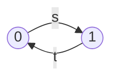
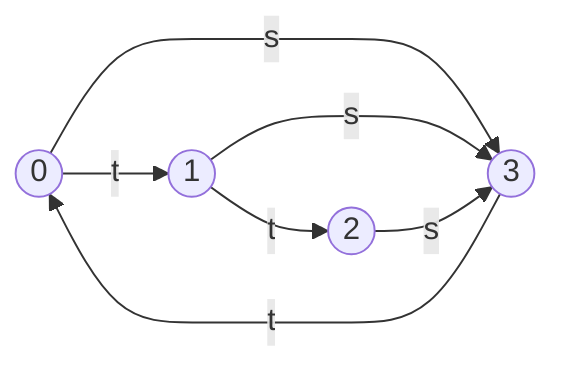
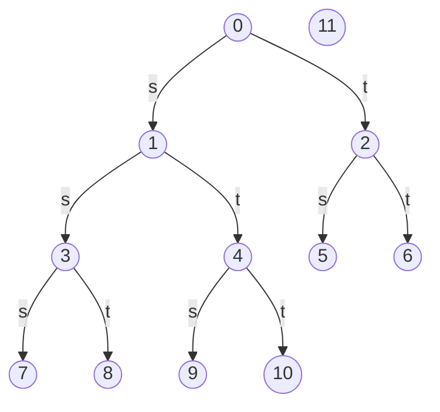
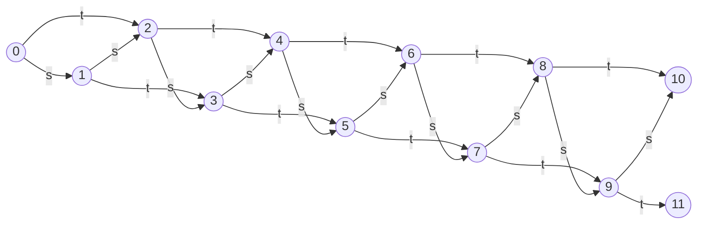

# 神戸大学 システム情報学研究科 2017年8月実施 専門科目 計算機科学 \[2\]

## **Author**
祭音Myyura (co-authored with GPT 5.6 SOL)

## **Description**
グラフの探索では、同一ノードを何度も探索しないよう注意が必要である。次の C プログラムにおいて、`struct node` は有向グラフのノードを表す。フィールド `s`,`t` がノードへの参照をもつとき、そのノードへの辺が存在する。`id` は識別子、`visited` は訪問回数である。`dfs(node)` は `node` を起点として、`s`、`t` の順に再帰的な探索を行う。

```c
#include <stdio.h>
#define BUFSIZE 20
typedef struct node {
    struct node *s;
    struct node *t;
    int id; int visited;
} *node_tp;
struct node nodes[BUFSIZE];

void printNode(node_tp node) {
    printf("(%d, %d)\n", node->id, node->visited);
}
void dfs(node_tp node) {
    node_tp s = node->s;
    node_tp t = node->t;
    node->visited++;
    printNode(node);
    if (node->visited > 1) return;
    if (s != NULL) dfs(s);
    if (t != NULL) dfs(t);
}
void initNodes(int n) {
    int i;
    for (i = 0; i < n; i++) {
        nodes[i].id = i; nodes[i].visited = 0;
        nodes[i].s = nodes[i].t = NULL;
    }
}
void link(node_tp node, node_tp s, node_tp t) {
    node->s = s; node->t = t;
}
```

テストプログラムは次のとおりである。

```c
void test0(void) {
    initNodes(2);
    link(&nodes[0], &nodes[1], NULL);
    link(&nodes[1], NULL, &nodes[0]);
    dfs(&nodes[0]);
}

void test1(void) {
    initNodes(4);
    link(&nodes[0], &nodes[3], &nodes[1]);
    link(&nodes[1], &nodes[3], &nodes[2]);
    link(&nodes[2], &nodes[3], NULL);
    link(&nodes[3], NULL, &nodes[0]);
    dfs(&nodes[1]);
}

void test2(void) {
    int i;
    initNodes(12);
    for (i = 0; i < 5; i++) {
        link(&nodes[i], &nodes[2*i+1], &nodes[2*i+2]);
    }
    dfs(&nodes[1]);
    printf("---\n");
    dfs(&nodes[0]);
}

void test3(void) {
    int i;
    initNodes(12);
    for (i = 0; i < 10; i++) {
        link(&nodes[i], &nodes[i+1], &nodes[i+2]);
    }
    dfs(&nodes[0]);
}
```

例として、`test0` のグラフと標準出力は次のとおりである。



```text
(0, 1)
(1, 1)
(0, 2)
```

以下の各問に答えよ。図の辺には、その参照が `s`,`t` のいずれであるかを示すこと。

1. `test1` が生成するグラフ（ノード 0〜3）と標準出力を示せ。
2. `test2` が生成するグラフ（ノード 0〜11）と標準出力を示せ。
3. `test3` が生成するグラフ（ノード 0〜11）を示せ。さらに、`dfs` 中の

   ```c
   if (node->visited > 1) return;
   ```

   を完全に取り除いた場合、`test3` の終了時に `nodes[10]` の訪問回数はいくつになるか。簡単な理由も述べよ。

### 题目描述

上述 C 程序用 `s`、`t` 两个指针表示有向边；`dfs` 先把当前结点的 `visited` 加一并输出，再在首次访问时依次沿 `s`、`t` 递归搜索。

1. 画出 `test1` 生成的结点 0 至 3 的图，并写出标准输出。
2. 画出 `test2` 生成的结点 0 至 11 的图，并写出标准输出。
3. 画出 `test3` 生成的结点 0 至 11 的图。若完全删除 `dfs` 中的

   ```c
   if (node->visited > 1) return;
   ```

   求程序结束时 `nodes[10]` 的访问次数，并简述理由。

## **Kai**

### (1)



`dfs` は `s`、`t` の順に呼び出され、2 回目以降の訪問では直ちに戻る。したがって標準出力は

```text
(1, 1)
(3, 1)
(0, 1)
(3, 2)
(1, 2)
(2, 1)
(3, 3)
```

である。

### (2)



最初の探索でノード $1$ の部分木を訪問し、その訪問情報を保ったままノード $0$ から再び探索する。標準出力は

```text
(1, 1)
(3, 1)
(7, 1)
(8, 1)
(4, 1)
(9, 1)
(10, 1)
---
(0, 1)
(1, 2)
(2, 1)
(5, 1)
(6, 1)
```

である。

### (3)



条件文を削除すると、ノード $10$ はノード $0$ から $10$ へ至る各経路につき 1 回訪問される。その経路数を $p_k$ とすれば

$$
p_0=1,\qquad p_1=1,\qquad
p_k=p_{k-1}+p_{k-2}\quad(k\ge2).
$$

よって

$$
(p_0,p_1,\ldots,p_{10})
=(1,1,2,3,5,8,13,21,34,55,\boxed{89}).
$$

したがって `nodes[10].visited` の最終値は $\boxed{89}$ である。
