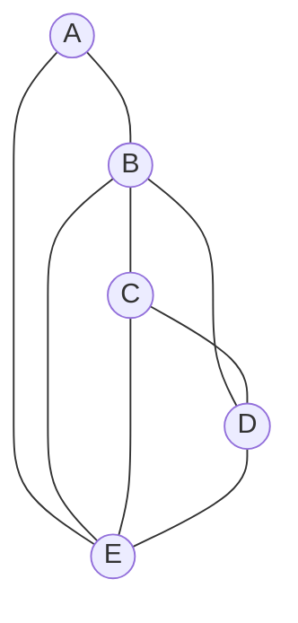
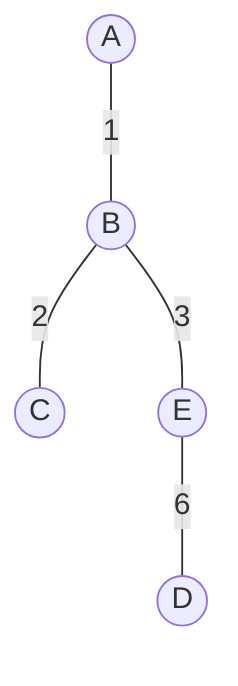

# 神戸大学 システム情報学研究科 2017年8月実施 専門科目 システム理論 \[1\]

## **Author**
祭音Myyura (co-authored with GPT 5.6 SOL)

## **Description**
$A$〜$E$ の各地点を光ファイバーで相互に接続する。図 (a) の頂点は地点、辺は光ファイバーを設置できる地点対を表す。

1. 図 (a) の隣接行列とラプラシアン行列を示せ。
2. 全域木の辺数と全域木の総数を、根拠とともに示せ。
3. 各辺の設置費用が次表（単位：$1000$ 万円）で与えられるとき、全域木の最小総費用を求めよ。

| 辺 | $AB$ | $AE$ | $BC$ | $BD$ | $BE$ | $CD$ | $CE$ | $DE$ |
|---|---:|---:|---:|---:|---:|---:|---:|---:|
| 費用 | 1 | 4 | 2 | 7 | 3 | 8 | 5 | 6 |

### 题目描述

用光纤连接地点 $A$ 至 $E$。图 (a) 的顶点表示地点，边表示能够直接铺设光纤的地点对。

1. 写出图 (a) 的邻接矩阵和 Laplacian 矩阵。
2. 求每棵生成树的边数及生成树总数，并说明依据。
3. 各边费用如上表所示（单位：$1000$ 万日元），求生成树的最小总费用。

## **Kai**

頂点の順序を $(A,B,C,D,E)$ とする。

### (1)

隣接行列は

$$
\boldsymbol A=
\begin{pmatrix}
0&1&0&0&1\\
1&0&1&1&1\\
0&1&0&1&1\\
0&1&1&0&1\\
1&1&1&1&0
\end{pmatrix}.
$$

次数行列は $\boldsymbol D=\operatorname{diag}(2,4,3,3,4)$ であるから、ラプラシアン行列は

$$
\boldsymbol L=\boldsymbol D-\boldsymbol A=
\begin{pmatrix}
2&-1&0&0&-1\\
-1&4&-1&-1&-1\\
0&-1&3&-1&-1\\
0&-1&-1&3&-1\\
-1&-1&-1&-1&4
\end{pmatrix}.
$$

### (2)

頂点数が $5$ なので、全域木の辺数は $5-1=4$ 本である。

行列木定理より、全域木の総数は $\boldsymbol L$ の任意の主余因子に等しい。第 $1$ 行・第 $1$ 列を除けば

$$
\tau(G)=
\det\begin{pmatrix}
4&-1&-1&-1\\
-1&3&-1&-1\\
-1&-1&3&-1\\
-1&-1&-1&4
\end{pmatrix}
=40.
$$

したがって、全域木は $40$ 通りである。

### (3)

Kruskal 法を用いる。費用の小さい順に閉路を作らない辺を選ぶと

$$
AB(1),\quad BC(2),\quad BE(3),\quad DE(6)
$$

を得る。辺 $AE(4),CE(5)$ は、それぞれ選択時に閉路を作るため除く。

よって最小総費用は

$$
1+2+3+6=\boxed{12}
$$

すなわち $1$ 億 $2000$ 万円である。
