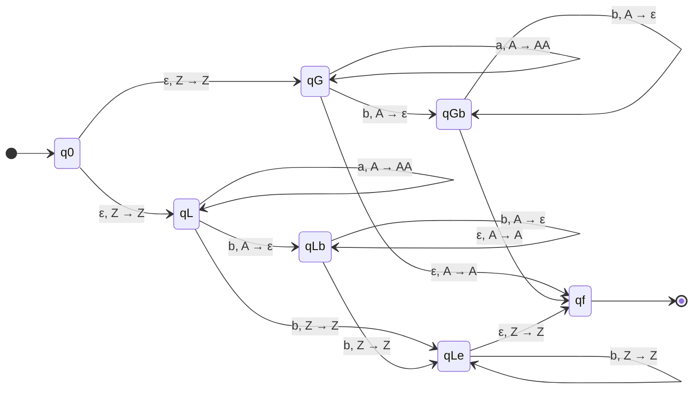

# 神戸大学 システム情報学研究科 2018年1月実施 第二期 専門科目 計算機科学 \[1\]

## **Author**
祭音Myyura (co-authored with GPT 5.6 SOL)

## **Description**
$a,b,c$ を記号とし、$i,j,k$ を $0$ 以上の整数を表す変数とする。以下の (1) - (4) に答えよ。CFG を答える場合は、変数記号、開始記号、生成規則をそれぞれ書くこと。

### (1)

$$
L_0=\{a^ib^j\mid i=j\}
$$

とする。

1. $L_0$ を生成する CFG を書け。
2. 1 の CFG における $a^3b^3$ の構文木を書け。

### (2)

$$
L_1=\{a^ib^j\mid i\ne j\}
$$

とする。

1. $L_1$ を生成する CFG を書け。
2. $L_1$ を受理言語とする PDA の推移図を書け。

### (3)

$$
M_0=\{a^ib^jc^k\mid i\ne j\ \text{または}\ j\ne k\}
$$

とする。$M_0$ を生成する CFG を書け。

### (4)

$$
M_1=\{a^ib^jc^k\mid i=j=k\}
$$

とする。CFL の反復補題を用いて、$M_1$ が CFL ではないことを示せ。

### 题目描述

令 $a,b,c$ 为符号，$i,j,k$ 为非负整数。

1. 对 $L_0=\{a^ib^j\mid i=j\}$，给出生成它的上下文无关文法，并画出 $a^3b^3$ 的语法树。
2. 对 $L_1=\{a^ib^j\mid i\ne j\}$，给出生成它的上下文无关文法，并画出识别它的下推自动机状态转移图。
3. 给出生成 $M_0=\{a^ib^jc^k\mid i\ne j\text{ 或 }j\ne k\}$ 的上下文无关文法。
4. 用上下文无关语言的抽引引理证明 $M_1=\{a^ib^jc^k\mid i=j=k\}$ 不是上下文无关语言。

## **Kai**

### (1)

#### (i)
変数を $\{S\}$、開始記号を $S$、終端記号を $\{a,b\}$ とし、生成規則を

$$
\boxed{S\to aSb\mid\varepsilon}
$$

とすればよい。

#### (ii)

```text
S
├── a
├── S
│   ├── a
│   ├── S
│   │   ├── a
│   │   ├── S
│   │   │   └── ε
│   │   └── b
│   └── b
└── b
```

葉を左から読むと $aaabbb=a^3b^3$ となる。

### (2)

#### (i)
変数を $\{S,A,B,P,Q\}$、開始記号を $S$、終端記号を $\{a,b\}$ とし、生成規則を

$$
\begin{aligned}
S&\to A\mid B,\\
A&\to aAb\mid P, & P&\to aP\mid a,\\
B&\to aBb\mid Q, & Q&\to bQ\mid b
\end{aligned}
$$

とする。$A$ は $i>j$、$B$ は $i<j$ の語をちょうど生成するので、この CFG は $L_1$ を生成する。

#### (ii)
スタック底記号を $Z$、カウンタ記号を $A$ とする。ラベルは「入力、スタック頂上 $\to$ 置換列」を表し、入力をすべて読んで終状態 $q_f$ に入ったとき受理する。



$q_G$ 側は入力終了時に $A$ が残る場合、すなわち $i>j$ を受理する。$q_L$ 側は $A$ をすべて取り除いた後にも $b$ が一つ以上残る場合、すなわち $i<j$ を受理する。

### (3)
変数を $\{S,X,P,Q,C,A,Y,R,T\}$、開始記号を $S$、終端記号を $\{a,b,c\}$ とし、生成規則を

$$
\begin{aligned}
S&\to XC\mid AY,\\
X&\to aXb\mid P\mid Q,
&P&\to aP\mid a,
&Q&\to bQ\mid b,\\
C&\to cC\mid\varepsilon,
&A&\to aA\mid\varepsilon,\\
Y&\to bYc\mid R\mid T,
&R&\to bR\mid b,
&T&\to cT\mid c
\end{aligned}
$$

とする。$XC$ は $i\ne j$ の語を、$AY$ は $j\ne k$ の語を生成する。したがって、この CFG は両者の和集合 $M_0$ を生成する。

### (4)
$M_1$ が CFL であると仮定し、反復長を $n$ とする。語

$$
z=a^nb^nc^n\in M_1
$$

を取り、反復補題による任意の分解

$$
z=uvwxy,\qquad |vwx|\leq n,\qquad |vx|\geq1
$$

を考える。$|vwx|\leq n$ だから、$vwx$ が $a$ の部分と $c$ の部分を同時に含むことはない。したがって $v,x$ によって個数が変わる記号は高々隣接する2種類であり、少なくとも1種類の個数は $n$ のままである。

$m=0$ として $uwy$ を考えると、$|vx|\geq1$ より少なくとも1種類の個数は減少する一方、少なくとも1種類は $n$ のままである。よって3種類の個数は等しくならない（記号の順序が崩れる場合も $M_1$ に属さない）。したがって

$$
uwy\notin M_1,
$$

となり反復補題に矛盾する。ゆえに

$$
\boxed{M_1\ \text{は CFL ではない}}.
$$
