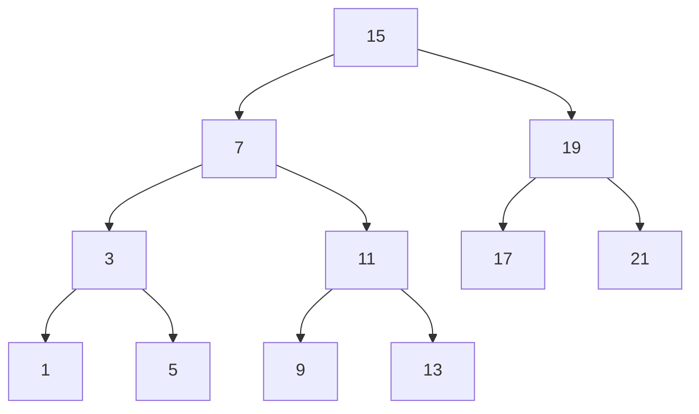
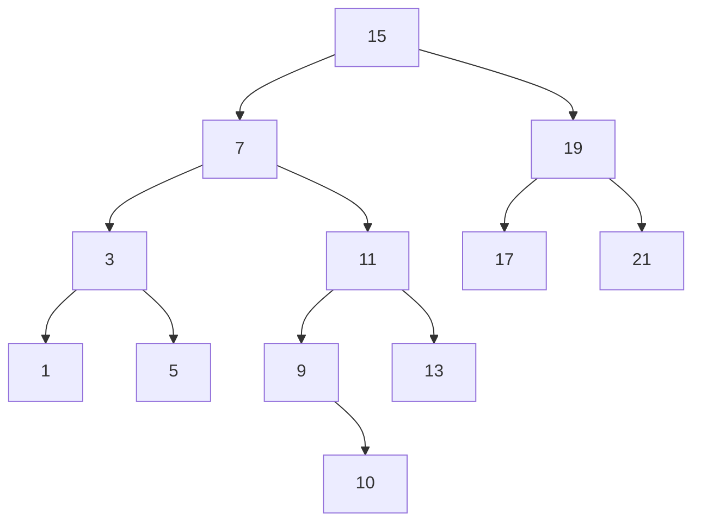
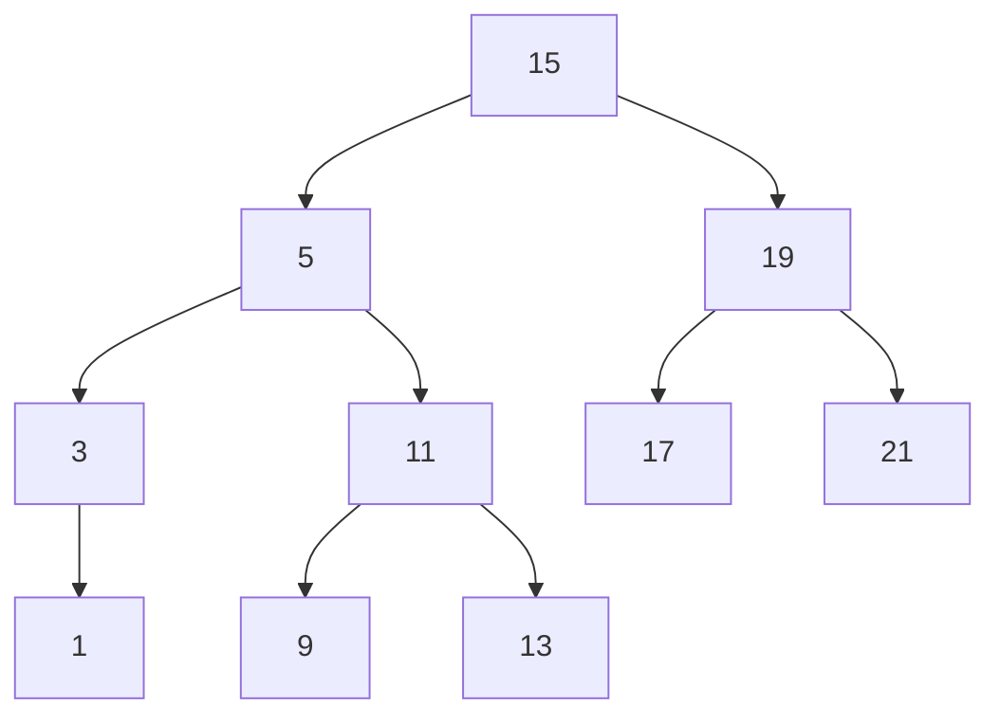

# 神戸大学 システム情報学研究科 2018年1月実施 第二期 専門科目 計算機科学 \[2\]

## **Author**
祭音Myyura (co-authored with GPT 5.6 SOL)

## **Description**
以下の各問に答えよ。

### (1)
図 A に C 言語で記述された関数 `func0`、`func1`、`func2` を示す。いずれも正の整数値 $n,m$ を引数とする。各関数の時間計算量を $n,m$ に関する Big O 記法で答えよ。ただし、`func1` がアクセスする二次元配列 `A`、`B`、`C` の各次元のサイズ `SIZE` は $n,m$ より大きく、桁あふれは無視する。

```c
int func0(int n, int m) {
    int i, j, result = 0;
    for (i = 0; i < n * m; i++) {
        for (j = 1; j <= 3; j++) {
            result += n * i * j + m * (4 - j);
        }
    }
    return result;
}

double A[SIZE][SIZE];
double B[SIZE][SIZE];
double C[SIZE][SIZE];

void func1(int n, int m) {
    int i, j, k;
    for (i = 0; i < n; i++) {
        for (k = 0; k < m; k++) {
            for (j = 0; j < n; j++) {
                C[i][k] += A[i][j] * B[j][k];
            }
        }
    }
}

int func2(int n, int m) {
    if (n == 0) return m;
    else return func2(n / 2, m + n % 2);
}
```

### (2)
二分探索木の探索時間は木の形状によって異なる。ノード数が $N$ で、根から各葉までの距離がすべて等しい完全二分木の場合、探索に要する時間計算量を **[ア]** とする。木がバランスされていない場合の最悪時間計算量を **[イ]** とする。また、AVL 木では探索・挿入・削除に必要な最悪時間計算量を **[ウ]** とする。

**[ア]** - **[ウ]** を $N$ に関する Big O 記法で答えよ。

### (3)
図 B の二分探索木について答えよ。



1. 図 B の二分探索木に値 $10$ を挿入してできる二分探索木を図示せよ。
2. 図 B の二分探索木から値 $7$ を削除してできる二分探索木の例を一つ図示せよ。ただし、この操作によって木の高さが増えないようにせよ。ここで木の高さとは、根から木の下端に位置するノードへの距離の最大値である。

### 题目描述

1. 给出代码中 `func0`、`func1`、`func2` 的时间复杂度，使用关于正整数 $n,m$ 的 Big O 记号。数组尺寸足够大，忽略整数溢出。
2. 用关于结点数 $N$ 的 Big O 记号填写：完全二叉搜索树的搜索复杂度 **[ア]**；不平衡二叉搜索树的最坏搜索复杂度 **[イ]**；AVL 树搜索、插入、删除的最坏复杂度 **[ウ]**。
3. 对题图所示二叉搜索树：（i）插入 $10$ 后画出结果；（ii）删除 $7$ 后画出一种树高不增加的结果。

## **Kai**

### (1)
`func0` の外側ループは $nm$ 回、内側ループは常に3回であるから、

$$
\boxed{\operatorname{func0}:O(nm)}.
$$

`func1` の三重ループの反復回数は $n\cdot m\cdot n$ なので、

$$
\boxed{\operatorname{func1}:O(n^2m)}.
$$

`func2` では再帰のたびに $n$ が $\lfloor n/2\rfloor$ となり、各段の処理は定数時間である。したがって

$$
T(n)=T(\lfloor n/2\rfloor)+O(1)
$$

より、

$$
\boxed{\operatorname{func2}:O(\log n)}.
$$

### (2)
完全二分木および AVL 木の高さは $O(\log N)$、バランスされていない二分探索木の高さは最悪で $N-1$ である。よって

$$
\boxed{\text{[ア]}=O(\log N),\qquad
\text{[イ]}=O(N),\qquad
\text{[ウ]}=O(\log N)}.
$$

### (3)

#### (i)
$15\to7\to11\to9$ と比較して進み、$10$ は $9$ の右子になる。



#### (ii)
一例として、$7$ を左部分木の最大値 $5$ で置き換え、元の葉 $5$ を削除する。



この木の高さは元の木と同じ $3$ であり、増加していない。
