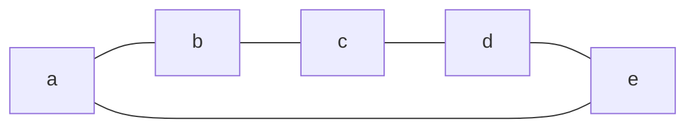
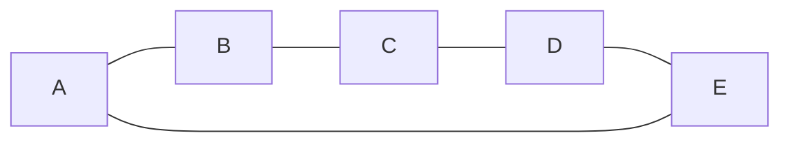
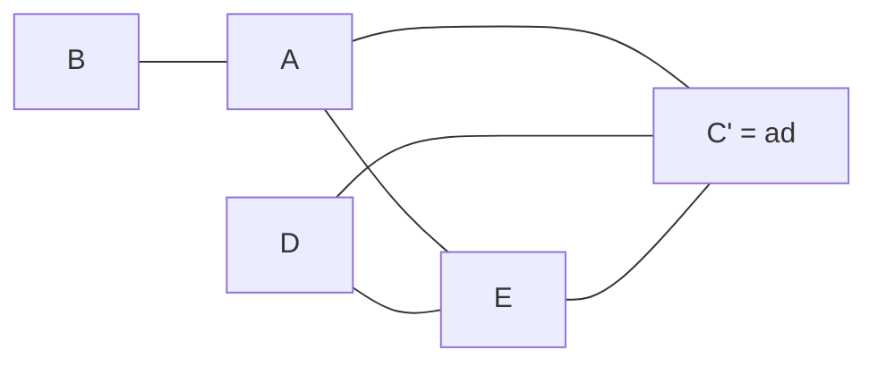

# 神戸大学 システム情報学研究科 2018年1月実施 第二期 専門科目 システム理論 \[2\]

## **Author**
祭音Myyura (co-authored with GPT 5.6 SOL)

## **Description**
5つのチーム $a$ - $e$ が参加する大会で，事前の抽選により次の5試合が決まった。頂点はチーム，辺はその両チーム間に試合があることを表す。

1. 全試合を行うために少なくとも何時間必要か。各試合は1時間で，コート数は十分にあるものとし，一つの日程例も示せ。
2. 試合を頂点とし，同一チームが行う試合を辺で結ぶグラフ $G$ を描け。5試合を $A,B,C,D,E$ とせよ。
3. 全試合を行う時間が $k$ 時間あるとき，試合の開催方法数を $k$ の関数で示せ。
4. $c$ チームと $d$ チームの試合がなくなり，代わりに $a$ チームと $d$ チームの試合が組まれた。3 と同様に，開催方法数を $k$ の関数で示せ。

### 题目描述

5 支队伍 $a$ - $e$ 参加比赛，抽签确定的对阵为五边形上的 5 条边：$ab,bc,cd,de,ea$。

1. 每场比赛 1 小时且场地足够时，完成全部比赛至少需要多少小时？给出一个赛程。
2. 把比赛作为顶点，若两场比赛有共同队伍就连边，画出冲突图 $G$。
3. 可用时间为 $k$ 个小时时，用 $k$ 的函数表示排赛方法数。
4. 取消 $c$ - $d$ 的比赛，改为 $a$ - $d$ 的比赛。再求排赛方法数。

## **Kai**

同じチームが出る2試合は同時に行えない。したがって，時刻の割当ては問 2 のグラフ $G$ の適正頂点彩色に一致する。

### (1)

試合を五角形の順に

$$
A=ab,\quad B=bc,\quad C=cd,\quad D=de,\quad E=ea
$$

と名付ける。例えば，

| 時間帯 | 同時に行う試合 |
|:---:|:---:|
| 1 | $A=ab, C=cd$ |
| 2 | $B=bc, D=de$ |
| 3 | $E=ea$ |

とすれば3時間で実施できる。一方，これらの試合は長さ5の奇数閉路を作るため，2時間だけでは二色に分けられない。よって最小時間は

$$
\boxed{3\text{ 時間}}
$$

である。

### (2)

$A$ と $B$，$B$ と $C$，$C$ と $D$，$D$ と $E$，$E$ と $A$ がそれぞれ同一チームを共有する。したがって $G$ も長さ5の閉路 $C_5$ である。

### (3)

$k$ 個の時間帯を色と見なすと，求める数は $C_5$ の彩色多項式である。一般に

$$
P(C_n,k)=(k-1)^n+(-1)^n(k-1)
$$

であるから，

$$
\boxed{
P(G,k)=(k-1)^5-(k-1)
=k(k-1)(k-2)(k^2-2k+2)
}
$$

通りである。

### (4)

新しい試合を $C'=ad$ とすると，試合の衝突グラフは次のようになる。

$E$ と $C'$ の色は $k(k-1)$ 通りに選べる。$A,D$ はともに $E,C'$ と隣接し，$A$ と $D$ は隣接しないので，それぞれ独立に $k-2$ 通りである。最後に $B$ は $A$ と異なる $k-1$ 色から選べる。よって，

$$
\boxed{P(k)=k(k-1)^2(k-2)^2}
$$

通りである。
