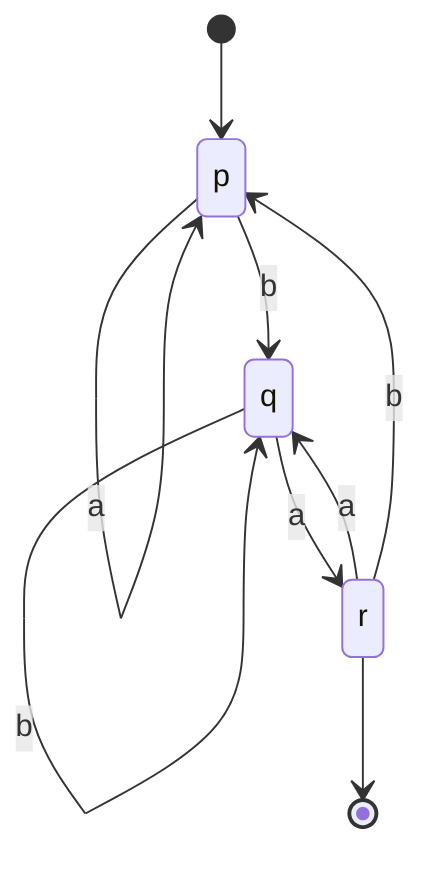
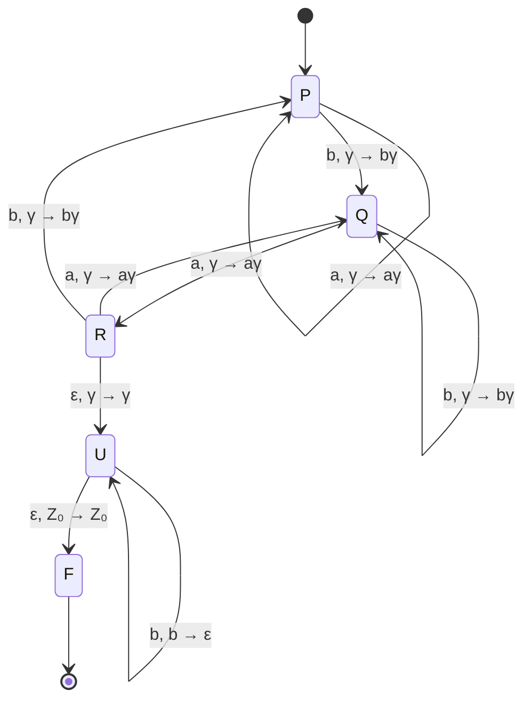

# 神戸大学 システム情報学研究科 2018年8月実施 専門科目 計算機科学 \[1\]

## **Author**
祭音Myyura (co-authored with GPT 5.6 SOL)

## **Description**
$a,b$ を記号とする。$a,b$ の記号列 $w$ に対し，逆順の記号列を $w^R$，$w$ を $n$ 個並べた記号列を $w^n$ と表す。

つぎの DFA を $A$ とし，$A$ の受理言語を $K$ とする。

- 入力記号：$a,b$
- 状態：$p,q,r$
- 開始状態：$p$
- 受理状態：$r$

| 状態 | $a$ | $b$ |
|---|---|---|
| $p$ | $p$ | $q$ |
| $q$ | $r$ | $q$ |
| $r$ | $q$ | $p$ |

また，

$$
L=\{ww^R\mid w\in K\}
$$

とする。CFG を答える問いでは，変数記号，開始記号，生成規則をそれぞれ示せ。

1. $A$ の遷移図を描け。
2. $K$ を表す正規表現を書け。
3. $K$ を生成する CFG を書け。
4. $L$ を生成する CFG を書け。
5. $L$ を受理言語とする PDA の遷移図を描け。最初にスタックの底にある記号は $Z_0$ とする。
6. 正規言語の反復補題を用いて，$L$ は正規言語ではないことを示せ。

### 题目描述

字母表为 $\{a,b\}$。对字符串 $w$，以 $w^R$ 表示逆序串，以 $w^n$ 表示重复 $n$ 次所得字符串。DFA $A$ 的初态为 $p$、唯一终态为 $r$，转移表如下。

| 状态 | $a$ | $b$ |
|---|---|---|
| $p$ | $p$ | $q$ |
| $q$ | $r$ | $q$ |
| $r$ | $q$ | $p$ |

令 $K=L(A)$，并定义

$$
L=\{ww^R\mid w\in K\}.
$$

1. 画出 $A$ 的状态转移图。
2. 写出表示 $K$ 的正则表达式。
3. 给出生成 $K$ 的上下文无关文法。
4. 给出生成 $L$ 的上下文无关文法。
5. 画出接受 $L$ 的下推自动机；栈底符号为 $Z_0$。
6. 用正则语言的泵引理证明 $L$ 不是正则语言。

## **Kai**

### (1)

### (2)
$p$ から初めて $r$ に到達する語は $a^*bb^*a$ である。また，$r$ から途中で $r$ を通らずに $r$ に戻る語は

$$
ab^*a\quad\text{または}\quad ba^*bb^*a
$$

である。よって，例えばつぎの正規表現が $K$ を表す。

$$
\boxed{a^*bb^*a\left(ab^*a+ba^*bb^*a\right)^*}.
$$

### (3)
変数記号を $\{P,Q,R\}$，開始記号を $P$ とし，生成規則を

$$
\boxed{
\begin{aligned}
P&\to aP\mid bQ,\\
Q&\to aR\mid bQ,\\
R&\to \varepsilon\mid aQ\mid bP
\end{aligned}}
$$

とすればよい。各変数は DFA の同名状態に対応する。

### (4)
変数記号を $\{P,Q,R\}$，開始記号を $P$ とし，

$$
\boxed{
\begin{aligned}
P&\to aPa\mid bQb,\\
Q&\to aRa\mid bQb,\\
R&\to \varepsilon\mid aQa\mid bPb
\end{aligned}}
$$

とする。外側から読んだ前半で DFA の遷移を模擬し，状態 $r$ に達したときだけ $\varepsilon$ で中央を閉じるので，生成語はちょうど $ww^R$（$w\in K$）となる。

### (5)
$\Gamma=\{Z_0,a,b\}$ をスタック記号の集合とする。状態 $P,Q,R$ では前半を読みながら DFA を模擬し，読んだ記号をスタックに積む。$R$ から $U$ への $\varepsilon$ 遷移で中央を非決定的に選び，$U$ では後半とスタックを照合する。

ここで積む遷移の $\gamma$ は任意の $\gamma\in\Gamma$ を表す。入力をすべて読み，スタックが $Z_0$ に戻ったとき $F$ で受理する。

### (6)
$L$ が正規言語であると仮定し，反復補題の定数を $m$ とする。

$$
w=a^mba\in K,\qquad
s=ww^R=a^mba^2ba^m\in L
$$

を選ぶ。任意の分解 $s=xyz$ で $|xy|\le m$，$|y|>0$ を満たすものについて，$y=a^k$（$1\le k\le m$）である。$i=0$ として反復すると

$$
xy^0z=a^{m-k}ba^2ba^m.
$$

この語は先頭と末尾の $a$ の連続長が異なるため回文ではない。一方，$L$ のすべての語 $vv^R$ は回文であるから $xy^0z\notin L$。これは反復補題に矛盾する。したがって

$$
\boxed{L\text{ は正規言語ではない。}}
$$
