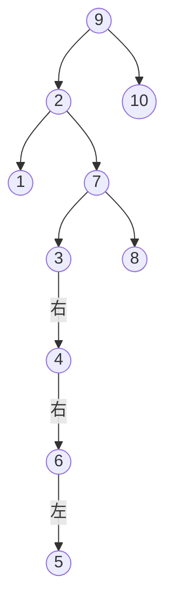

# 神戸大学 システム情報学研究科 2018年8月実施 専門科目 計算機科学 \[2\]

## **Author**
祭音Myyura (co-authored with GPT 5.6 SOL)

## **Description**
データ $1$ から $10$ の格納に関する，つぎの設問に答えよ。(1)，(2) の配列の添字は $0$ から始まるものとする。

### (1)
要素数 $N=10$ の配列 $B[i]$ を用いるオープンアドレス法を考える。データ $x$ の最初のハッシュ値を

$$
h(x)=x(x+2)\bmod N
$$

とし，衝突時の $k$ 回目の再ハッシュには

$$
h_k(x)=\{h(x)+k^2\}\bmod N,\qquad k=1,2,\ldots
$$

を用いる。空の配列に

$$
[9,6,4,1,7,10,2,5,3,8]
$$

をこの順に挿入した後の $B[0],\ldots,B[9]$ を示せ。

### (2)
配列 $H$ で 2 分ヒープを実現する。$H[0]$ が根で，節点 $H[i]$ の左の子を $H[2i+1]$，右の子を $H[2i+2]$ とし，親のデータは子のデータ以下とする。新しいデータを配列末尾に置き，条件を満たすまで親と交換する方法で，空のヒープに

$$
[9,6,7,10,2,5,3,8,1,4]
$$

をこの順に挿入する。最後の $H[0],\ldots,H[9]$ を配列の形で示せ。

### (3)
データ $1,2,\ldots,10$ を，つぎの形の 2 分木の各節点に割り当て，2 分探索木にせよ。

```text
          ○
         / \
        ○   ○
       / \
      ○   ○
         / \
        ○   ○
         \
          ○
           \
            ○
           /
          ○
```

### (4)
すべての節点で左右部分木の高さの差が $1$ 以下である 2 分探索木を AVL 木と呼ぶ。データ $1,2,\ldots,10$ を，節点数 $10$ の AVL 木の各節点に割り当てるとき，可能な AVL 木は全部で何通りあるか。図示は不要である。

### 题目描述

回答下面关于整数 $1$ 至 $10$ 的数据结构问题；数组下标从 $0$ 开始。

1. 对长度 $N=10$ 的开放寻址散列表，初始散列函数与第 $k$ 次再散列分别为

   $$
   h(x)=x(x+2)\bmod N,\qquad
   h_k(x)=(h(x)+k^2)\bmod N.
   $$

   从空表开始，依次插入 $[9,6,4,1,7,10,2,5,3,8]$，写出最终数组。
2. 用数组实现小根二叉堆，依次插入 $[9,6,7,10,2,5,3,8,1,4]$，写出最终数组。
3. 将 $1$ 至 $10$ 唯一地填入题图所示二叉树，使之成为二叉搜索树。
4. 统计以 $1$ 至 $10$ 为键、共有 $10$ 个结点的 AVL 树有多少棵。

## **Kai**

### (1)
各挿入で実際に採用される位置はつぎのとおりである。

| $x$ | $h(x)$ | 採用した $k$ | 添字 |
|---:|---:|---:|---:|
| 9 | 9 | 0 | 9 |
| 6 | 8 | 0 | 8 |
| 4 | 4 | 0 | 4 |
| 1 | 3 | 0 | 3 |
| 7 | 3 | 2 | 7 |
| 10 | 0 | 0 | 0 |
| 2 | 8 | 2 | 2 |
| 5 | 5 | 0 | 5 |
| 3 | 5 | 1 | 6 |
| 8 | 0 | 1 | 1 |

よって

$$
\boxed{[B[0],\ldots,B[9]]=[10,8,2,1,4,5,3,7,6,9]}.
$$

### (2)
各挿入後に新要素を親と比較し，小さい間だけ上方へ交換する。最終状態は

$$
\boxed{[H[0],\ldots,H[9]]=[1,2,3,6,4,7,5,10,8,9]}.
$$

### (3)
2 分探索木の中間順走査が $1,2,\ldots,10$ となるように割り当てればよい。



### (4)
空木の高さを $0$ とする。高さ $2$，$3$ の AVL 木について，節点数ごとの形の個数は

| 高さ | 節点数 $n$ と個数 |
|---|---|
| 2 | $n=2:2$ 個，$n=3:1$ 個 |
| 3 | $n=4:4$ 個，$n=5:6$ 個，$n=6:4$ 個，$n=7:1$ 個 |

である。節点数 $10$ の木の根を除くと，左右部分木の節点数の和は $9$ である。

- 両方が高さ $3$：$(4,5),(5,4)$ なので

  $$
  4\cdot6+6\cdot4=48.
  $$

- 高さが $3$ と $2$：一方の向きについて $(6,3),(7,2)$ なので

  $$
  4\cdot1+1\cdot2=6.
  $$

  左右を交換した場合も含めて $2\cdot6=12$。

各木のキー配置は中間順により一意に定まる。したがって

$$
\boxed{48+12=60\text{ 通り}}.
$$
