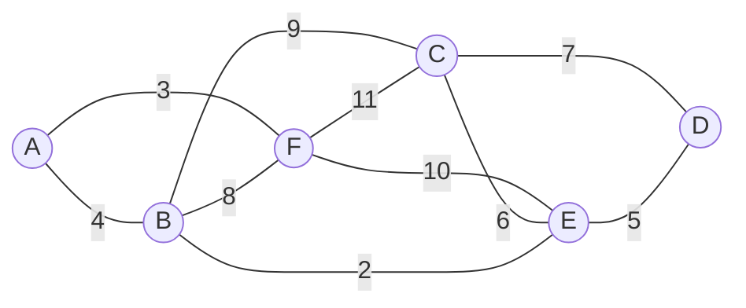

# 神戸大学 システム情報学研究科 2018年8月実施 専門科目 システム理論 \[2\]

## **Author**
祭音Myyura (co-authored with GPT 5.6 SOL)

## **Description**
図 (a) の無向重み付きグラフについて，以下の問いに答えよ。ただし，辺の交差箇所には頂点はないものとする。

1. 図 (a) のグラフがオイラー・グラフかどうか判定せよ。
2. 各頂点を道路の交差点，各辺を道路，辺の数字を距離（km）とする。任意の交差点を出発し，全道路を少なくとも 1 回通って，できるだけ短い総距離で出発点へ戻る経路を考える。また，2 回以上通る道路ができるだけ多くならないようにする。その経路の総距離を求めよ。
3. 豪雨の影響により道路 $C-F$ が通行止めになったとき，(2) の経路を見直し，その総距離を求めよ。

### 题目描述

对图 (a) 所示无向带权图回答下列问题。边的交叉处没有顶点。

1. 判断该图是否为欧拉图。
2. 将顶点视为道路交叉口、边视为道路、边权视为距离（km）。从任意交叉口出发，至少经过每条道路一次并回到起点；要求总距离尽量短，且尽量不使重复经过的道路过多。求该路线的总距离。
3. 暴雨导致道路 $C-F$ 封闭时，重新求上述路线及总距离。

## **Kai**

### (1)
各頂点の次数は

$$
\deg A=2,\quad \deg B=4,\quad \deg C=4,
\quad \deg D=2,\quad \deg E=4,\quad \deg F=4
$$

である。グラフは連結で，すべての頂点の次数が偶数であるから，

$$
\boxed{\text{図 (a) はオイラー・グラフである。}}
$$

### (2)
オイラー閉路では各辺をちょうど 1 回通れる。例えば

$$
\boxed{A-F-C-D-E-B-C-E-F-B-A}
$$

はオイラー閉路である。したがって最短総距離は全辺の重みの和に等しく，

$$
\begin{aligned}
L
&=4+3+8+9+10+6+7+5+2+11\\
&=\boxed{65\ \mathrm{km}}.
\end{aligned}
$$

### (3)
辺 $C-F$ を削除すると，$C,F$ だけが奇数次数となる。閉路を作るには，残ったグラフ上で $C$ と $F$ を結ぶ経路を重複して通る必要がある。

Dijkstra 法による $C$ からの最短距離は順に

$$
d(E)=6,\quad d(D)=7,\quad d(B)=8,\quad d(A)=12,\quad d(F)=15
$$

となる。したがって $C$ から $F$ への最短路は

$$
\boxed{C-E-B-A-F}
$$

であり，その長さは

$$
6+2+4+3=15\ \mathrm{km}
$$

である。$C-F$ を除いた辺の総和は $65-11=54$ km なので，最短総距離は

$$
\boxed{54+15=69\ \mathrm{km}}.
$$

例えば，追加する最短路の各辺を 1 本ずつ複製すれば，

$$
\boxed{A-F-E-B-A-F-B-E-C-D-E-C-B-A}
$$

が条件を満たす閉路となる。
