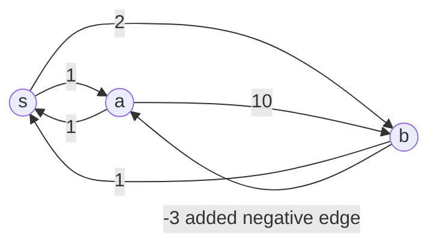

# 京都大学 情報学研究科 数理工学専攻 2017年8月実施 グラフ理論

## Author
祭音Myyura

## **Description**
Let $G=(V,E)$ be a simple strongly connected directed graph. Let $N=[G,w]$ be a network obtained by assigning a nonnegative real weight $w(e)$ to each arc $e \in E$. An arc from vertex u to vertex v is denoted by $(u,v)$, and its weight is also denoted by $w(u,v)$. Define $\text{dist}(u,v)$ as the minimum total weight of a simple directed path from $u$ to $v$ in $N$.

Answer the following questions.

(i) Let $S \subseteq V$ and $s \in S$. Among all arcs $(u,v)$ going from $S$ to $V−S$, choose an arc $(u^*, v^*)$ minimizing

$$
\text{dist}(s,u)+w(u,v).
$$

Prove that

$$
\text{dist}(s,v^∗)=\text{dist}(s,u^∗)+w(u^∗,v^∗).
$$

(ii) Show that Dijkstra’s algorithm from a starting vertex $s \in V$ can be implemented in $O(|E| \log |V|)$ time on $N$.

(iii) If one arc with negative weight is added to $N$, the values output by Dijkstra’s algorithm may fail to be correct shortest distances. Construct a concrete example with

$$
3\le |V| \le 4
$$

and explain how Dijkstra’s algorithm fails.

## **Kai**
### (i)
Take a shortest path from $s$ to $u^*$, and then append the arc $(u^*, v^*)$. If this walk repeats vertices, we may delete cycles. Since all edge weights are nonnegative, deleting cycles cannot increase the total weight. Hence there is a simple path from $s$ to $v^*$ of weight at most

$$
\text{dist}(s,u^∗)+w(u^∗,v^∗).
$$

i.e.,

$$
\text{dist}(s,v^∗) \le \text{dist}(s,u^∗)+w(u^∗,v^∗).
$$

Now we prove the reverse inequality.

Let $$P$ be a shortest simple path from $s$ to $v^*$. Since $s \in S$ and $v^* \in V - S$, the path $P$ must cross from $S$ to $V−S$ at least once.

Let $(x,y)$ be the first arc of $P$ that goes from $S$ to $V−S$. Thus $x \in S$ and $y \in V−S$. The part of $P$ from $s$ to $x$ has weight at least $\text{dist}(s,x)$. Also, all edge weights after $y$ are nonnegative. Hence

$$
\text{dist}(s, v^*) \ge \text{dist}(s, x) + w(x, y)
$$

By the choice of $(u^*, v^*)$,

$$
\text{dist}(s,u^∗)+w(u^∗,v^∗) \le \text{dist}(s, x) + w(x, y)
$$

Hence,

$$
\text{dist}(s, v^*) \ge \text{dist}(s,u^∗)+w(u^∗,v^∗)
$$

Combining the two inequalities, we get

$$
\text{dist}(s,v^∗)=\text{dist}(s,u^∗)+w(u^∗,v^∗).
$$

### (ii)
Use an adjacency-list representation and a binary heap priority queue supporting Extract-Min and Decrease-Key, the pseudocode of Dijkstra algorithm is given as follows:

```text
Dijkstra(G, w, s):

    for each vertex v in V:
        d[v] = infinity
        parent[v] = NIL

    d[s] = 0

    S = empty set
    Q = priority queue containing all vertices v, keyed by d[v]

    while Q is not empty:

        u = Extract-Min(Q)

        add u to S
        // At this moment, d[u] is fixed.
        // It will never be changed again.

        for each outgoing arc (u, v) in Adj[u]:

            if v is not in S:
                if d[v] > d[u] + w(u, v):
                    d[v] = d[u] + w(u, v)
                    parent[v] = u
                    Decrease-Key(Q, v, d[v])

    return d, parent
```

For the time complexity

- Each vertex is extracted from the priority queue once: $O(|V| \log |V|)$
- Each arc is relaxed once, and each successful relaxation causes a priority queue update: $O(|E| \log |V|)$

As the directed graph is strongly connected, we have $|E| \geq |V|$ when $|V| \ge 2$.

Thus the total running time is

$$
O(|V| \log |V|) + O(|E| \log |V|) = O(|E| \log |V|)
$$

### (iii)



The true shortest distance from $s$ to $a$ is $2 + (-3) = -1$ using the path $s \to b \to a$.

Now run Dijkstra’s algorithm from $s$.

Initially,

$$
\text{dist}(s) = 0, \text{dist}(a) = \infty, \text{dist}(b) = \infty.
$$

After processing $s$,

$$
\text{dist}(a) = 1, \text{dist}(b) = 2.
$$

Dijkstra chooses a next because $\text{dist}(a) = 1 < \text{dist}(b) = 2$. It fixes $\text{dist}(a) = 1$, but the true distance is $\text{dist}(a) = -1$.

Therefore Dijkstra’s algorithm fails when a negative-weight edge is allowed.