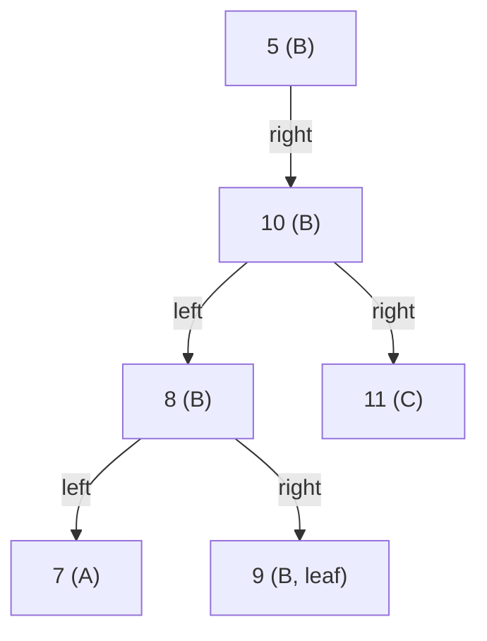

# 京都大学 情報学研究科 知能情報学専攻 2017年2月実施 情報学基礎 F-1

## **Author**
祭音Myyura (co-authored with GPT 5.6 SOL)

## **Description**

### Q.1

Binary search trees are a widely used data structure in computer science.

1. Give the definition of a binary search tree in 100 words.
2. When searching for the number $363$ in a binary search tree that has distinct integers in $[1,1000]$, which of the following sequences could **not** be the sequence of nodes visited? Give the reason for your choice(s).

   - (a) $925,202,911,240,912,245,363$
   - (b) $948,218,911,237,888,258,362,363$
   - (c) $7,249,401,395,330,344,394,363$
   - (d) $935,278,347,621,299,392,358,363$
   - (e) $12,399,387,219,266,380,379,278,363$
3. Suppose that the search for a key $k$ in a binary search tree ends at a leaf. Let $A$ be the keys to the left of the search path, $B$ the keys on the search path, and $C$ the keys to the right of the search path. Must every $a\in A$, $b\in B$, and $c\in C$ satisfy $a\le b\le c$? If yes, prove it. If not, give a counterexample with the minimum number of nodes and explain it.

### Q.2

Finding the $p$-th smallest element in an array $Q$ of $n$ distinct numbers is called **Selection**.

1. Give a Selection algorithm taking $\Theta(n\log n)$ time for an unsorted array $Q$.
2. Give pseudocode for another Selection algorithm based on partitioning $Q$ that runs in linear time on average, and prove its time complexity.

### 题目描述

1. 回答二叉搜索树相关问题：
   1. 用不超过 100 词定义二叉搜索树。
   2. 在由 $[1,1000]$ 内不同整数构成的二叉搜索树中查找 $363$，判断给定的五个序列中哪些不可能是访问节点序列，并说明理由。
   3. 将一条以叶节点结束的搜索路径左侧、路径上、路径右侧的键分别记为 $A,B,C$。判断是否总有 $a\le b\le c$；若否，给出节点数最少的反例。
2. 在含 $n$ 个不同数的未排序数组 $Q$ 中求第 $p$ 小元素：
   1. 给出 $\Theta(n\log n)$ 时间算法；
   2. 给出基于划分、平均线性时间的算法伪代码，并证明复杂度。

## **Kai**

### Q.1

#### 1.1

A binary search tree is a rooted binary tree whose nodes have distinct keys. For every node $v$, every key in the left subtree of $v$ is smaller than $v.key$, and every key in the right subtree is larger than $v.key$. Both subtrees satisfy the same property recursively. Consequently, an inorder traversal lists the keys in increasing order.

#### 1.2

During the search, maintain the open interval $(L,U)$ in which the next visited key must lie. Initially $(L,U)=(-\infty,\infty)$. At a visited key $x$, set $L=x$ if $x<363$, and set $U=x$ if $x>363$.

- **(a) is impossible.** After $240$, the interval is $(240,911)$, but the next key is $912$.
- **(d) is impossible.** After $621$, the interval is $(347,621)$, but the next key is $299$.
- (b), (c), and (e) respect the interval at every step and hence can occur.

Thus the answer is

$$
\boxed{\text{(a) and (d)}}.
$$

#### 1.3

No. The following six-node tree is a minimum counterexample. The search for $k=9$ follows the marked path $5,10,8,9$.



Choose $a=7$, $b=5$, and $c=11$. Then $a>b$, so $a\le b\le c$ is false.

Both $A$ and $C$ must be nonempty, requiring at least two off-path nodes. If the path had at most three nodes, it would have at most two branch decisions. To make both side sets nonempty, those decisions would have to be `right, left` or `left, right`; in either case every left-side key is below every path key and every right-side key is above every path key. Thus a violation needs at least four path nodes. Hence at least $4+2=6$ nodes are necessary, and the example is minimum.

### Q.2

#### 2.1

Sort $Q$ by merge sort and return the element at rank $p$:

```text
SELECTION-BY-SORTING(Q, p)
    MERGE-SORT(Q)
    return Q[p]                 // indices start at 1
```

Merge sort takes $\Theta(n\log n)$ time, and the final access takes $\Theta(1)$ time. Thus the total is $\Theta(n\log n)$.

#### 2.2

Use randomized quickselect.

```text
RANDOMIZED-SELECT(Q, p)
    if |Q| = 1
        return Q[1]

    choose a pivot q uniformly at random from Q
    partition Q into L = {x < q} and R = {x > q}

    if p = |L| + 1
        return q
    if p <= |L|
        return RANDOMIZED-SELECT(L, p)
    return RANDOMIZED-SELECT(R, p - |L| - 1)
```

One partition costs $cn$ time. If the pivot has rank $r$, the recursive subproblem has size at most $\max(r-1,n-r)$. Therefore

$$
\mathbb E[T(n)]
\le cn+\frac1n\sum_{r=1}^{n}
\mathbb E\!\left[T\bigl(\max(r-1,n-r)\bigr)\right].
$$

Moreover,

$$
\frac1n\sum_{r=1}^{n}\max(r-1,n-r)\le \frac{3n}{4}.
$$

Assuming inductively that $\mathbb E[T(k)]\le ak$ for $k<n$, the recurrence gives

$$
\mathbb E[T(n)]\le cn+\frac{3a}{4}n\le an
$$

for $a\ge4c$. Thus the expected running time is $O(n)$. Since partitioning inspects all $n$ elements, it is also $\Omega(n)$, hence

$$
\boxed{\mathbb E[T(n)]=\Theta(n)}.
$$
