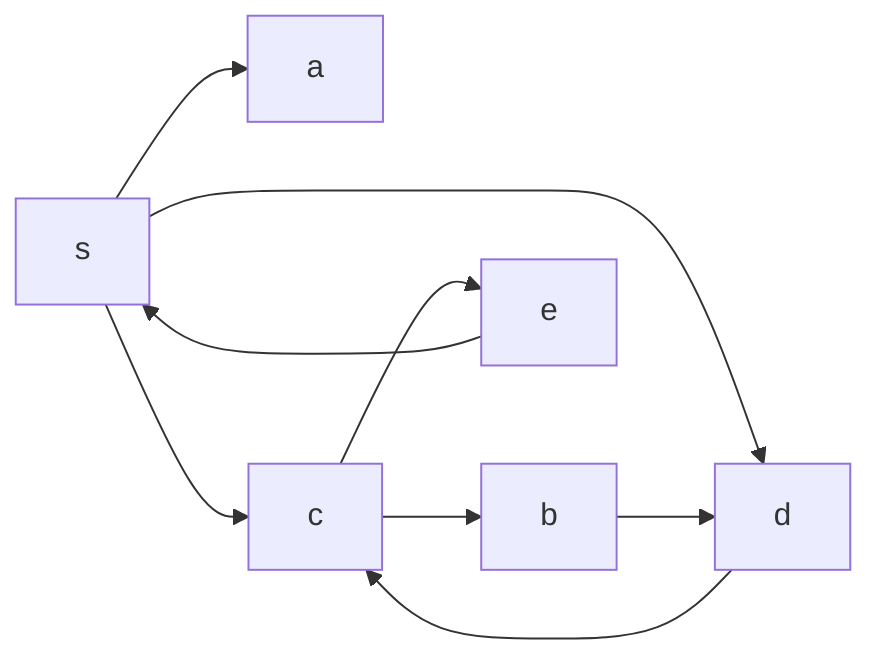

# 京都大学 情報学研究科 知能情報学専攻 2018年2月実施 情報学基礎 F-1

## **Author**
祭音Myyura (co-authored with GPT 5.6 SOL)

## **Description**

### Q.1

A hash table is an effective data structure for implementing operations such as `INSERT`, `SEARCH`, and `DELETE` in computer systems.

1. What is the advantage of hash tables compared with directly addressing into an array?
2. Given a hash table of size $7$ for integer keys, with linear probing and hash function $h(x)=x\bmod 7$, show the table after inserting $0,11,3,7,1,9$ in this order.
3. A hash function $h$ hashes $n$ distinct keys into an array $T$ of length $m$. Assuming uniform hashing, what is the expected cardinality of

   $$
   \bigl\{\{k,l\}:k\ne l\text{ and }h(k)=h(l)\bigr\}?
   $$

### Q.2

Breadth-first search (BFS) and depth-first search (DFS) are algorithms for traversing trees or graphs.

1. Draw the directed graph on vertices $\{a,b,c,d,e,s\}$ specified by

   $$
   \begin{aligned}
   \operatorname{adj}(s)&=[a,c,d],&
   \operatorname{adj}(a)&=[],\\
   \operatorname{adj}(c)&=[b,e],&
   \operatorname{adj}(b)&=[d],\\
   \operatorname{adj}(d)&=[c],&
   \operatorname{adj}(e)&=[s].
   \end{aligned}
   $$

   Here $\operatorname{adj}(i)$ lists the vertices to which $i$ points.
2. Give the order in which the vertices are visited by BFS and DFS, respectively. Both algorithms start at $s$, and neighbors are examined in their adjacency-list order.
3. Give a recursive DFS algorithm for a graph.

### 题目描述

1. 回答哈希表相关问题：
   1. 与直接寻址数组相比，哈希表有何优点？
   2. 长度为 $7$ 的哈希表使用线性探测和 $h(x)=x\bmod7$。按序插入 $0,11,3,7,1,9$ 后，写出表内容。
   3. 将 $n$ 个不同键均匀哈希到长度 $m$ 的数组，求发生碰撞的无序键对数量的期望。
2. 对给定有向邻接表：
   1. 画出图；
   2. 从 $s$ 出发，按邻接表中的顺序分别写出 BFS 与 DFS 的访问顺序；
   3. 给出图上 DFS 的递归算法。

## **Kai**

### Q.1

#### 1.1

A direct-address table needs one slot for every possible key, so it uses $\Theta(|U|)$ space for key universe $U$. A hash table can use $m=\Theta(n)$ slots for $n$ stored keys and still supports search, insertion, and deletion in expected $\Theta(1)$ time under uniform hashing. It therefore saves substantial space when the stored key set is sparse.

#### 1.2

Linear probing tests $h(x),h(x)+1,\ldots$ cyclically until it finds an empty slot. The insertions give

| Index | 0 | 1 | 2 | 3 | 4 | 5 | 6 |
|:---:|:---:|:---:|:---:|:---:|:---:|:---:|:---:|
| Key | 0 | 7 | 1 | 3 | 11 | 9 | empty |

Thus the final table is

$$
\boxed{[0,7,1,3,11,9,\varnothing]}.
$$

#### 1.3

For each unordered pair $\{k,l\}$, define

$$
I_{kl}=\mathbf 1\{h(k)=h(l)\}.
$$

Uniform hashing gives $\mathbb E[I_{kl}]=1/m$. There are $\binom n2$ unordered pairs, so linearity of expectation yields

$$
\boxed{
\mathbb E\!\left[\sum_{\{k,l\}}I_{kl}\right]
=\binom n2\frac1m
=\frac{n(n-1)}{2m}
}.
$$

### Q.2

#### 2.1



#### 2.2

Using the adjacency-list order shown in the question,

$$
\boxed{\text{BFS: }s,a,c,d,b,e}
$$

and

$$
\boxed{\text{DFS: }s,a,c,b,d,e}.
$$

#### 2.3

```text
DFS-VISIT(G, u)
    visited[u] = true
    output u
    for each v in G.adj[u]
        if not visited[v]
            DFS-VISIT(G, v)

DFS(G)
    for each vertex u in G
        visited[u] = false
    for each vertex u in G
        if not visited[u]
            DFS-VISIT(G, u)
```

Each vertex is visited once and each directed edge is examined once, so the running time is $\Theta(|V|+|E|)$.
