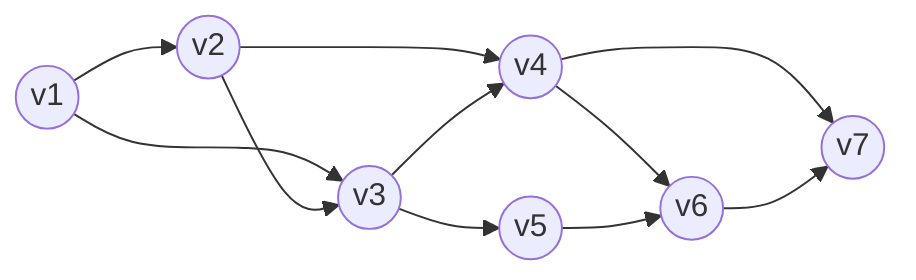

# 京都大学 情報学研究科 知能情報学専攻 2024年2月実施 基礎科目 F2-1

## **Author**
祭音Myyura (co-authored with GPT 5.6 SOL)

## **Description**

### Q.1
We have the following weighted directed acyclic graph (DAG) $G_1$ that has seven nodes named $v_1, v_2, ..., v_7$. The weight of all edges is equal to 1.



**(1)** List all of the shortest paths from $v_1$ to $v_7$.

**(2)** Answer the number of directed paths from $v_1$ to $v_7$.

Suppose we have a simple connected weighted DAG $G = (V, E)$ with a set of nodes $V$ and a set of edges $E$. The weight of all edges is equal to 1. For any node $v \in V$, let $N(v) = \{ v' \mid (v', v) \in E \}$. Note that $(v', v)$ indicates an edge from $v'$ to $v$. We suppose $v_s \in V$ is the only node whose $N(v_s)$ is an empty set.

**(3)** For any node $v \in V - \{v_s\}$, let $s(v)$ denote the number of paths from $v_s$ to $v$, and let $s(v_s) = 1$. Express $s(v)$ using elements of $\{s(v')\}_{v' \in V - \{v\}}$.

**(4)** For any node $v \in V - \{v_s\}$, let $d(v)$ denote the length of the shortest path from $v_s$ to $v$, and let $d(v_s) = 0$. Express $d(v)$ using elements of $\{d(v')\}_{v' \in V - \{v\}}$.

### Q.2
Let $\mathbb{N}$ be the set of all non-negative integers and $\mathbb{N}^3 = \{(i, j, k) \mid i, j, k \in \mathbb{N}\}$. We define a total order $\preccurlyeq$ of two elements in $\mathbb{N}^3$ as $(i, j, k) \preccurlyeq (s, t, u)$ if and only if $(i - s, j - t, k - u) = (0, 0, 0)$ or the rightmost non-zero component of $(i - s, j - t, k - u)$ is negative. For example, $(4, 2, 3) \preccurlyeq (5, 2, 3)$, $(4, 2, 3) \preccurlyeq (5, 4, 3)$, and $(4, 2, 3) \preccurlyeq (2, 3, 3)$.

For a given $N \in \mathbb{N}$, consider the task of listing all elements in $S_N = \{(i, j, i^2 + j^2) \in \mathbb{N}^3 \mid 0 \le i \le N, 0 \le j \le N\}$ following the order $\preccurlyeq$, that is, listing all elements in $S_N$ as

$$
(0, 0, 0), (1, 0, 1), (0, 1, 1), ..., (i_n, j_n, {i_n}^2 + {j_n}^2), (i_{n+1}, j_{n+1}, {i_{n+1}}^2 + {j_{n+1}}^2), ..., (N, N, 2N^2)
$$

so that $(i_n, j_n, {i_n}^2 + {j_n}^2) \preccurlyeq (i_{n+1}, j_{n+1}, {i_{n+1}}^2 + {j_{n+1}}^2)$ holds for all $n = 1, 2, ..., (N + 1)^2$.

Both Algorithm 1 and Algorithm 2 on the next page are for accomplishing the task with a min-heap $H$ for keeping elements in $S_N$, where "min" means minimum in the order $\preccurlyeq$. Note that "Insert $A$ into $H$" means to insert $A$ into $H$ as its root and to maintain $H$ so that it keeps the heap property. Also, "Extract $A$ from $H$" means to remove $A$ from $H$ and to maintain $H$ so that it keeps the heap property.

**(1)** Draw the heap $H$ of Algorithm 1 as a *tree*, not an array, obtained after executing the part ① for the case $N=2$. Also illustrate step by step how $H$ is maintained in the first repetition of the while loop.

**(2)** Fill blank in Algorithm 2 so that the size of $H$ is no more than $N+1$ in the while loop.

**(3)** For the case $N=2$, illustrate step by step how $H$ is maintained in the first and second repetitions of the while loop in Algorithm 2.

**(4)** Let $N \ge 2$. Explain the reason why Algorithm 2 with your answer for (2) works as requested.

```text
Algorithm 1
    H = empty heap
    for j = 0 to N:
        for i = 0 to N:                       <- part ①
            insert (i, j, i^2 + j^2) into H
    while H is not empty:
        extract and output the root

Algorithm 2
    H = empty heap
    for j = 0 to N:
        insert (0, j, j^2) into H
    while H is not empty:
        extract the root as (i', j', (i')^2 + (j')^2)
        and output it
        if i' < N:
            insert [ blank ] into H
```

### 题目描述

1. 题图给出含 7 个顶点 $v_1,\ldots,v_7$、所有边权均为 1 的加权 DAG $G_1$。

   图的边集如上方 Mermaid 图所示。

   1. 列出从 $v_1$ 到 $v_7$ 的全部最短路径；
   2. 求从 $v_1$ 到 $v_7$ 的有向路径总数。

   再设简单连通加权 DAG $G=(V,E)$ 的所有边权为 1，
   $N(v)=\{v'\mid(v',v)\in E\}$ 为 $v$ 的入邻接点，且 $v_s$ 是唯一满足 $N(v_s)=\varnothing$ 的顶点。
   3. 令 $s(v)$ 为从 $v_s$ 到 $v$ 的路径数，$s(v_s)=1$。用其他顶点的 $s(v')$ 表示 $s(v)$。
   4. 令 $d(v)$ 为从 $v_s$ 到 $v$ 的最短距离，$d(v_s)=0$。用其他顶点的 $d(v')$ 表示 $d(v)$。
2. 令 $\mathbb N$ 为非负整数集。在 $\mathbb N^3$ 上定义全序：
   $(i,j,k)\preccurlyeq(s,t,u)$ 当且仅当二者相等，或差
   $(i-s,j-t,k-u)$ 最右侧非零分量为负。对给定 $N$，需按此序列出

   $$
   S_N=\{(i,j,i^2+j^2)\mid0\le i,j\le N\}.
   $$

   题图 Algorithm 1、2 均用以 $\preccurlyeq$ 为序的最小堆 $H$ 完成任务。
   1. 当 $N=2$ 时，画出 Algorithm 1 执行部分 ① 后的堆树，并逐步展示 `while` 第一次迭代中如何维护堆。
   2. 填写 Algorithm 2 空栏，使循环中 $|H|\le N+1$。
   3. 当 $N=2$ 时，逐步展示 Algorithm 2 的前两次迭代中堆的维护。
   4. 对 $N\ge2$，解释填空后的 Algorithm 2 为何正确。

   两个算法的伪代码见上方代码块。

## **Kai**

### Q.1
#### (1) A shortest path must use the edge $v_4 \to v_7$, because reaching $v_7$ through $v_6$ requires at least $4$ edges.

Thus the two shortest paths, both of length $3$, are

$$
v_1 \to v_2 \to v_4\to v_7,
\qquad
v_1 \to v_3 \to v_4\to v_7.
$$

#### (2) Number of directed paths from `v1` to `v7`

Let `s(vi)` denote the number of directed paths from `v1` to `vi`. Set `s(v1) = 1`.

For every other vertex, sum the numbers of paths reaching its immediate predecessors:

```text
s(v1) = 1
s(v2) = s(v1) = 1
s(v3) = s(v1) + s(v2) = 1 + 1 = 2
s(v4) = s(v2) + s(v3) = 1 + 2 = 3
s(v5) = s(v3) = 2
s(v6) = s(v4) + s(v5) = 3 + 2 = 5
s(v7) = s(v4) + s(v6) = 3 + 5 = 8
```

Hence, the number of directed paths from `v1` to `v7` is `8`.

#### (3) General recurrence for the number of paths
For any `v ∈ V - {vs}`, every path from `vs` to `v` must end with one incoming edge `(v', v)` where `v' ∈ N(v)`. Therefore

```text
s(v) = Σ_{v' ∈ N(v)} s(v').
```

with the base value

```text
s(vs) = 1.
```

#### (4) General recurrence for the shortest-path length
Since every edge has weight `1`, a shortest path to `v` must come from one predecessor `v' ∈ N(v)` and then use one extra edge. Therefore

```text
d(v) = 1 + min_{v' ∈ N(v)} d(v').
```

with the base value

```text
d(vs) = 0.
```

### Q.2
The order `≼` compares triples by

1. increasing `k`,
2. then increasing `j`,
3. then increasing `i`.

This is because the rightmost non-zero component is checked first.

#### (1) Heap of Algorithm 1 for `N = 2`
The inserted elements are

```text
(0,0,0), (1,0,1), (2,0,4),
(0,1,1), (1,1,2), (2,1,5),
(0,2,4), (1,2,5), (2,2,8).
```

A min-heap after part ① can be drawn as

```text
                    (0,0,0)
                 /           \
           (1,0,1)           (2,0,4)
          /       \         /       \
     (0,1,1)   (1,1,2)  (2,1,5)   (0,2,4)
      /    \
 (1,2,5)  (2,2,8)
```

Now perform the first repetition of the while loop.

Step 1: extract the root `(0,0,0)` and move the last element `(2,2,8)` to the root.

```text
                    (2,2,8)
                 /           \
           (1,0,1)           (2,0,4)
          /       \         /       \
     (0,1,1)   (1,1,2)  (2,1,5)   (0,2,4)
      /
 (1,2,5)
```

Step 2: compare `(2,2,8)` with its children and swap with the smaller child `(1,0,1)`.

```text
                    (1,0,1)
                 /           \
           (2,2,8)           (2,0,4)
          /       \         /       \
     (0,1,1)   (1,1,2)  (2,1,5)   (0,2,4)
      /
 (1,2,5)
```

Step 3: compare `(2,2,8)` with its children and swap with `(0,1,1)`.

```text
                    (1,0,1)
                 /           \
           (0,1,1)           (2,0,4)
          /       \         /       \
     (2,2,8)   (1,1,2)  (2,1,5)   (0,2,4)
      /
 (1,2,5)
```

Step 4: compare `(2,2,8)` with its child `(1,2,5)` and swap once more.

```text
                    (1,0,1)
                 /           \
           (0,1,1)           (2,0,4)
          /       \         /       \
     (1,2,5)   (1,1,2)  (2,1,5)   (0,2,4)
      /
 (2,2,8)
```

This is the heap after the first extraction.

#### (2) Fill in the blank of Algorithm 2
After extracting `(i', j', (i')^2 + (j')^2)`, the next candidate with the same `j'` should be the successor in the same sorted list for fixed `j'`. Therefore the blank is

```text
(i' + 1, j', (i' + 1)^2 + (j')^2)
```

#### (3) Algorithm 2 for `N = 2`

Initial heap after the `for every j from 0 to N` part:

```text
        (0,0,0)
       /       \
  (0,1,1)   (0,2,4)
```

##### First repetition
Extract the root `(0,0,0)`.

Move the last element `(0,2,4)` to the root:

```text
        (0,2,4)
       /
  (0,1,1)
```

Heapify down by swapping with `(0,1,1)`:

```text
        (0,1,1)
       /
  (0,2,4)
```

Since `i' = 0 < 2`, insert

```text
(1,0,1).
```

After insertion and heap maintenance:

```text
        (1,0,1)
       /       \
  (0,2,4)   (0,1,1)
```

##### Second repetition
Extract the root `(1,0,1)`.

Move the last element `(0,1,1)` to the root:

```text
        (0,1,1)
       /
  (0,2,4)
```

This already satisfies the heap property.

Since `i' = 1 < 2`, insert

```text
(2,0,4).
```

After insertion:

```text
        (0,1,1)
       /       \
  (0,2,4)   (2,0,4)
```

This is the heap after the second repetition.

#### (4) Why Algorithm 2 works
For each fixed `j`, define the sequence

```text
Lj = (0, j, j^2), (1, j, 1 + j^2), ..., (N, j, N^2 + j^2).
```

For fixed `j`, this sequence is already sorted by `≼`, because the third component `i^2 + j^2` strictly increases as `i` increases.

Algorithm 2 initially inserts only the first element of each sequence `Lj`, so the heap size is exactly `N + 1`.

Whenever the minimum element `(i', j', (i')^2 + (j')^2)` is extracted, the only new candidate from the same sequence that can possibly come next is

```text
(i' + 1, j', (i' + 1)^2 + (j')^2),
```

and this successor is inserted only if `i' < N`.

Therefore:

- at any moment the heap contains at most one not-yet-output candidate from each `Lj`;
- the heap size is never more than `N + 1`;
- the root of the heap is always the smallest not-yet-output element in all of `S_N`.

Hence Algorithm 2 is exactly a `k`-way merge of the `N + 1` sorted sequences `L0, L1, ..., LN`, so it outputs all elements of `S_N` in the required order.
