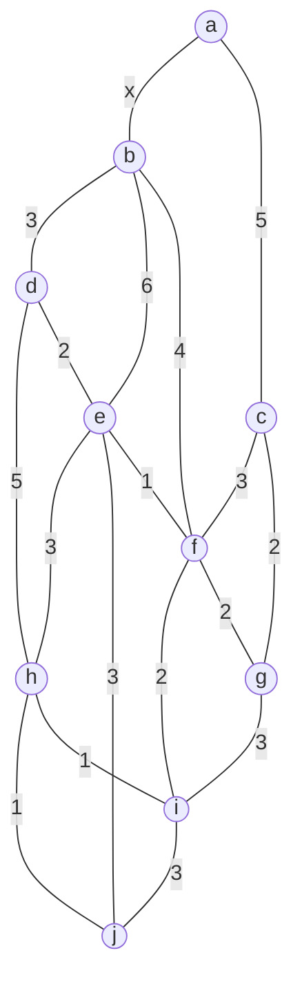

# 京都大学 情報学研究科 知能情報学専攻 2024年8月実施 情報学基礎 F2-1

## **Author**
祭音Myyura

## **Description (English)**
### Q.1
In the undirected graph shown below, the numbers attached to the edges represent their lengths. The edge length $x$ between nodes $a$ and $b$ is a positive real number. Among all paths between two nodes $s$ and $t$, those with the minimum total edge length are called the shortest paths between $s$ and $t$. The total edge length in a shortest path is referred to as the distance between $s$ and $t$. A path is represented as a sequence of nodes in which no node appears more than once.

(1) Derive the distance between $b$ and $j$, and identify all shortest paths, each represented as a sequence of nodes.

(2) Derive the condition on $x$ under which $b$ is included in all shortest paths between $a$ and $j$.

### Q.2
Given a set $U = \{1, 2, \dots, n\}$ and a set $S = \{S_1, S_2, \dots, S_m\}$ where each $S_i$ is a subset of $U$, the set cover problem is to identify a set $\mathcal{C} = \{S_{c_1}, S_{c_2}, \dots, S_{c_k}\} \subseteq S$ with the minimum $k$ such that $S_{c_1} \cup S_{c_2} \cup \dots \cup S_{c_k} = U$ holds. Note that $n$ and $m$ are positive integers and it is assumed that $S_1 \cup S_2 \cup \dots \cup S_m = U$ holds. The following pseudo-code describes a greedy algorithm that computes an approximate solution to this problem.

$$
\begin{array}{ll}
1 & \mathcal{C} \leftarrow \{\}; \mathcal{P} \leftarrow \mathcal{S}; V \leftarrow U; \\
2 & \mathbf{while}\ V \neq \{\}\ \mathbf{do\ begin} \\
3 & \quad h \leftarrow \max(\{\#(S_j \cap V) \mid S_j \in \mathcal{P}\}); \\
4 & \quad i \leftarrow \min(\{j \mid \#(S_j \cap V) = h,\ S_j \in \mathcal{P}\}); \\
5 & \quad \mathcal{P} \leftarrow \mathcal{P} \setminus \{S_i\};\ V \leftarrow V \setminus S_i;\ \mathcal{C} \leftarrow \mathcal{C} \cup \{S_i\}; \\
6 & \mathbf{end} \\
7 & \mathbf{output}\ \mathcal{C};
\end{array}
$$

Note that $\#(X)$, $\max(X)$, and $\min(X)$ denote the number of elements, the maximum element, and the minimum element of a set $X$, respectively. Note also that $X \setminus Y$ denotes the set difference, which is the set obtained by deleting the elements belonging to both $X$ and $Y$ from $X$. For example, $\{1, 3, 4, 5\} \setminus \{2, 3, 5\} = \{1, 4\}$ holds.

This algorithm may output different solutions even for the same $S$, depending on the ordering of their elements. For example, suppose that $U = \{1, 2, 3, 4, 5\}$ and $S = \{\{1, 3, 5\}, \{2, 4\}, \{2, 3, 5\}\}$. This algorithm outputs $\mathcal{C} = \{\{1, 3, 5\}, \{2, 4\}\}$ if $S_1 = \{1, 3, 5\}, S_2 = \{2, 4\}$, and $S_3 = \{2, 3, 5\}$, whereas it outputs $\mathcal{C} = \{\{2, 3, 5\}, \{2, 4\}, \{1, 3, 5\}\}$ if $S_1 = \{2, 3, 5\}, S_2 = \{2, 4\}$, and $S_3 = \{1, 3, 5\}$.

When considering all possible orderings of the elements of $S$ (i.e., all permutations of the elements of $S$) for given $U$ and $S$, among all solutions $\mathcal{C}$ outputted by this algorithm, let $A_{\min}(U, S)$ denote the cardinality of $\mathcal{C}$ with the smallest cardinality, and let $A_{\max}(U, S)$ denote the cardinality of $\mathcal{C}$ with the largest cardinality. Note that for the case of $(U, S)$ given above, $A_{\min}(U, S) = 2$ and $A_{\max}(U, S) = 3$ hold. Answer the following questions where reasons must be given for all answers.

(1) Let $U = \{1, 2, \dots, 10\}$ and $S = \{\{i, i+1\} \mid i = 1, 2, \dots, 9\}$. Derive $A_{\min}(U, S)$ and $A_{\max}(U, S)$.

(2) Let $U = \{1, 2, \dots, 100\}$ and $S = \{\{i, j\} \mid \text{all integers } i, j \text{ satisfying } 1 \le i < j \le 100\}$. Derive $A_{\min}(U, S)$ and $A_{\max}(U, S)$.

(3) Let $U = \{1, 2, \dots, 63\}$ and $S = \{\{i, 2i\}, \{i, 2i+1\} \mid i = 1, 2, \dots, 31\}$. Derive $A_{\min}(U, S)$.

## **Kai**
### Q.1
#### (1)
Applying Dijkstra's algorithm from $b$, the relevant distances are

$$
d(b,d)=3,\qquad d(b,f)=4,\qquad d(b,e)=5,
$$

$$
d(b,i)=6,\qquad d(b,h)=7,\qquad d(b,j)=8.
$$

The distance $8$ is attained by the following three paths:

$$
(b,d,e,j),\qquad
(b,f,e,j),\qquad
(b,f,i,h,j).
$$

Their lengths are

$$
3+2+3=8,
$$

$$
4+1+3=8,
$$

and

$$
4+2+1+1=8,
$$

respectively.

Any path from $b$ through $a$ has length at least $x+12>8$, since
$x>0$. Therefore,

$$
\boxed{d(b,j)=8}
$$

and all shortest paths are

$$
\boxed{
(b,d,e,j),\quad
(b,f,e,j),\quad
(b,f,i,h,j)
}.
$$

#### (2)

A shortest $a$-$j$ path through the edge $\{a,b\}$ has length

$$
x+d(b,j)=x+8.
$$

If $b$ is avoided, the path must start with $\{a,c\}$. In the graph
with $b$ removed,

$$
d(c,j)=7,
$$

as shown by

$$
(c,f,e,j),\qquad
(c,f,i,h,j),\qquad
(c,g,i,h,j).
$$

Hence the shortest $a$-$j$ path avoiding $b$ has length

$$
5+7=12.
$$

Thus $b$ is contained in every shortest path exactly when

$$
x+8<12.
$$

Since $x$ is positive,

$$
\boxed{0<x<4}.
$$

When $x=4$, shortest paths both through and avoiding $b$ exist; when
$x>4$, the shortest paths avoid $b$.

### Q.2
In each case, regard $U$ as the vertex set of a graph and each
two-element set in $\mathcal S$ as an edge.

While an edge with two uncovered endpoints exists, the greedy algorithm
chooses such an edge. These chosen edges form a maximal matching $M$.
Let

$$
r=|M|.
$$

After these $r$ choices, $2r$ vertices are covered. Since $M$ is
maximal, no two uncovered vertices are adjacent, so each later choice
covers exactly one new vertex. Therefore, the total number of selected
sets is

$$
r+(n-2r)=n-r.
$$

Moreover, any maximal matching can be obtained by placing all its edges
first in the ordering.

#### (1)

The graph is the path

$$
1-2-\cdots-10.
$$

Its maximum matching size is $5$, for example,

$$
\{\{1,2\},\{3,4\},\{5,6\},\{7,8\},\{9,10\}\}.
$$

Hence

$$
A_{\min}(U,\mathcal S)=10-5=5.
$$

For $A_{\max}$, we need a maximal matching of minimum size. The matching

$$
\{\{2,3\},\{5,6\},\{8,9\}\}
$$

is maximal and has size $3$.

No maximal matching can have size at most $2$: otherwise at least six
vertices would be unmatched, but a path on ten vertices has an
independent set of size at most five. Thus two unmatched vertices would
be adjacent, contradicting maximality.

Therefore,

$$
\boxed{
A_{\min}(U,\mathcal S)=5,\qquad
A_{\max}(U,\mathcal S)=7
}.
$$

#### (2)

The graph is the complete graph $K_{100}$.

As long as at least two vertices are uncovered, an edge joining two
uncovered vertices exists, so the greedy algorithm covers two new
vertices at every step. Equivalently, every maximal matching in
$K_{100}$ is a perfect matching of size $50$.

Therefore, independently of the ordering,

$$
\boxed{
A_{\min}(U,\mathcal S)
=
A_{\max}(U,\mathcal S)
=
50
}.
$$

#### (3)

The graph is the complete binary tree with vertices $1,\ldots,63$,
where vertex $i$ is joined to $2i$ and $2i+1$.

Let $T_h$ be the complete binary tree with levels $0,\ldots,h$. Define

- $F_h$: the maximum matching size when the root is not matched to its
  parent;
- $G_h$: the maximum matching size when the root is already matched to
  its parent.

Then

$$
F_0=G_0=0,
$$

and, for $h\geq1$,

$$
G_h=2F_{h-1},
$$

$$
F_h=
\max\left\{
2F_{h-1},
\,
1+G_{h-1}+F_{h-1}
\right\}.
$$

The values are

$$
\begin{array}{c|cccccc}
h&0&1&2&3&4&5\\ \hline
F_h&0&1&2&5&10&21\\
G_h&0&0&2&4&10&20
\end{array}
$$

Thus the maximum matching size of the given tree is

$$
F_5=21.
$$

Consequently,

$$
A_{\min}(U,\mathcal S)
=
63-21
=
\boxed{42}.
$$
