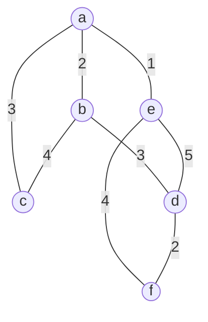
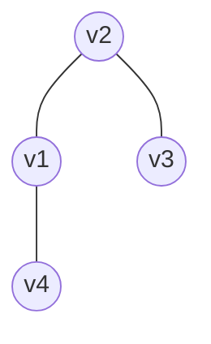

# 京都大学 情報学研究科 知能情報学専攻 2024年8月実施 情報学基礎 F2-2

## **Author**
祭音Myyura

## **Description (English)**
Fig. 1 shows a weighted undirected graph $G$. The vertex set of $G$ is $V = \{a, b, c, d, e, f\}$, and the edge set of $G$ is $E = \{(a, b), (a, c), (a, e), (b, c), (b, d), (d, e), (d, f), (e, f)\}$. For each edge $(u, v) \in E$, the order of $u$ and $v$ is not distinguished. In Algorithms 1 and Algorithm 2, $V$ and $E$ are referred to as $G.V$ and $G.E$, respectively. The weight $w(u, v)$ of each edge in $G$ is given in Fig. 1. A minimum spanning tree of $G$ is a connected subgraph that contains all vertices in $G$, has no cycles, and minimizes the total weight of its edges.

#### <center> Figure 1.

<div align="center">



</div>

### Q.1
Answer the following questions.

(1) List all the edges of the minimum spanning tree of $G$, and answer the total weight of those edges.

(2) Suppose that a cut $(S, V - S)$ of $G$ is defined by the vertex set $S = \{d, f\}$. List all the edges between $S$ and $V - S$.

(3) Prove by contradiction that the edge $(b, d)$ is included in the minimum spanning tree of $G$.

### Q.2
Prim's algorithm is a greedy method for constructing a minimum spanning tree. The algorithm starts from an arbitrary root $r \in V$ and grows the tree by iteratively selecting edges with the smallest weights $w(u, v)$, until the tree includes all vertices in $V$. To select the next vertex to add, the algorithm manages the vertices using a min-priority queue $Q$. Each vertex $v \in V$ in the queue has an attribute $v.key$, which stores the weight of the smallest edge weights between $v$ and the tree. For each step, the vertex with the smallest $key$ is extracted from $Q$ and added to the tree. The parent of a vertex $v$ in the tree is denoted by $v.parent$. Answer the following questions about this algorithm.

(1) Complete Algorithm 1: MST-PRIM, which shows the pseudo-code for Prim's algorithm, by filling in the blanks $\fbox{(a)}$ and $\fbox{(b)}$. In Algorithm 1, $Q$ denotes the set of vertices stored in the min-priority queue. The following operations are used:
+ $\operatorname{Insert}(Q, u)$ inserts a vertex $u$ into $Q$.
+ $\operatorname{Extract-Min}(Q)$ removes and returns the vertex in $Q$ that has the smallest $key$.
+ $\operatorname{Decrease-Key}(Q, v, w(u, v))$ updates the value of $v.key$ to $w(u, v)$ for vertex $v$ in $Q$.
Assume that the priority queue $Q$ maintains its order so that the vertex with the smallest $key$ can always be extracted without searching. This reordering is performed after each of the operations $\operatorname{Insert}$, $\operatorname{Extract-Min}$, and $\operatorname{Decrease-Key}$.

$$
\begin{array}{l}
\hline
\textbf{Algorithm 1: } \text{:MST-PRIM}(G, w, r) \\
\hline
\mathbf{1}\phantom{0} \quad \textbf{for each } \textit{vertex } u \in G.V \\
\mathbf{2}\phantom{0} \quad \vert \quad u.key = \infty \\
\mathbf{3}\phantom{0} \quad \vert \quad u.parent = \text{NIL} \\
\mathbf{4}\phantom{0} \quad r.key = 0 \\
\mathbf{5}\phantom{0} \quad Q = \emptyset \\
\mathbf{6}\phantom{0} \quad \textbf{for each } \textit{vertex } u \in G.V \\
\mathbf{7}\phantom{0} \quad \vert \quad \text{INSERT}(Q, u) \\
\mathbf{8}\phantom{0} \quad \textbf{while } Q \neq \emptyset \\
\mathbf{9}\phantom{0} \quad \vert \quad u = \text{EXTRACT-MIN}(Q) \\
\mathbf{10} \quad \vert \quad \textbf{for each } v \in G.V \textit{ adjacent to } u \\
\mathbf{11} \quad \vert \quad \vert \quad \textbf{if } v \in \text{\fbox{(a)}} \textit{ and } w(u, v) < \text{\fbox{(b)}} \\
\mathbf{12} \quad \vert \quad \vert \quad \quad v.parent = u \\
\mathbf{13} \quad \vert \quad \vert \quad \quad v.key = w(u, v) \\
\mathbf{14} \quad \vert \quad \vert \quad \quad \text{DECREASE-KEY}(Q, v, w(u, v)) \\
\hline
\end{array}
$$

(2) Suppose that Algorithm 1 is applied to the graph $G$ with $r = d$. List all the vertices $v$ remaining in $Q$ at the end of each iteration of the while loop as pairs $(v, v.key)$, sorted in ascending order of $key$. In the answer, write each state of $Q$ on a separate line, in execution order, until $Q = \emptyset$. If multiple vertices have the same $key$, list them in alphabetical order.
The state of $Q$ just before entering the while loop is as follows (do not include this in your answer):
$$
(d, 0), (a, \infty), (b, \infty), (c, \infty), (e, \infty), (f, \infty) 
$$

(3) Answer the asymptotic upper bound of the worst-case running time when Algorithm 1 is executed on the graph $G = (V, E)$. Use the Big-O notation and express the answer using $|V|$ and $|E|$, where $|\cdot|$ denotes the number of elements in a set. Assume that the reorganization of the priority queue associated with each of the operations $\operatorname{Insert}$, $\operatorname{Extract-Min}$, and $\operatorname{Decrease-Key}$ takes $O(|V|)$ time. Answer with the smallest order.

### Q.3
Kruskal's algorithm derives a minimum spanning tree by sequentially adopting an edge that does not generate a cycle, in ascending order of edge weight. Algorithm 2 shows a pseudo-code of Kruskal's algorithm in which Union-find algorithm is used to evaluate whether a cycle is generated by the selected edge. Union-find can efficiently check whether two elements belong to the same set by expressing a set with a tree structure. Answer the following questions.

(1) Suppose that Kruskal's algorithm is applied to the graph $G$ with the weights $w$ shown in Fig. 1. Show the edges composing the obtained minimum spanning tree in order of being adopted. If there are multiple edges with the same weight, any of them can be selected first.

(2) Let $v.parent$ denote a parent node of a node $v$ in a tree structure. Assume $v.parent = v$ when $v$ is a root. Express the tree $T$ shown in Fig. 2 in the format of $\{(v_i, v_i.parent)\}, i = 1, 2, 3, 4$, where the root of $T$ is $v_2$.

(3) Fill in the blank $\fbox{(c)}$ to complete Algorithm 2.

(4) The computing efficiency can be improved when the line 14 in Algorithm 2 is replaced with $v.parent = \operatorname{FindSet}(v.parent)$. Explain the reason. You may use diagrams.

$$
\begin{array}{l}
\hline
\textbf{Algorithm 1: } \text{:MST-KRUSKAL}(G, w) \\
\hline
\mathbf{1}\phantom{0} \quad \text{Assume that } G.E \text{ is given with a list structure} \\
\mathbf{2}\phantom{0} \quad MST = \emptyset \\
\mathbf{3}\phantom{0} \quad \textbf{for each } v \in G.V \\
\mathbf{4}\phantom{0} \quad \quad v.parent = v \\
\mathbf{5}\phantom{0} \quad \text{Sort } G.E \text{ into ascending order by weight } w \\
\mathbf{6}\phantom{0} \quad \textbf{for each } (u, v) \in G.E \\
\mathbf{7}\phantom{0} \quad \quad \textbf{if } \text{\fbox{(c)}} \\
\mathbf{8}\phantom{0} \quad \quad \quad MST = MST \cup \{(u, v)\} \\
\mathbf{9}\phantom{0} \quad \quad \quad \text{Union}(u, v) \\
\mathbf{10} \quad \textbf{return } MST \\
\mathbf{11} \quad \text{FindSet}(v) \\
\mathbf{12} \quad \quad \textbf{if } v \neq v.parent \\
\mathbf{13} \quad \quad \quad \textbf{return } \text{FindSet}(v.parent) \\
\mathbf{14} \quad \quad \textbf{return } v.parent \\
\mathbf{15} \quad \text{Union}(u, v) \\
\mathbf{16} \quad \quad ru = \text{FindSet}(u) \\
\mathbf{17} \quad \quad rv = \text{FindSet}(v) \\
\mathbf{18} \quad \quad \textbf{if } ru == rv \\
\mathbf{19} \quad \quad \quad \textbf{return} \\
\mathbf{20} \quad \quad ru.parent = rv
\end{array}
$$

#### <center> Figure 2.

<div align="center">



</div>

## **Kai**
### Q.1
#### (1)

The edges of the minimum spanning tree are

$$
\boxed{
(a,e),\ (a,b),\ (d,f),\ (a,c),\ (b,d)
}.
$$

Their total weight is

$$
1+2+2+3+3=\boxed{11}.
$$

#### (2)

For

$$
S=\{d,f\},
\qquad
V-S=\{a,b,c,e\},
$$

the edges crossing the cut $(S,V-S)$ are

$$
\boxed{
(b,d),\ (d,e),\ (e,f)
}.
$$

### (3)

Assume, for contradiction, that a minimum spanning tree $T$ does not
contain $(b,d)$.

Add $(b,d)$ to $T$. This creates a cycle. Since $b\notin S$ and
$d\in S$, the path from $b$ to $d$ in $T$ must contain an edge
crossing the cut $(S,V-S)$. Because $(b,d)\notin T$, that edge must
be either $(d,e)$ or $(e,f)$, whose weights are $5$ and $4$,
respectively.

Removing that edge from the cycle and keeping $(b,d)$, whose weight is
$3$, produces a spanning tree with smaller total weight. This
contradicts the minimality of $T$.

Therefore,

$$
\boxed{(b,d)\text{ is contained in every minimum spanning tree of }G}.
$$

---

## Q.2

### (1)

The blanks are

$$
\boxed{\text{(a)}=Q},
\qquad
\boxed{\text{(b)}=v.key}.
$$

Thus the condition is

$$
\textbf{if }v\in Q\textbf{ and }w(u,v)<v.key.
$$

### (2)

Starting from $r=d$, the states of $Q$ after successive iterations
of the while loop are

$$
(f,2),\ (b,3),\ (e,5),\ (a,\infty),\ (c,\infty)
$$

$$
(b,3),\ (e,4),\ (a,\infty),\ (c,\infty)
$$

$$
(a,2),\ (c,4),\ (e,4)
$$

$$
(e,1),\ (c,3)
$$

$$
(c,3)
$$

$$
\emptyset.
$$

The vertices are extracted in the order

$$
d,\ f,\ b,\ a,\ e,\ c.
$$

### (3)

There are $|V|$ insertions and $|V|$ extractions. Since each
priority-queue reorganization takes $O(|V|)$ time, these operations
take

$$
O(|V|^2).
$$

The adjacency lists contain $O(|E|)$ entries, and
$\operatorname{Decrease-Key}$ is called at most $O(|E|)$ times.
Thus these updates take

$$
O(|V||E|).
$$

Hence the total running time is

$$
O(|V|^2+|V||E|).
$$

Because the graph is connected, $|E|\ge |V|-1$, so the smallest
equivalent bound is

$$
\boxed{O(|V||E|)}.
$$

---

## Q.3

### (1)

One possible order in which Kruskal's algorithm adopts the edges is

$$
\boxed{
(a,e),\ (a,b),\ (d,f),\ (a,c),\ (b,d)
}.
$$

Their weights are

$$
1,\ 2,\ 2,\ 3,\ 3,
$$

respectively. The order of edges having the same weight may be
interchanged.

### (2)

Since $v_2$ is the root, the parent representation is

$$
\boxed{
\{
(v_1,v_2),\
(v_2,v_2),\
(v_3,v_2),\
(v_4,v_1)
\}
}.
$$

### (3)

An edge is adopted only when its endpoints belong to different
components. Therefore,

$$
\boxed{
\text{(c)}\;=\;
\operatorname{FindSet}(u)\ne\operatorname{FindSet}(v)
}.
$$

### (4)

The improved version of `FindSet` is

```text
FindSet(v)
    if v != v.parent
        v.parent = FindSet(v.parent)
    return v.parent
```

The assignment

$$
v.parent=\operatorname{FindSet}(v.parent)
$$

makes every visited vertex point directly to the root. This operation is
called **path compression**.

For example, a path

$$
v_1\to v_2\to v_3\to v_4
$$

is changed after `FindSet(v1)` into

$$
v_1\to v_4,\qquad
v_2\to v_4,\qquad
v_3\to v_4.
$$

Thus the tree becomes shallower, and later `FindSet` operations require
fewer parent-pointer traversals. Therefore, repeated cycle tests in
Kruskal's algorithm become more efficient.
