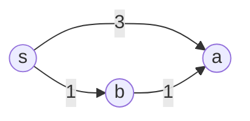
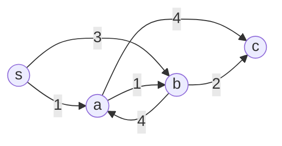

# 名古屋工業大学 工学研究科 工学専攻 情報工学系 2021年度 計算機ソフトウェア（データ構造とアルゴリズム）

## **Author**
GPT-5.6 Sol, 祭音Myyura

## **Description**

問題26「計算機ソフトウェア」の設問 I について答えよ。

頂点集合 $V$ を持つ有向グラフが与えられている。次のアルゴリズムは、開始頂点 $s\in V$ から各頂点 $v\in V$ までの経路を探し、そのコストを $D[v]$ に保存する。$\operatorname{cost}(u,v)$ は有向辺 $(u,v)$ の正のコスト、$\varnothing$ は空集合を表す。4 行目で候補が複数ある場合は、頂点のアルファベット順で選ぶ。

```text
1  for (v ∈ V) { D[v] ← ∞ }
2  X ← ∅; D[s] ← 0
3  while (X ≠ V) {
4      u を D[v] (v ∉ X) が最小となる頂点とする
5      X ← X ∪ {u}
6      for (v ∈ {u から有向辺が存在する頂点}) {
7          D[v] ← min(D[v], D[u] + cost(u,v))
8      }
9  }
```

### (1)

上のアルゴリズムを次の二つのグラフに適用し、1 回目の反復終了時とアルゴリズム終了時の $D$ を埋めよ。

グラフ 1 の辺は

$$
(s,a,3),\qquad(s,b,1),\qquad(b,a,1)
$$

である。



|  | $D[s]$ | $D[a]$ | $D[b]$ |
|---|---:|---:|---:|
| 1 回目 | (A) | $3$ | (B) |
| 終了時 | (C) | (D) | $1$ |

グラフ 2 の辺は

$$
(s,a,1),\ (s,b,3),\ (a,b,1),\ (b,a,4),\ (a,c,4),\ (b,c,2)
$$

である。



|  | $D[s]$ | $D[a]$ | $D[b]$ | $D[c]$ |
|---|---:|---:|---:|---:|
| 1 回目 | (E) | (F) | (G) | $\infty$ |
| 終了時 | (H) | (I) | (J) | (K) |

### (2)

次の各記述の正誤を答えよ。

1. このアルゴリズムはクラスカル法と呼ばれる。
2. グラフが閉路を持つ場合、終了しない可能性がある。
3. 終了時の $D[v]$ は、$s$ から $v$ までの最小コストである。
4. 実行中に $D[v]$ が増加することはない。

### (3)

$|V|=n$、有向辺数を $m$ とする。配列および辺コストへのアクセスと $X\ne V$ の判定は $O(1)$、4--5 行目は 1 反復当たり $O(n)$、6--8 行目は $u$ の出次数に比例するものとする。最もタイトな計算量を選べ。

$$
\begin{array}{ll}
\text{(a) }O(m+n^2), & \text{(b) }O(m^2+n^2),\\
\text{(c) }O(mn+n^2),& \text{(d) }O(m^2+n).
\end{array}
$$

### (4)

最短経路上で頂点 $v$ の直前にある頂点を $P[v]$ に保存する。

#### (ア)

$$
P[a]=s,\qquad P[b]=s,\qquad P[c]=d,\qquad P[d]=b
$$

のとき、$s$ から $d$ までの経路を選べ。

$$
\text{(a) }s,a,b,d\quad
\text{(b) }s,b,c,d\quad
\text{(c) }s,b,d\quad
\text{(d) }s,c,d
$$

#### (イ)

同じ最小コストを持つ経路が複数ある場合、すべての直前頂点を集合 $P[v]$ に保存する。

$$
P[a]=\{s\},\quad P[b]=\{s\},\quad
P[c]=\{s,a,b\},\quad P[d]=\{b,c\}
$$

のとき、$s$ から $d$ までの異なる最短経路数を求めよ。

### (5)

最短経路数を $N[v]$ に保存する。初期値を $N[s]=1$、$v\ne s$ に対して $N[v]=0$ とし、7 行目を次のように置き換える。空欄を埋めよ。

```text
if (D[v] > D[u] + cost(u,v)) {
    D[v] ← D[u] + cost(u,v)
    N[v] ← (A)
} else if (D[v] = D[u] + cost(u,v)) {
    N[v] ← (B)
}
```

## **Kai**

### (1)

グラフ 1 では最初に $s$ を選び、

$$
D[a]=3,\qquad D[b]=1
$$

となる。次に $b$ を選ぶと

$$
D[a]=\min(3,1+1)=2
$$

である。したがって、

$$
\boxed{(A)=0,\ (B)=1,\ (C)=0,\ (D)=2}
$$

となる。

グラフ 2 では最初に $s$ を選び、

$$
(D[s],D[a],D[b],D[c])=(0,1,3,\infty)
$$

となる。その後 $a,b,c$ の順に選ばれ、

$$
D[b]=\min(3,1+1)=2,\qquad
D[c]=\min(1+4,2+2)=4.
$$

よって、

$$
\boxed{(E)=0,\ (F)=1,\ (G)=3,\ (H)=0,\ (I)=1,\ (J)=2,\ (K)=4}
$$

である。

### (2)

1. $\boxed{\text{誤}}$。これはクラスカル法ではなくダイクストラ法である。
2. $\boxed{\text{誤}}$。各反復で新しい頂点が $X$ に加わるため、高々 $|V|$ 回で終了する。
3. $\boxed{\text{正}}$。すべての辺のコストが正なので、確定した距離は最短距離である。
4. $\boxed{\text{正}}$。更新は最小値との置換だけなので、$D[v]$ は増加しない。

### (3)

4--5 行目は $n$ 回反復され、合計 $O(n^2)$ である。6--8 行目の総計は出次数の総和より $O(m)$ である。したがって、

$$
O(n^2)+O(m)=O(m+n^2)
$$

であり、答えは $\boxed{\text{(a)}}$ である。

### (4)

#### (ア)

$P[d]=b$、$P[b]=s$ を逆向きにたどると $d\leftarrow b\leftarrow s$ である。よって、

$$
\boxed{s\to b\to d}\qquad\boxed{\text{(c)}}
$$

となる。

#### (イ)

各頂点までの経路数を $C(v)$ とすると、

$$
C(s)=1,\qquad C(a)=C(b)=1,
$$

$$
C(c)=C(s)+C(a)+C(b)=3,\qquad
C(d)=C(b)+C(c)=4.
$$

したがって、答えは $\boxed{4}$ 本である。

### (5)

より短い経路が得られた場合は従来の経路数を捨て、$u$ までの経路数で置き換える。同じ距離の経路が得られた場合は、その経路数を加える。よって、

$$
\boxed{(A)=N[u]},\qquad
\boxed{(B)=N[v]+N[u]}
$$

である。

### 検算

ダイクストラ法を実装して各反復を記録したところ、グラフ 1 は

$$
(0,3,1)\to(0,2,1),
$$

グラフ 2 は

$$
(0,1,3,\infty)\to(0,1,2,5)\to(0,1,2,4)
$$

となった。また、前駆頂点集合から 4 本の経路を列挙でき、上の結果と一致した。
